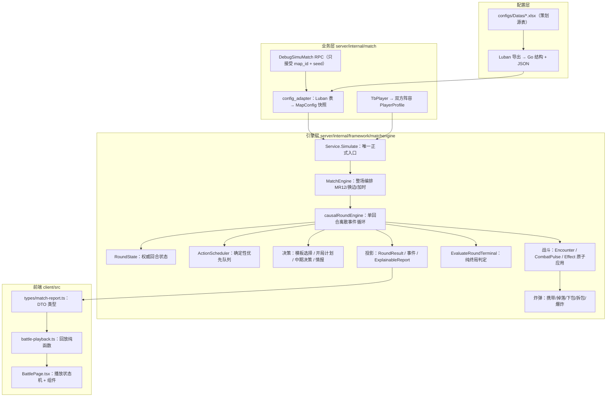

# 01 · 全景概览：从"预定胜方"到"因果模拟"

> 这是专栏的第一篇。不碰代码细节，只回答三个问题：这套引擎**之前为什么是错的**、**现在为什么对**、以及**我们应该按什么路线把它学明白**。

## 1. 一句话背景

你在这个项目里实现了一个 CS2 模拟对局引擎：给两支五人队伍、一张 Dust2 地图和一个随机种子，服务器一次性推演出整场比赛——每一小局的战术、移动、遭遇战、击杀、下包、拆包，直到 13 分决出胜者，然后前端用回放页把它"演"出来。

这套逻辑在提案 `implement-causal-simu-match-engine` 中被整体重写过一次。重写的原因，是旧实现犯了一个**因果倒置**的错误。

## 2. 旧实现错在哪：赢家先于过程

旧引擎的回合流程是这样的（依据 `doc/reviews/ebc8906-review-guide.md#4.1`）：

1. 先比较两队整体战力，**抽出本回合的胜方**（`resolveRoundWinner`）；
2. 再把胜方作为参数，反过来生成击杀方向、存活人数、下包概率、获胜原因（`resolveRoundEvents` / `pickKillSide` / `inferWinReason`）；
3. 最后拼一条和结果"相容"的事件流水。

这就像**先看比分牌，再补写比赛解说**：解说永远自洽，但比赛从来没被"打"过。选手属性、武器、遭遇战、中期决策全部沦为摆设——你改什么都不影响结果，只会让解说词变一变。

**新引擎要做的只有一件事：让胜负变成"输出"，而不是"输入"。**

## 3. 新引擎的四个核心思想

### 3.1 因果模拟（Causal Simulation）

状态只能被"前一层状态"改变，胜负只能从"最终状态"判定：

```text
移动 → 接触 → 遭遇战 → 伤害 → 死亡 → 掉包 → 下包/拆包 → 终局判定
```

每一环只消费上一环留下的状态，**没有任何函数签名接受"本回合胜方"这个参数**。这一点甚至被写成了测试：`causality_guard_test.go` 用 AST 静态扫描，禁止生产代码中出现旧 API 的符号（`TestCausalSubsystemAPIsRejectPreselectedOutcomeInputs`）。

### 3.2 离散事件调度（Discrete Event Scheduler）

引擎**不按秒逐帧推演**。每个行动（移动、下包、拆包、决策）在生成时就把自己的完成时刻冻结成一个绝对时间点 `ResolveAt`；调度器只做一件事——**跳到下一个最早到期的事件去结算**。回合可能是 90 秒，但引擎只需要结算几十个"有意义的瞬间"。省下的不是性能，是解释成本：战报的每个事件都有明确的时间戳和原因。

### 3.3 可解释性（Explainable）

每个关键事件（击杀、下包、转点、战术选择）都携带 `ReasonRecord`：主因是什么、各修正项加了多少分、公式长什么样。前端只展示"谁杀了谁"，但后端保留了完整的**审计链**——这对你后续调参（标定）至关重要。

### 3.4 确定性（Determinism）

同样的 `MatchInput + 地图配置版本 + 规则集 + 随机种子`，必须产出**逐事件完全一致**的结果。所有随机数从种子派生，不共享可变随机流；所有 ID 从语义身份哈希派生，不依赖 map 遍历顺序。这是"可回放"和"可标定"的根基。

## 4. 一张全景图



读图顺序：**右上角的请求**是入口，**底部的前端**是终点；中间的引擎层就是本专栏的主战场。

## 5. 这套系统"不"做什么（边界同样重要）

设计文档明确划定了第一版的非目标（`doc/simuMatchDesign.md#1.2`、`#4.11`）：

| 不做 | 为什么重要 |
|------|-----------|
| 逐帧移动、碰撞、真实弹道、烟闪实体 | 引擎只模拟"玩家能感知、策划能调参"的层级 |
| 客户端回合内指令、实时观战 | 一次 RPC 算完整场，没有实时输入 |
| 完整经济系统、购买、掉枪 | 后续规则集扩展，不在第一版 |
| 物理寻路导航网格 | 只在配置的语义图上做**有界确定性**路径选择 |
| 通用游戏框架式的 Action 系统 | 它只为这个模拟器服务 |

记住这些边界，能帮你理解很多"看起来奇怪"的设计取舍——比如为什么移动只是"节点与边上的进度"，为什么 Encounter 不拆成 1v1 单挑。

## 6. 学习路线：15 篇如何划分

| 分区 | 篇目 | 目标 |
|------|------|------|
| **总览区**（01–03） | 概览 / 术语词典 / 端到端旅程 | 建立全局地图，能回答"比赛怎么跑起来的" |
| **内核区**（04–13） | 配置 → 整场 → 回合 → 状态 → 行动 → 地图 → 决策 → 遭遇战 → 脉冲 → 收尾 | 逐层拆解，能回答"每一行逻辑为什么存在" |
| **周边区**（14–15） | 前端回放 / 验收与差距 | 能回答"怎么验证它是对的、哪里还不达标" |

内核区的顺序大体是**自底向上的依赖序**：先知道状态长什么样（07），才能理解行动怎么改状态（08）；先知道地图语义（09），才能理解遭遇战在哪里发生（11）。但如果你读完 06 已经上头，跳着读也没关系——每篇开头都标注了前置依赖。

## 7. 动手之前，先立一个共识

这套引擎的代码是 AI 写的，Review 文档你"看不太懂"。这个专栏的立场是：

1. **代码和设计文档是平等的**。教程会不断在两者之间来回引用，因为理解引擎 = 理解"设计意图"与"代码实现"之间的映射，包括映射不上的地方（第 15 篇专门讲）。
2. **术语第一遍全讲，之后不再重复**。第 2 篇是词典；后面遇到只给一句回指。
3. **每一处引用都精确到符号**。不是"战斗模块里"，而是 `combat.go#ResolveCombatPulse`。跟着引子去读，代码会越来越短。

## 本篇回顾

- 旧引擎的病灶：**先抽胜方、再补过程**，因果倒置。
- 新引擎的药方：**因果模拟 + 离散事件调度 + 可解释 + 确定性**。
- 胜负从"输入"变成"输出"，这件事有静态测试守护。
- 15 篇文章 = 总览区（01–03）+ 内核区（04–13）+ 周边区（14–15）。

**下篇预告**：Nakama 插件是什么、Go 的哪些特性会反复出现、以及一份引擎专有名词词典——先把武器库备齐，再上战场。

**关联阅读**：`openspec/changes/implement-causal-simu-match-engine/proposal.md`（Why / What Changes）；`doc/reviews/ebc8906-review-guide.md#2`（一页式总览）。
