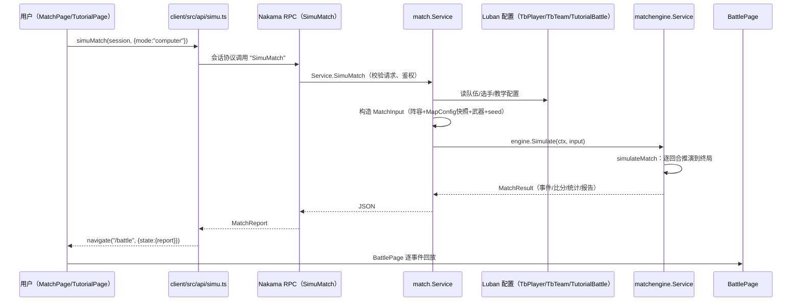

# 03 · 一次模拟的完整旅程

> 前两篇建立了概念地图。这篇我们让一个真实的请求从客户端出发，穿过 RPC、业务层、引擎、配置，最后带着整场比赛回到前端。**读完这篇，你应该能不看任何代码，把整条链路给同事讲一遍。**
>
> 前置依赖：02（术语词典）。

## 1. 一个请求的一生

用户在前端点下"开始匹配"（电脑对战）或"进入教学"按钮，下面这条链路就启动了：



注意两个事实：**引擎全程不读数据库、不读 Luban 表**——它只消费 `MatchInput` 这个自包含快照；**前端全程不参与结算**——它只"重放"服务器算好的结果。

## 2. 第一站：RPC 入口

`server/internal/match/api_rpc.go` 注册了两个 RPC（注册点在插件初始化时调用 `RPCDebugSimuMatch` / `RPCSimuMatch`）：

| RPC | 用途 | 请求字段 |
|-----|------|---------|
| `DebugSimuMatch` | 调试/快速观战，用默认阵容 | `map_id`（可空）、`seed`（可空，默认当前时间纳秒） |
| `SimuMatch` | 正式入口：`computer`（电脑对战）或 `tutorial`（15 元教学阵容） | `mode`、`tutorial_config_id`、`config_version`、`player_ids` |

两个 RPC 共用 `decodeStrictRequest`（`api_rpc.go#decodeStrictRequest`），它做了一件在"防作弊"语境下很重要的事：

```go
decoder := json.NewDecoder(strings.NewReader(payload))
decoder.DisallowUnknownFields()
```

**未知字段直接报错**。这意味着客户端没法通过塞入 `for_winner:"team_a"` 这类字段来脚本化比赛——老引擎的 `ForcedRoundWinners` 就是被这类机制（加上引擎内部模型删除）彻底关死的。响应也一样：任何引擎错误都映射成带稳定 `Code` 的 `MatchError` JSON，而不是堆栈。

## 3. 第二站：业务服务组装 MatchInput

`server/internal/match/service.go#Service.SimuMatch` 按模式取阵容：

- `computer` 模式：从 `TbPlayer` 表里挑 `team_falcons` / `team_vitality` 各 5 人（`defaultTeamPlayerIDs`）；
- `tutorial` 模式：校验玩家提交的阵容在预算内（`validateTutorialLineup`，按档位 1–5 计价），对手来自教学配置。

选手从配置行转成引擎的 `PlayerProfile`（`playerFromConfig`：15 项属性 + 角色标签 + 头像裁剪），然后 `Service.simulate`（`service.go#simulate`）组装出引擎唯一认识的输入：

```go
input := &matchengine.MatchInput{
    MatchID:    matchID,
    MapID:      mapID,
    Seed:       seed,
    RuleSet:    matchengine.DefaultMR12RuleSet(state.config.CombatConstants),
    TeamA:      teamA,
    TeamB:      teamB,
    InitialSideByTeam: map[string]string{teamA.TeamID: SideT, teamB.TeamID: SideCT},
    MapConfig:    state.config,      // 启动时缓存好的快照
    WeaponSpecs:  defaultWeaponSpecs(),
    SideLoadouts: defaultSideLoadouts(),
}
```

几个值得现在就记住的点：

1. **`MapConfig` 是启动时缓存并校验过的快照**（`cacheMapConfig` + `buildMapConfigFromTables`）。校验失败不会让服务器崩——错误被缓存，RPC 返回结构化 `CONFIG_ERROR`（第 4 篇展开）。
2. **`DefaultMR12RuleSet` 从配置常量构造**，说明赛制参数本身也是配表驱动的（第 5 篇展开）。
3. **武器目前是两把硬编码默认枪**：T 全队 AK-47、CT 全队 M4A1-S（`defaultWeaponSpecs`/`defaultSideLoadouts`）。经济系统是明确非目标，所以"人人全甲全弹"。
4. `DebugSimuMatch` 还多一个开关：`BattleReportDebugLog` 配置键决定响应里 `debug_enabled` 是否为 true——前端据此开启 console 全量战报日志（第 14 篇会用到）。

## 4. 第三站：引擎入口

`server/internal/framework/matchengine/service.go#Service.Simulate` 是**唯一的正式引擎入口**（测试里还有反射断言守护这一点，见 15 篇）：

```go
func (s *Service) Simulate(ctx context.Context, input *MatchInput) (*MatchResult, error) {
    engine := newProductionMatchEngine(input)
    return engine.simulateMatch(ctx)
}
```

`simulateMatch`（`engine.go#simulateMatch`）先做**输入校验**（`validateInput`：种子非零、规则集合法、地图配置合法、每队恰好 5 人、双方 side 一 T 一 CT、武器表完备），再进入整场循环：

```text
for roundNumber := 1..RegulationMaxRounds:
    第 13 回合前 swapSides()          ← 半场换边
    roundSimulator.SimulateRound(...) ← 单回合推演
    consumeRoundSimulation(...)       ← 校验终局 → 比分 +1 → 战术记忆
    若 RegulationComplete → break     ← 13 分到点 / 打满 24 回合
若 24 回合平局 → playOvertime(...)    ← MR3 双段加时
```

每回合的种子是**派生**的，不是共用的（`engine.go#buildRoundInput`）：

```go
Seed: deriveSeed(e.input.Seed, e.input.MapVersion, e.input.RuleSet.RuleSetID, ctx.roundNumber)
```

同一场比赛里，第 1 回合和第 12 回合各有独立的随机流；但只要总种子、地图版本、规则集不变，重跑一万次结果逐字节相同——这就是"可回放"的根基。

## 5. 第四站：单回合推演（先睹为快）

回合模拟器接口 `roundSimulator` 在生产环境只有一个实现：`causalRoundEngine`，其核心是 `round_engine.go#runCausalRound`。第 6 篇会逐行拆解，这里只给"一回合的一生"：

```text
① 选战术：SelectStrategyTemplate（T）+ SelectCTSetup（CT，独立种子）
② 造计划：BuildRoundPlan（角色、路线、持包人）
③ 初始化：NewRoundState（满血满状态、Utility 预算、节点控制权）
④ 部署：DeployOpeningActions（T 走进攻路线、CT 站防守位）
⑤ 主循环（Terminal == nil 时）：
     ensureActions        ← 发现遭遇战 / 自动下包 / 补移动 / 触发决策
     EvaluateRoundTerminal ← 批次后判终局
     NextTime → AdvanceTimeline ← 跳到下一个最早到期事件
     resolveTimestamp     ← 结算同一时间戳的所有行动
     DecayIntelAndControl + DetectDecisionTriggers + reevaluatePhase
⑥ 投影：ProjectRoundResult → RoundResult（事件、比分、状态快照）
```

一个细节：`consumeRoundSimulation`（`engine.go#consumeRoundSimulation`）在给胜方加分前，会先**校验**回合终局是否与当前阵营映射一致：

```go
expectedSide := e.state.SideByTeam[terminal.WinnerTeamID]
if expectedSide == "" || (terminal.WinnerSide != "" && terminal.WinnerSide != expectedSide) ...
```

这是"比分权威性"的第一道闸：回合模拟器不能凭空宣布一个不存在的队伍获胜，也不能在换边后报错阵营。

## 6. 第五站：战报投影与返回

回合结束后的 `RoundResult` 不是内部状态的裸拷贝，而是**投影**（`round_projection.go#ProjectRoundResult`）：事件带时间戳、原因、坐标；比分按队伍身份填写 `ScoreTeamA/B`，再按阵营投影出兼容字段 `ScoreT/ScoreCT`（第 13 篇详解）。整场结束后，`engine.go#simulateMatch` 汇总 `FinalStats`（K/D/A、ADR、首杀、下包/拆包数）与 `BuildMatchExplainableReport`，随 JSON 一起返回前端。

前端拿到的就是 `MatchReport`——约几十 KB 的纯 JSON，包含**整场比赛每一秒的权威真相**。

## 7. 第六站：前端回放

`client/src/api/simu.ts#simuMatch` 把 JSON 解成 `MatchReport` 类型后，入口页直接导航：

```tsx
// MatchPage.tsx（computer 模式）与 TutorialPage.tsx（tutorial 模式）同款逻辑
const report = await simuMatch(session, { mode: "computer" })
navigate("/battle", { state: { report } })
```

`main.tsx` 里 `/battle` 路由挂载 `BattlePage`。BattlePage 只做一件事：**把服务器算好的结果按时间轴"演"出来**——每秒揭示一个事件，玩家状态、比分、炸弹、地图标记全部由已揭示的事件前缀推导（`battle-playback.ts` 的五个纯函数，第 14 篇详解）。

这里有个值得玩味的哲学：**回放页不重新模拟，只重放**。它连"比分"都不自己算，而是问 `authoritativeScoreAtPlayback`："到当前事件为止，服务器权威比分是多少？"——因果链条在服务器端闭合，客户端只是观众。

## 8. 动手实验：追踪你的第一场比赛

现在就可以做一次 15 分钟的实验：

1. 打开前端，进入匹配对战（computer 模式），F12 看 console——若 `debug_enabled` 为 true，你会看到 `[SimuMatch]` 开头的全量日志：整场战报、每回合事件表、最终统计（`BattlePage.tsx#logFullMatchReport`）。
2. 记下界面右上角显示的 `Seed`。
3. 换个方式再开一局同 seed（或直接调 `DebugSimuMatch` RPC 传相同 seed），对比两场战报——**应逐事件一致**。这就是确定性。

如果看到任何不一致，那就是 bug，值得按第 15 篇的测试思路去复现。

## 本篇回顾

- 完整链路：`simuMatch` 前端调用 → Nakama RPC（严格解码）→ `match.Service` 组装 `MatchInput` → `matchengine.Service.Simulate` → 逐回合推演 → 投影成 `MatchResult` → 前端逐事件回放。
- 引擎**不读库、不读表**，只消费自包含快照；前端**不结算**，只重放权威结果。
- 每个回合有独立派生种子；换边只换阵营映射，比分永远按队伍身份累计。
- 你现在已经能回答"比赛是怎么跑起来的"了——接下来 11 篇，把链路里的每一环拆开看。

**下篇预告**：策划在 Excel 里改一个数字，是怎么穿过 Luban、校验、快照，最终改变比赛走势的？

**关联阅读**：`server/internal/match/api_rpc.go`；`server/internal/match/service.go#simulate`；`server/internal/framework/matchengine/engine.go#simulateMatch`；`client/src/api/simu.ts#simuMatch`。
