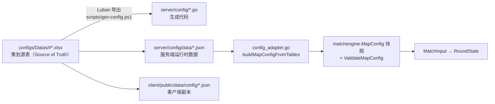

# 04 · 配置世界：Luban 管线与地图快照

> 引擎的第一原则是"少模拟，多结算"，而"结算"的全部参数都来自配置。这一篇回答：**策划在 Excel 里改一个数字，是如何变成比赛里的一次击杀概率的？** 以及：**配置错了会怎样？**
>
> 前置依赖：02（Luban 概念）、03（MapConfig 快照）。

## 1. 为什么配置的地位这么高

回忆第 1 篇的设计原则：**参数可控**——"以胜率、下包率、拆包率、击杀数等目标分布标定"。这决定了引擎里的一条铁律（`doc/simuMatchDesign.md#2.2`）：

> 其余公式、调度、Clamp 和终局所需数值**不得依赖未命名代码默认值**。

翻译成人话：**公式写在代码里，公式用的数字必须全部能在一张表里找到**。这样调平衡时只改 Excel、重导出、跑标定，不需要碰 Go 代码。（第 15 篇你会看到，代码里还是残留了一些"未命名常量"，这是已知缺口之一。）

## 2. 配置的两段旅程

一个数字从策划手里到引擎生效，要经过两段旅程：



**第一段（Luban 管线）**：Excel 是唯一真源，导出三份产物——Go 结构代码（编译期类型安全）、服务端 JSON（运行时加载）、客户端 JSON（前端展示用，与服务端**字节级一致**）。任何手改 JSON 的行为都会在下一次导出时被覆盖，所以改配置必须回 Excel 改。

**第二段（适配与校验）**：`server/internal/match/config_adapter.go#buildMapConfigFromTables` 把 Luban 行**逐行映射**成引擎的自包含快照 `MapConfig`（八张语义表 + 战斗常量），再交给 `ValidateMapConfig` 做完整校验。引擎从此不再 import `config` 包——这一点有静态测试守护（第 15 篇）。

## 3. 十三张业务表：谁负责什么

`configs/Datas/` 下共有 13 张业务表（另有 Luban 元表）。引擎直接消费其中的 9 张：

| 表 | 引擎内角色 | 深入篇目 |
|----|-----------|---------|
| `#RouteTemplate` | 6 个 T 战术 + 3 个 CT setup 模板 | 10 |
| `#Scenario` | 12 个战斗场景（路线/阶段/距离/节奏/姿态/道具语境） | 11 |
| `#MapTag` | 地图语义标签（长距离、架点角、转点风险…） | 09、11 |
| `#EncounterModifier` | 场景下"标签和属性如何转成分数" | 11 |
| `#MapNode` | 15 个语义节点（含雷达坐标、区域形状、用途） | 09 |
| `#MapEdge` | 6 条边（耗时、风险热点、拦截候选） | 09 |
| `#Visibility` | 3 条关键视线（范围/角度优势/掩体修正） | 09、11 |
| `#Route` | 16 条可走路线的节点序列 | 09、10 |
| `#CombatConst` | 64 个必配常量键（时间/战斗/炸弹/资源/决策/情报/防卡死） | 本篇 |

另外 `#Player`/`#Team`/`#TutorialBattle` 供业务层组阵容（第 3 篇见过），`#item` 是旧表。武器目前**没有表**：`defaultWeaponSpecs` 是业务层硬编码的两把枪（AK-47 / M4A1-S），`tb_weapon` 是规格里留待后续的工作。

## 4. 必配常量：引擎的"总开关面板"

`#CombatConst` 是一张 key-value 表：**64 个必配键**分属八个类别（配置表实际 65 行，多出的 `BattleReportDebugLog` 是调试开关，不在必配库存里）。挑几个最有故事的：

| 键 | 类别 | 职责 |
|----|------|------|
| `RoundTimeLimit` | Time | 常规回合时长（当前 90s） |
| `BombExplodeTime` | Bomb | 下包后爆炸倒计时（30s） |
| `BasePlantTime` / `BaseDefuseTime` | Bomb | 下包/拆包基础时长（当前 2s / 8s） |
| `ForceExecuteThreshold` | Decision | 剩余时间低于它时触发强攻决策（60s） |
| `MaxDecisionCount` | Decision | 单回合最大重新决策次数（3） |
| `MaxEncounterPulses` | Combat | 单次遭遇战最大脉冲数（5） |
| `MaxScheduledActions` | Clamp | 调度器硬上限（1500） |
| `CombatScale` | Combat | sigmoid 命中公式的分差缩放（50） |
| `CommunicationDelay` | Intel | 队内情报延迟；**必须为 0**，否则配置直接判错 |
| `ControlIntelTTL` | Intel | 控制权情报的有效时长 |
| `DefaultStrategyTemplateID` | Decision | 开局计划兜底模板（`Default_Pick`） |

引擎代码通过 `CombatConstants.Int(key, fallback)` / `.Float` 访问这些值（`validation.go#CombatConstants`）。fallback 参数只会在校验已经通过后成为死代码——因为**缺键在进入引擎前就被拦下了**。

## 5. ValidateMapConfig：配置的安检闸门

`matchengine/validation.go#ValidateMapConfig` 是引擎里少有的"防御性极强"的函数，检查顺序大致是：

```text
nil/空 MapID
→ 五张核心表非空（RouteTemplate/Scenario/MapNode/Route/MapTag）
→ 常量存在性 + map key 与行内 key 一致性
→ 常量类型/取值范围（18 个 Float 键、2 个 String 键，其余 Int；13 对 Min≤Max）
→ CommunicationDelay 必须为 0（否则 `CONFIG_UNSUPPORTED_COMMUNICATION_DELAY`）
→ 节点枚举/坐标 [0,1]/形状几何（Circle 半径>0、Polygon ≥3 顶点）
→ 场景十属性权重合计必须 = 100（不重复）
→ 路线 → 模板（人数分配合计必须 = 5）→ EncounterModifier → 边 → 视线
→ 路线逐段连通（边确实存在）
→ A/B 包点存在（AreaUsages 含 Plant）
→ 默认模板存在且阵营正确
→ 正式 Dust2 覆盖检查（MapID=de_dust2 且默认版本时强制）
```

每类失败都有**稳定错误码**，例如：缺常量 `CONFIG_MISSING_COMBAT_CONST`、权重不对 `CONFIG_BAD_SCENARIO_WEIGHT`、模板人数闭合错误 `CONFIG_BAD_TEMPLATE_LIMIT`、悬空引用 `CONFIG_BAD_EDGE_NODE`、路线断连 `CONFIG_ROUTE_NOT_CONNECTED`、无下包点 `CONFIG_NO_PLANT_SITE`、Dust2 覆盖不全 `CONFIG_INCOMPLETE_DUST2_COVERAGE`。完整清单看 `validation.go` 的错误矩阵，RPC 层会把这些码原样带给客户端（第 3 篇见过 `MatchError` 映射）。

一个特例：`CONFIG_MISSING_KILL_SAMPLE` 是**警告**而非错误——节点标记了击杀采样用途但没配几何形状时，引擎回退用节点坐标，只在 `MapConfig.Warnings` 里记录。这是唯一允许"降级"的配置问题。

**校验失败的时机**：`match.NewService` 构造时立即缓存 `DefaultMapID` 的校验结果（`service.go#cacheMapConfig`）。失败不会让服务器启动失败，而是把错误**缓存**起来，RPC 请求到这张图时返回结构化错误——"配置坏了，比赛照常拒绝，服务器照常活着"。

## 6. Dust2 覆盖要求：为什么要有"最低配齐标准"

`validateFormalDust2Coverage` 对正式地图强制一套覆盖底线（`validation.go#requiredDust2*`）：

- **6 个 T 战术模板**：`A_Long_Rush`、`A_Short_Split`、`B_Tunnel_Explode`、`Mid_To_B`、`Default_Pick`、`Fake_A_Go_B`；
- **3 个 CT setup 模板**，覆盖 A/B/Mid 三块初始防区；
- **节点/边/关键视线/路线的最小覆盖底线**（当前配置实为 20 节点、19 边、12 视线、16 路线，远超底线）；
- 路线节点必须从双方出生点可达；A/B 包点必须存在。

这套要求的由来：旧引擎的配置只有"一条路线、一个模板、一个场景"的占位深度，所以永远只会模拟 A 大一条线。覆盖检查保证的是**战术空间的下限**——没有它，配表漏一条边可能不会报错，只会在运行时让某个战术永远走不通。

## 7. 动手实验：改一个数字看世界变化

推荐一个 20 分钟实验，体会"配置即调参"：

1. 打开 `configs/Datas/#CombatConst.xlsx`，找到 `BombExplodeTime`，从 30 改成 15（拆包压力翻倍）；
2. 跑 `scripts/gen-config.ps1` 重新导出（或按项目的 `luban-config` skill 流程）；
3. 重启后端、重新进一场比赛，观察：终局分布里 `bomb_exploded` / `timeout` 的比例变化；
4. 改回 30，确认结果回到原分布。

再试一个"破坏性"实验：把 `#Scenario` 里某个场景族的十属性权重合计改成 99——重载后调 RPC，你会直接收到 `CONFIG_BAD_SCENARIO_WEIGHT`，而不是一场莫名其妙的比赛。**配置错误宁可拒绝服务，也不静默兜底**，这是引擎的设计立场。

## 本篇回顾

- 配置两段旅程：Excel（唯一真源）→ Luban 三产物 → `MapConfig` 快照 → 校验 → 引擎。
- 64 个必配常量键是引擎的"总开关面板"；公式在代码里，数字全在表里。
- `ValidateMapConfig` 用稳定错误码拒绝一切坏配置，唯一允许降级的是击杀采样几何缺失。
- Dust2 覆盖底线保证了战术空间的下限，防止"单路线引擎"回归。
- 武器目前是业务层硬编码，`tb_weapon` 是后续工作。

**下篇预告**：有了配置，比赛怎么在 24 个回合里跑完？MR12、半场换边、加时——以及那个最容易被写错的"比分权威性"问题。

**关联阅读**：`server/internal/framework/matchengine/validation.go`；`server/internal/match/config_adapter.go#buildMapConfigFromTables`；`doc/simuMatchDesign.md#2.2`；`openspec/changes/implement-causal-simu-match-engine/config-inventory.md`。
