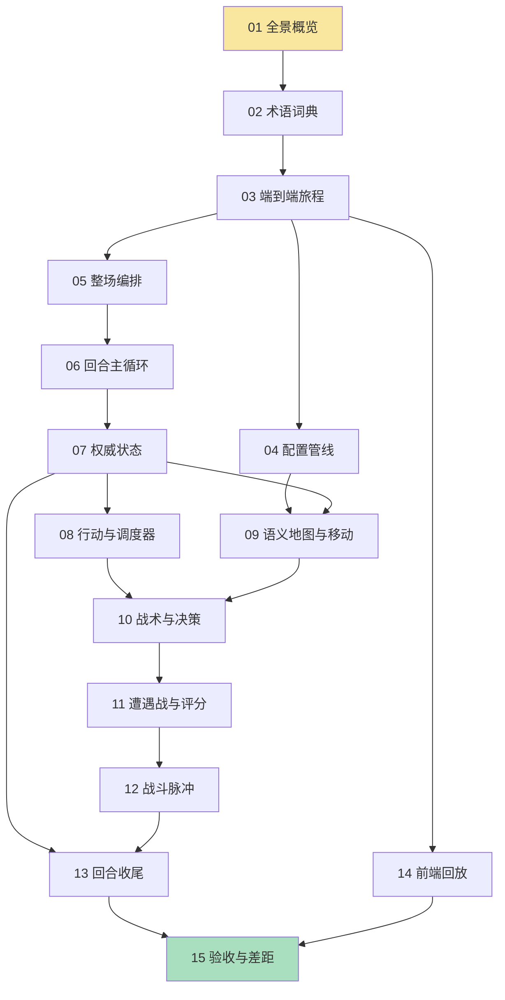

# CS2 模拟对局引擎 · 学习专栏

> 面向本项目维护者的自学教程系列。目标：把 `implement-causal-simu-match-engine` 提案产出的"因果模拟引擎"讲透——不是复述文档，而是带你理解**每一行关键逻辑为什么存在**。
>
> 写作前提：你熟悉 CS2 比赛本身（Rush B、MR12、下包拆包、回防转点都不用解释），但不需要熟悉 Go、Nakama、React/TypeScript、Luban——这些会在用到的地方随文铺垫。

## 目录

| # | 文章 | 一句话内容 | 前置依赖 |
|---|------|-----------|---------|
| 01 | [全景概览：从"预定胜方"到"因果模拟"](./01-全景概览.md) | 旧实现为什么错、新引擎的核心思想与全景地图 | 无 |
| 02 | [背景知识与术语词典](./02-术语词典.md) | Nakama/Go/Luban 最小背景 + 引擎专有名词词典 + 代码地图 | 01 |
| 03 | [一次模拟的完整旅程](./03-端到端旅程.md) | 从 RPC 请求到战报回放的端到端调用链 | 02 |
| 04 | [配置世界：Luban 管线与地图快照](./04-配置管线与校验.md) | 策划 xlsx 如何变成引擎的 MapConfig，校验如何兜底 | 03 |
| 05 | [整场编排：MR12、换边与加时](./05-整场编排.md) | 比分权威、半场换边、加时块的正确姿势 | 03 |
| 06 | [回合主循环：离散事件状态机](./06-回合主循环.md) | runCausalRound 的每一次循环在做什么 | 03, 05 |
| 07 | [权威状态与不变量](./07-权威状态.md) | RoundState/BombState/控制权/情报容器的所有权规则 | 06 |
| 08 | [行动生命周期与调度器](./08-行动与调度器.md) | Intent→Action→Busy、版本失效、确定性优先队列 | 06, 07 |
| 09 | [语义地图与移动](./09-语义地图与移动.md) | MapNode/MapEdge/Route/Visibility 如何参与结算 | 04, 07 |
| 10 | [战术选择与 AI 决策](./10-战术与决策.md) | 六模板评分、CT 独立性、中期决策、情报边界 | 07, 08 |
| 11 | [遭遇战：从接触到评分](./11-遭遇战与评分.md) | Encounter 生命周期与三层评分公式 | 09, 10 |
| 12 | [战斗脉冲：原子伤害与死亡](./12-战斗脉冲.md) | CombatPulse 快照、原子应用、伤害分配与击杀归属 | 11 |
| 13 | [回合收尾：炸弹、终局与战报投影](./13-回合收尾.md) | 炸弹状态机、终局优先级、NoProgress 兜底、事件投影 | 07, 12 |
| 14 | [前端回放：从 JSON 到 BattlePage](./14-前端回放.md) | 类型契约、回放纯函数、播放状态机 | 03 |
| 15 | [验收与差距：测试、标定与"设计 vs 现实"](./15-验收与差距.md) | 确定性测试、标定指标、OpenSpec 工作流、已知断链清单 | 全部 |

## 阅读顺序图

- 黄色节点是**入口**，绿色节点是**收尾**。
- 01–03 是"自顶向下"的总览区；04–13 是"自底向上"的内核区，大体沿数据流与依赖顺序展开；14、15 是周边区，可穿插阅读。
- 只想快速看懂"比赛是怎么跑起来的"：读 01→03→05→06 即可；想彻底理解战斗与炸弹，按顺序读完 04–13。

## 引用约定

教程里的代码引用统一为 `路径#符号名` 格式，例如：

- `server/internal/framework/matchengine/engine.go#simulateMatch` —— 指该文件中的函数/类型/字段。
- `doc/simuMatchDesign.md#2.5` —— 指设计文档的章节号。
- `openspec/changes/implement-causal-simu-match-engine/design.md#Decisions 12` —— 指提案设计文档的决策条目。

**行号故意不写**：代码会随迭代变化，符号名才是稳定的锚点。查代码时按符号名搜索（IDE 的 "Go to Symbol" 或 `grep` 均可）。

代码摘录可能为阅读方便做过**省略**（用 `...` 表示），不要直接当运行代码复制。

## 关联参考文档

| 文档 | 定位 | 何时回查 |
|------|------|---------|
| `doc/simuMatchDesign.md` | 模拟对局**需求设计**（权威语义来源） | 每篇内核文章都标注了对应章节 |
| `openspec/changes/implement-causal-simu-match-engine/proposal.md` | 提案：为什么改、改什么 | 01 篇背景 |
| `openspec/changes/implement-causal-simu-match-engine/design.md` | 工程化设计决策（22 个 Decisions） | 内核各篇的"设计依据" |
| `openspec/specs/simu-*-*.md` | 已同步的主规格（SHALL 要求） | 验收口径 |
| `doc/reviews/ebc8906-review-guide.md` | 对 ebc8906 提交的深度 Review | 第 15 篇的"已知断链"主要来源 |
| `openspec/changes/implement-causal-simu-match-engine/calibration-summary.md` | 批量标定实测指标 | 第 15 篇 |

> 说明：Review 指南针对的是提交 `ebc8906`，本教程以**当前工作区代码**为准（写作时 HEAD 为 `fef1ee8`）。两版之间差异不大；若某处代码已演进，以教程引用的符号名与最新代码为准。

## 阅读建议

1. 每篇 10–15 分钟，建议一天 1–2 篇，别贪多——内核几篇的信息密度很高。
2. 每篇末尾有"本篇回顾"（3–5 条要点）和"下篇预告"，读完先自己默写一遍回顾再看下一篇。
3. 遇到不理解的行为，最有效的验证手段：在后端写一个带固定 seed 的单测，或在 `DebugSimuMatch` RPC 的返回里找对应事件，配合前端 `debug_enabled` 的 console 输出观察。
