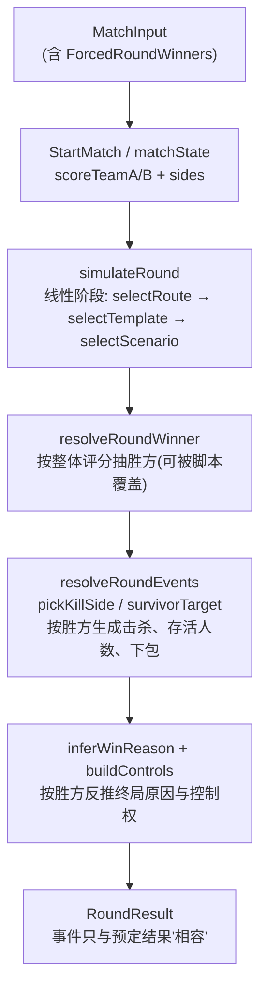
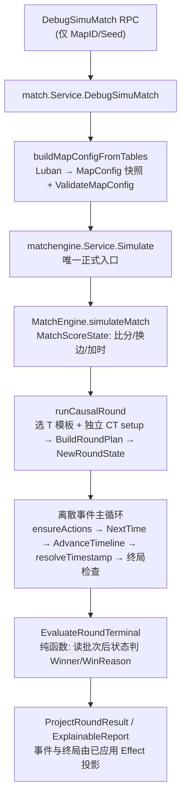
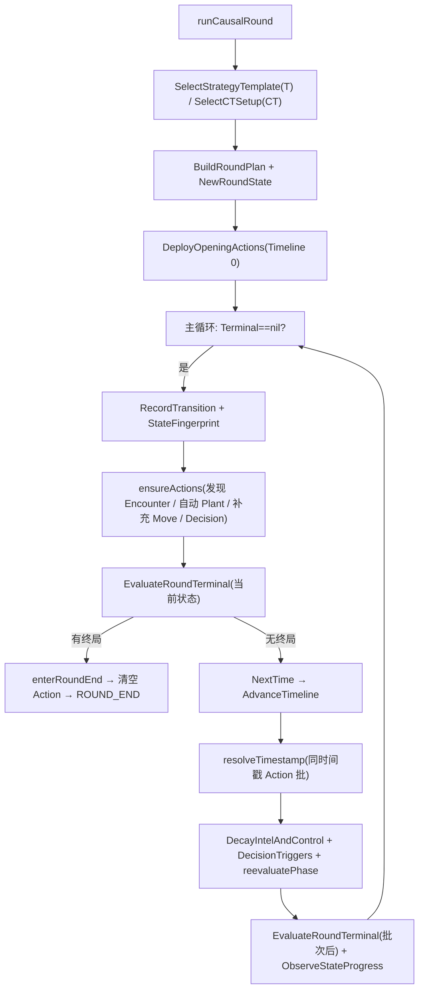
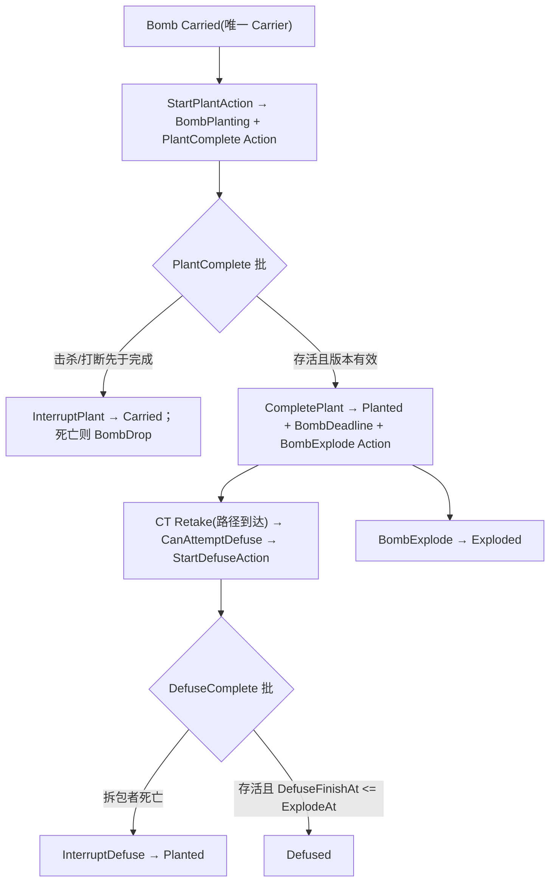
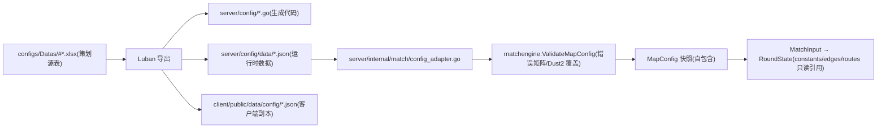
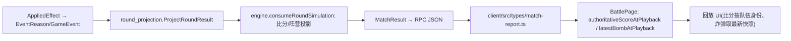

# ebc8906 提交 Review 指南：从"预定胜方"到"因果模拟"的重写

## 1. Review 对象与版本边界

| 项 | 值 |
|---|---|
| 目标 Commit | `ebc890606842e8b485f307cd661b2dcc8cc76360` |
| Parent Commit | `ebc890606842e8b485f307cd661b2dcc8cc76360^` |
| Commit message | `让AI根据需求方案，重新实现模拟对局功能` |
| Author / Date | JonathanLin，2026-08-02 11:57:13 +0800 |
| 分析对象 | Commit 快照（不是当前工作区） |
| 主需求文档 | `doc/simuMatchDesign.md`（本提交内被重写，532 增 / 304 删） |
| 本次 OpenSpec change | `openspec/changes/implement-causal-simu-match-engine/` |
| 归档的旧 change | `openspec/changes/archive/2026-08-01-complete-simu-match-mr12/`（本提交从 `openspec/changes/complete-simu-match-mr12` 整体重命名归档） |
| 变更规模 | 147 个文件，+25,136 / -2,436 |

**工作区漂移检测**：`git rev-parse HEAD` 等于目标 Commit，`git status --porcelain` 为空。本指南以 Commit 快照为准，不存在"当前工作区与提交不一致"的问题。

**证据规则**：本指南的全部结论来自以下证据，按可信度标记：

- **已确认**：由 Commit 内代码、调用关系、配置数据或测试断言直接证明。
- **合理推断**：由多个实现证据推导，但没有直接契约。
- **待确认**：当前证据不足，需要人工进一步判断。
- **疑似偏差**：实现可能偏离需求、OpenSpec 或既有行为。
- **文档声明**：只出现在设计/验证文档中，尚未由代码独立验证。

`proposal.md`、`design.md`、`tasks.md`、`traceability.md`、`verification-summary.md`、`calibration-summary.md` 与 Commit message 只作为线索，不作为"已经实现"的证据；凡是文档声称但代码证据不足的结论，本指南明确标注"仅有文档声明，尚未找到充分实现证据"。

---

## 2. 一页式总览

**旧系统的核心问题**：旧 `engine.go` 是"线性阶段流水线 + 反向因果"。每回合先 `resolveRoundWinner` 抽胜方（还支持 `MatchInput.ForcedRoundWinners` 测试脚本），再把 `winnerSide` 传给 `resolveRoundEvents`、`pickKillSide`、`survivorTarget`、`inferWinReason` 和 `buildControls`。击杀方向、存活人数、下包概率、炸弹叙事和控制权快照全部由预定胜方反推，选手属性、武器、遭遇战状态和中期决策无法真正决定比赛结果。

**新系统的核心方案**：以 `simuMatchDesign.md` 为权威语义，把回合内核替换为轻量离散事件状态机：

- `MatchScoreState` 只做比分/换边/加时编排，消费自然 `RoundTerminal`；
- `causalRoundEngine`（`runCausalRound`）按绝对时间推进 `ScheduledAction` 队列；
- 移动、Hold、Encounter（`CombatPulse`）、Decision、Plant/Defuse/Explode 都是可打断、带版本校验的 Action；
- `ApplyCombatPulseCommit` 把单个 pulse 的伤害作为原子事务，HP 归零才派生死亡/KILL/掉包；
- 终局由纯函数 `EvaluateRoundTerminal` 从批次后的状态判定，WinReason 不再反向生成；
- 配置从 Luban 源表补全为完整 Dust2 第一版数据（6 个 T 模板、3 个 CT setup、16 条路线、20 节点、19 边、12 场景、64 个常量键）。

**最重要的架构变化**：胜负判定从"输入"变成"输出"。旧代码中 `winner` 是回合模拟的输入参数；新代码中 `Winner/WinReason` 在 `RoundState.Terminal` 产生前不存在，任何 resolver 签名都不接受胜方。

**主要改动模块**：`server/internal/framework/matchengine`（52 个文件，重写主体）、`server/internal/match`（5 个文件，RPC/适配层）、`server/config` 与 `configs/Datas`（Luban 生成物，33+10 个文件）、`openspec`（30 个文件，新 change + 主规格同步 + 旧 change 归档）、`client`（16 个文件，类型与回放兼容）、`doc/simuMatchDesign.md`（需求重写）。

**最大的 Review 风险**：一批按设计实现并通过单测的子系统没有接入生产循环，形成"测试通过但生产不生效"的断层：

- TeamIntel 记录（`RecordIntel`/`DegradeIntelForObserverDeath`）无生产调用，AI 决策实际读取不到任何情报；
- 移动拦截（`ScheduleInterceptCheck`/`InterruptMovementForEncounter`）无生产调用，边上 Progress 在生产中不推进；
- 开局计划重试/默认模板回退（`planOpening`）无生产调用，生产只做一次 attempt 0；
- Recovery 完成分类（`CompleteNoProgressRecovery`）无生产调用，`Failed → NoProgressCheck` 链路在生产不可达；
- SiteContest 决策（`PlanSiteContest`）无生产调用；
- 同一时间戳的跨 Action 批次快照原子性没有实现（`resolveTimestamp` 逐 Action 顺序结算）。

**推荐阅读阶段**：分 4 个阶段——(1) 需求与规格；(2) 整场编排与回合主循环；(3) 行动/调度/战斗/炸弹内核；(4) 决策/情报/配置/测试与客户端。

---

## 3. 先建立哪些背景知识

开始读代码前，先理解以下概念（首次出现的专有名词在正文中会继续展开）：

| 概念 | 一句话解释 |
|---|---|
| Causal Simulation | 先逐步结算移动、伤害、炸弹等状态变化，最后才由终局函数判定胜方；胜方不能反过来决定事件 |
| Discrete Event Scheduler | 不为每一秒循环，只把每个行动冻结为绝对时间 `ResolveAt`，每次推进到最早的事件点 |
| RoundState | 单回合权威状态容器：Timeline、玩家、炸弹、节点控制权、情报、调度器、终局 |
| Intent / ActionInstance / BusyInterval | 战术意图（持续）、一次执行（可打断）、时间占用（互斥）三层模型 |
| ActionVersion | 每个玩家持有的递增版本号；行动构造时冻结版本，结算时版本不匹配即失效（防"幽灵完成"） |
| CombatPulse | 一次交火内的一个射击窗口；同一 pulse 的全部伤害基于同一快照采样后原子应用 |
| ActualControl / KnownControl | 引擎真实控制权 vs 每方认知的控制权；AI 只能读 KnownControl |
| Semantic Map | 由 MapNode/MapEdge/Route/Visibility 组成的战术语义图，不是物理导航网格 |
| Authoritative BombState | 炸弹是独立实体，唯一权威状态（Carried/Dropped/Planting/Planted/Defusing/Defused/Exploded） |
| Deterministic Seed | 以 MatchInput.Seed 为根派生每回合、每行动、每次随机采样独立的 seed；不共享可变随机流 |
| MR12 与加时 | 每队 12 回合半场，13 分获胜；加时为 MR3 双段 block，比分按队伍身份累计，换边只换阵营 |
| NoProgress 与 Recovery Cycle | 连续无进展达到阈值后，一次确定性恢复尝试 + 显式资格检查，才能产生 `no_progress_timeout` 终局 |
| TeamIntel | 每方独立的情报记录（视野/交火/声音/死亡/空点/炸弹），带 confidence 和 TTL |
| ExplainableReport | 从实际 ReasonRecord 聚合的 KeyEvents、StrategySummary、LossReasons、WinFactors |

---

## 4. 提交前后架构对比

### 4.1 Before（父 Commit）



旧实现关键点（已确认）：

- `resolveRoundWinner(roundNumber, ...)` 先于任何事件决定 `winnerTeamID` 与 `scoreDelta`；`ForcedRoundWinners` 可直接指定逐回合胜方（`model.go` 旧版，`json:"-"` 不对外序列化）。
- `resolveRoundEvents(events, players, route, scenario, winnerTeamID, winnerSide, scoreDelta, ...)` 按胜方控制 `pickKillSide`、`survivorTarget`、下包概率分支。
- `teamPower/playerPower` 是"综合属性比大小"：高者击杀低者，与 `simu-match-engine-core` 旧 MVP 规格一致。
- 单回合只有一次 Opening/Mid/Site 调用，没有调度器、行动版本、打断、真实伤害或炸弹实体。

### 4.2 After（目标 Commit）



因果链变化：`Winner` 从"回合循环的输入"变成"回合循环的输出"。每一层（移动→接触→Encounter→Pulse→伤害→死亡→炸弹→终局）只消费前一层留下的状态。

---

## 5. 改动全景地图

| 模块 | 职责 | 主要文件 | 修改类型 | Review 优先级 | 上游依赖 | 下游影响 |
|---|---|---|---|---|---|---|
| 需求文档 | 模拟语义权威来源 | `doc/simuMatchDesign.md` | 重写 | P0 | 无 | 全部规格与实现 |
| OpenSpec 新 change | 提案/设计/任务/追踪/验证 | `openspec/changes/implement-causal-simu-match-engine/*` | 新增 | P0 | 需求文档 | 验收口径 |
| OpenSpec 主规格 | 已同步的正式规格 | `openspec/specs/*` | 新增/修改 | P2 | delta specs | 后续变更基线 |
| 整场编排 | MR12/换边/加时/比分 | `matchengine/engine.go`、`match_rules.go`、`match_memory.go` | 重写/新增 | P0 | RoundTerminal | MatchResult |
| 回合主循环 | 离散事件驱动 | `matchengine/round_engine.go`、`round_contract.go` | 新增 | P0 | RoundState/Scheduler | 整场结果 |
| 权威回合状态 | 玩家/炸弹/控制/情报/Utility | `matchengine/round_state.go` | 新增 | P0 | MapConfig 快照 | 所有 resolver |
| 行动与调度 | Intent/Action/Busy/版本/优先级队列 | `matchengine/action.go`、`scheduler.go` | 新增 | P0 | RoundState | 全部 Action 结算 |
| 战斗内核 | Encounter/评分/Pulse/伤害 | `matchengine/encounter.go`、`combat.go`、`effect_apply.go` | 新增 | P0 | 配置修正/Utility | 死亡/掉包/终局 |
| 炸弹状态机 | Plant/Drop/Pickup/Defuse/Explode | `matchengine/bomb.go`、`terminal.go` | 新增 | P0 | 调度/战斗 | 终局与战报 |
| No Progress | 指纹/恢复周期/终局资格 | `matchengine/noop.go` | 新增 | P0 | 图可达性 | `no_progress_timeout` |
| 决策/战术 | 模板选择/角色/中期决策 | `matchengine/strategy.go`、`decision.go`、`opening_plan.go` | 新增 | P1 | DecisionView | 实际行动 |
| 情报/控制 | TeamIntel/KnownControl | `matchengine/intel.go` | 新增 | P1 | 事件/Encounter | 决策输入边界 |
| 移动/地图 | OnEdge/路径/拦截 | `matchengine/movement.go` | 新增 | P1 | MapEdge/Route | 到达/接触 |
| 投影/解释 | 事件/Reason/报告 | `matchengine/event_projection.go`、`round_projection.go` | 新增 | P1 | 已应用 Effect | RPC/客户端 |
| 配置校验 | 错误矩阵/Dust2 覆盖 | `matchengine/validation.go` | 重写 | P0 | Luban 快照 | 启动可用性 |
| 标定 | 批量指标 | `matchengine/calibration.go` | 新增 | P2 | 生产 RoundEngine | 统计验收 |
| RPC/适配 | DTO/默认阵容/武器/快照 | `server/internal/match/*` | 修改/新增 | P1 | 引擎 | 客户端 |
| Luban 生成物 | 表结构/JSON | `server/config/*`、`server/config/data/*` | 再生成 | P3 | xlsx 源表 | 运行时配置 |
| 客户端 | 类型/回放 | `client/src/types/match-report.ts`、`battle-playback.ts` 等 | 修改/新增 | P2 | RPC DTO | 回放页 |

---

## 6. 推荐阅读路线

### 6.1 快速理解路线（约 12 个节点，半天内）

1. `doc/simuMatchDesign.md` 第 1–2 章（目标、边界、核心机制）。
2. `openspec/changes/implement-causal-simu-match-engine/proposal.md`（为什么改、改什么）。
3. `openspec/changes/implement-causal-simu-match-engine/design.md` 第 1–6 节（架构决策、状态机、调度、批次）。
4. `matchengine/model.go`（对外契约：MatchInput/MatchResult/RoundResult/EventReason）。
5. `matchengine/engine.go`（整场循环，找 `simulateMatch` 与 `consumeRoundSimulation`）。
6. `matchengine/round_engine.go` 的 `runCausalRound`（回合主循环骨架）。
7. `matchengine/round_state.go` 的 `RoundState`/`NewRoundState`/`ClampAndValidate`。
8. `matchengine/action.go` + `scheduler.go`（行动生命周期与确定性队列）。
9. `matchengine/combat.go` 的 `ResolveCombatPulse` + `effect_apply.go` 的 `ApplyCombatPulseCommit`。
10. `matchengine/bomb.go` + `terminal.go`（炸弹状态机与纯终局）。
11. `matchengine/validation.go` 的 `ValidateMapConfig`（配置完整性）。
12. `server/internal/match/service.go` + `config_adapter.go`（业务如何构造输入）。

读完这 12 个节点，你应该能回答：比赛如何进入模拟、回合如何推进、胜负为什么不再预定、配置从哪来。

### 6.2 完整深度 Review 路线

每个节点标注优先级（P0：决定核心需求是否成立；P1：高风险状态机/并发/终局/兼容；P2：重要支撑；P3：生成物）。共 22 个节点，其中 P0 12 个、P1 9 个、P2 1 个。

#### 节点 1（P0）需求与边界

- **阅读目标**：掌握 `simuMatchDesign.md` 的因果原则、非目标与验收指标。
- **为什么现在读**：它是设计/规格/实现共同声称的权威来源，后续所有"是否偏离"的判断都回到这里。
- **文件路径**：`doc/simuMatchDesign.md`（全文 3078 行，重点第 1、2、3、4 章）。
- **重点符号**：1.1 目标与核心原则；2.5 团战结算与唯一公式；2.6 AI 决策与情报边界；2.7 炸弹机制；3.3 状态机执行模型；4.7 随机性。
- **建议阅读顺序**：1 → 2.1 → 2.5 → 2.6 → 2.7 → 3.3 → 4.7 → 4.9。
- **暂时可跳过**：2.2 各表字段明细（遇到配置校验时再回查）、4.3 错误码矩阵（校验节再回查）。
- **读完后应能回答**：旧实现违反了什么？新实现必须满足哪些不变量？非目标有哪些？
- **需要验证的不变量**：胜负必须是事件与状态的输出；同秒批次先更新状态再判胜；AI 只读本方情报。
- **与下一步关系**：节点 2 的 OpenSpec 是对本文件歧义的工程化解释。

#### 节点 2（P0）OpenSpec 提案与设计

- **阅读目标**：理解 OpenSpec 如何把需求转成可验收的工程约束，以及它相对需求新增/收窄/改变的内容。
- **为什么现在读**：`design.md` 的第 1–6、14–19 节是实现的直接蓝图；`traceability.md` 需要被重新核查。
- **文件路径**：`openspec/changes/implement-causal-simu-match-engine/proposal.md`、`design.md`、`tasks.md`、`traceability.md`、`verification-summary.md`、`calibration-summary.md`、`config-inventory.md`。
- **重点符号**：proposal 的 "What Changes"；design 的 Decisions 1–6、14–19；config-inventory 的稳定 ID 清单。
- **建议阅读顺序**：proposal → design 1–6 → design 14–19 → config-inventory。
- **暂时可跳过**：design 第 20–22 节（标定/RPC 兼容细节）可先略读。
- **读完后应能回答**：OpenSpec 对"类实时调度器""KillChance 与 HP""情报传播""pathfinding"四个歧义做了什么解释？
- **需要验证的不变量**：文档声明的能力必须能在代码中找到对应物，找不到就是"仅有文档声明"。
- **与下一步关系**：节点 3 读规格，把"SHALL"转成测试断言清单。

#### 节点 3（P0）delta 规格与主规格差异

- **阅读目标**：建立"需求→规格→实现→测试"的验收口径，并发现规格层自身的不一致。
- **为什么现在读**：delta specs 是本 change 的权威规格；主规格是否同步决定后续维护基线。
- **文件路径**：`openspec/changes/implement-causal-simu-match-engine/specs/simu-engine-core/spec.md`、`simu-config-structures/spec.md`、`simu-map-config-runtime/spec.md`；对照 `openspec/specs/simu-engine-core/spec.md` 等主规格。
- **重点符号**：delta 的 ADDED/MODIFIED/REMOVED Requirements。
- **建议阅读顺序**：engine-core delta → config-structures delta → map-config-runtime delta → 抽查主规格同名校对。
- **暂时可跳过**：主规格中与 delta 完全一致的部分。
- **读完后应能回答**：哪些旧 MVP 要求被移除？主规格是否残留旧要求？
- **需要验证的不变量**：主规格不得与 delta 冲突。
- **已发现的不一致（已确认）**：主规格 `openspec/specs/simu-engine-core/spec.md` 仍保留 `Combat resolution uses simple comparison` 与 `Route configuration includes map positions` 两个 REMOVED 要求，且其"第一版实现遵循设计分层但限制细节深度"是弱化版（"MAY 保留为简化"），与 delta 的 SHALL 版本冲突；多个主规格 Purpose 仍是 "TBD - created by archiving change ..."。详见第 13 节。
- **与下一步关系**：节点 4 起进入生产代码，逐条对照。

#### 节点 4（P0）对外模型契约

- **阅读目标**：确认 MatchInput 冻结、无胜方脚本、无回合截断；输出 DTO 向后兼容。
- **为什么现在读**：所有调用链的起终点都在这里。
- **文件路径**：`server/internal/framework/matchengine/model.go`。
- **重点符号**：`MatchInput`、`RuleSet`、`RoundResult`、`GameEvent`、`EventReason`、`PlayerAttributes`（15 个字段 = 旧 6 项兼容 + 新十项）、`MapConfig`。
- **建议阅读顺序**：输入模型 → 输出模型 → 事件/Reason 结构。
- **暂时可跳过**：`CombatConstValue` 细节。
- **读完后应能回答**：`MatchInput` 有没有 `ForcedRoundWinners/RoundCount/MaxRounds`？`EventReason` 是否保留 `ScoreDelta float64` 并新增 Probability/Formula/Inputs/StateChanges？
- **需要验证的不变量**：生产 `Service` 只有 `Simulate` 一个导出入口（`match_orchestration_test.go` 的反射断言也验证了这点）。
- **与下一步关系**：节点 5 看这些结构如何被整场编排消费。

#### 节点 5（P0）整场编排：engine.go + match_rules.go + match_memory.go

- **阅读目标**：理解 MR12/换边/加时、比分权威性、StrategyMemory 更新。
- **为什么现在读**：它是"正式生产入口"的证据，也是"比分不可按阵营累计"的落点。
- **文件路径**：`server/internal/framework/matchengine/engine.go`、`match_rules.go`、`match_memory.go`、`round_contract.go`。
- **重点符号**：`simulateMatch`、`buildRoundInput`（`deriveSeed` 派生 RoundSeed）、`consumeRoundSimulation`（先校验 Terminal 与当前阵营一致，再 `ApplyRoundWinner`）、`MatchScoreState.ApplyRoundWinner/SwitchSides/RegulationComplete/OvertimeDecided`、`roundSimulator` 接口与 `causalRoundEngine` 装配。
- **建议阅读顺序**：`simulateMatch` → `buildRoundInput` → `consumeRoundSimulation` → `match_rules.go` → `updateStrategyMemory`。
- **暂时可跳过**：`addMatchBoundaryEvents` 的文案细节。
- **读完后应能回答**：权威比分存在哪？换边时什么变了、什么没变？RoundInput 里的 `ScoreByTeam` 为什么必须是副本？加时为什么不会在 block 中间结束？
- **需要验证的不变量**：`Terminal.WinnerTeamID` 必须属于当前队伍且阵营一致；ROUND_END 后不能再有比赛内事件。
- **与下一步关系**：节点 6 进入回合内部。

#### 节点 6（P0）回合主循环：round_engine.go

- **阅读目标**：理解 `runCausalRound` 的完整循环与每轮做什么。
- **为什么现在读**：这是生产单回合模拟的唯一入口，也是"回合胜方没有被预定"的最终证明点。
- **文件路径**：`server/internal/framework/matchengine/round_engine.go`。
- **重点符号**：`runCausalRound`、`SelectStrategyTemplate`/`SelectCTSetup`（注意 `SelectCTSetup` 不接收 T 模板）、`BuildRoundPlan`、`NewRoundState`、`ensureActions`、`NextTime`、`resolveTimestamp`、`resolveAction`、`EvaluateRoundTerminal`、`enterRoundEnd`、`reevaluatePhase`、`ObserveStateProgress`。
- **建议阅读顺序**：先读 `runCausalRound` 主循环；再读 `resolveTimestamp`（批次如何形成）；再读 `ensureActions`（行动如何补充）；最后读 `reevaluatePhase`。
- **暂时可跳过**：`appendRoundStart/appendDecisionEvent` 的事件组装细节。
- **读完后应能回答**：队列空且无 deadline 时发生了什么？终局检查在每批后如何执行？`NoProgressEligible` 如何进入终局？
- **需要验证的不变量**：`AdvanceTimeline` 只增不减；`resolveTimestamp` 不会推进超过队首 ResolveAt。
- **已发现的问题（疑似偏差，已确认代码事实）**：`resolveTimestamp` 对同一时间戳的多个 Action 逐个顺序结算，没有实现规格要求的"优先级带 + 批次开始快照"；跨 Encounter 的同秒 Pulse 会看到彼此的结果。详见第 13 节。
- **与下一步关系**：节点 7、8 解释状态与行动内核。

#### 节点 7（P0）权威回合状态：round_state.go

- **阅读目标**：掌握状态所有权与不变量。
- **为什么现在读**：所有 resolver 都围绕它，且它的 `ClampAndValidate` 是每批后的不变量闸门。
- **文件路径**：`server/internal/framework/matchengine/round_state.go`。
- **重点符号**：`RoundState`、`RoundPlayerState`、`NodeRuntimeState.ResolveContest/DecayKnownControl`、`BombState` 全部方法、`NewRoundState`、`ClampAndValidate`。
- **建议阅读顺序**：`RoundState` 字段 → `NewRoundState`（注意 UtilityBudget、Node 初始控制、BombCarrier 初始化）→ `ClampAndValidate` → `BombState` 方法。
- **暂时可跳过**：`String()`。
- **读完后应能回答**：炸弹在哪些状态下必须且只能有一个 carrier？`Node XOR Edge` 不变量在哪检查？
- **需要验证的不变量**：死亡玩家无 running action；Carried/Planting 时 carrierCount==1；RoundEnd 必须有 Terminal。
- **与下一步关系**：节点 8 的行动/调度内核直接读写这些状态。

#### 节点 8（P0）行动与调度内核：action.go + scheduler.go

- **阅读目标**：理解 Intent/Action/BusyInterval、ActorVersion、确定性堆与 deadline 选择。
- **为什么现在读**：并发、打断、同秒排序全部在这里。
- **文件路径**：`server/internal/framework/matchengine/action.go`、`scheduler.go`。
- **重点符号**：`ScheduledAction`、`BeginExclusiveAction`、`validActionActors`（版本/存活/CurrentActionID/位置四重校验）、`cancelActionForActors`、`scheduledActionHeap.Less`（ResolveAt/Priority/ActionType/MinActorID/ActionID）、`NextTime`、`RecordTransition/RecordRotation/ValidateEffectBatchSize/AdvanceTimeline`。
- **建议阅读顺序**：Action 结构 → `BeginExclusiveAction` → `validActionActors` → 堆排序键 → `NextTime`。
- **暂时可跳过**：`PopNextValid`（生产循环未使用，`resolveTimestamp` 自己弹）。
- **读完后应能回答**：为什么版本不匹配的行动被静默丢弃？group action 低于 MinRequiredActors 会怎样？deadline 如何压过队首行动？
- **需要验证的不变量**：堆排序键与规格一致；`MaxScheduledActions` 超限返回 `SCHEDULER_LIMIT_EXCEEDED`。
- **与下一步关系**：节点 9 看这些 Action 如何被结算成 Effect。

#### 节点 9（P0）战斗结算：encounter.go + combat.go + effect_apply.go

- **阅读目标**：验证"先伤害后死亡"、唯一冻结公式、单 pulse 原子性。
- **为什么现在读**：这是本提交因果性的核心证明。
- **文件路径**：`server/internal/framework/matchengine/encounter.go`、`combat.go`、`effect_apply.go`。
- **重点符号**：`StartEncounter`（只调度未来 Pulse/End，不生成伤亡）、`CalculatePlayerCombatScore`、`CalculateTargetSurvivalScore`、`CalculateEncounterScorePair` + `protectEncounterTrend`、`CreateCombatPulseSnapshot`、`SelectCombatTarget`、`CalculateAttackProbabilities`、`ResolveCombatPulse`、`ApplyCombatPulseCommit`（快照采样→伤害归一分配→HP 归零派生 Death/KILL/BombDrop）、`allocateActualDamage`、`selectKillContribution`、`EndEncounter`。
- **建议阅读顺序**：`ResolveCombatPulse` → `ApplyCombatPulseCommit` → `CalculateAttackProbabilities` → `CalculatePlayerCombatScore`/`TargetSurvivalScore` → `StartEncounter`。
- **暂时可跳过**：事件组装细节（`damageEvent/killEvent/bombDropEvent`）。
- **读完后应能回答**：KillChance 与 HitChance 的关系？同 pulse 被击杀者的攻击是否仍生效？KILL 归属如何确定？为什么 EncounterScore 不能直接定胜者？
- **需要验证的不变量**：`KillChance <= HitChance`；无 `TargetHPFactor`；伤害先应用、死亡后派生；同 pulse 快照一致性。
- **已发现的问题（已确认代码事实）**：`defaultCombatModifiers` 的 WeaponModifier/Stamina/Damage/Suppression 与协同项含硬编码尺度（如 `(Damage-30)/2 + RPM/600`、`/10`、`8`、`(n-1)*2` 等），与"不得有隐藏平衡常量"的规格要求存在张力。详见第 13 节。
- **与下一步关系**：节点 10 看炸弹如何消费这些死亡/打断。

#### 节点 10（P0）炸弹状态机与终局：bomb.go + terminal.go

- **阅读目标**：完整追踪 携带→掉落→拾取→下包→拆包→爆炸，以及纯终局优先级。
- **为什么现在读**：同秒边界（Plant=Deadline、Defuse=Explode）与 `no_progress_timeout` 都在这两个文件。
- **文件路径**：`server/internal/framework/matchengine/bomb.go`、`terminal.go`。
- **重点符号**：`CanAttemptPlant/StartPlantAction/ResolvePlantComplete`、`ScheduleBombRecovery/ResolveBombPickup`、`CanAttemptDefuse/StartDefuseAction/ResolveDefuseComplete/ResolveBombExplode/CanDenyDefuse`、`EvaluateRoundTerminal`、`ValidateTerminalInvariants`、`validateTerminalBomb`。
- **建议阅读顺序**：`EvaluateRoundTerminal`（优先级）→ `ResolvePlantComplete` → `ResolveDefuseComplete` → `ResolveBombExplode` → `CanDenyDefuse`。
- **暂时可跳过**：`PlanSiteContest`（生产未接线，见第 13 节）。
- **读完后应能回答**：下包完成与击杀同秒谁先？拆包与爆炸同秒谁先？T 全灭但已下包为什么不结束回合？`T_ELIMINATED_BOMB_DROPPED` 何时出现？
- **需要验证的不变量**：终局优先级 Defused > Exploded > 未下包淘汰 > timeout > no_progress > bomb_secured；ROUND_END 只能有一个。
- **与下一步关系**：节点 11 看 NoProgress 的生产路径是否闭环。

#### 节点 11（P0）No Progress 与恢复：noop.go

- **阅读目标**：验证 `no_progress_timeout` 的资格门槛与恢复周期。
- **为什么现在读**：规格对"不可达不能伪装成普通胜负"有严格要求，且本文件存在生产断链风险。
- **文件路径**：`server/internal/framework/matchengine/noop.go`。
- **重点符号**：`StateFingerprint`、`ObserveStateProgress`、`RecordNoOp`、`ScheduleNoProgressRecovery`、`CompleteNoProgressRecovery`、`failRecovery`、`resetRecoveryCycle`、`ValidNoProgress`、`pendingReachabilityAction`。
- **建议阅读顺序**：`StateFingerprint` → `RecordNoOp`（Cycle 创建）→ `ScheduleNoProgressRecovery` → `ValidNoProgress`。
- **暂时可跳过**：`validateRuntimeGraph`/`graphReachable` 的图遍历细节。
- **读完后应能回答**：什么算"真实进展"？恢复行动自身的变化为什么不清空 Cycle？`NoProgressEligible` 由谁设置？
- **需要验证的不变量**：PostPlant 不得进入 NoProgress 终局；断图返回配置错误而不是 no_progress_timeout。
- **已发现的问题（已确认代码事实）**：`CompleteNoProgressRecovery` 在生产代码中没有任何调用者（仅测试调用），因此 `Failed → NoProgressCheck` 链路在生产不可达；`no_progress_timeout` 只能通过 `ScheduleNoProgressRecovery` 的"完全找不到恢复行动"分支触发。详见第 13 节。
- **与下一步关系**：节点 12 看移动与拦截，理解"可达性"从哪来。

#### 节点 12（P1）语义移动与拦截：movement.go

- **阅读目标**：理解 MoveTime、OnEdgeLocation、路径搜索与拦截候选。
- **为什么现在读**：地图语义是否真正参与结算，主要看这里。
- **文件路径**：`server/internal/framework/matchengine/movement.go`。
- **重点符号**：`ResolveMoveDuration`、`StartMovement`、`ResumeInterruptedMovement`、`UpdateMovementProgress`、`CompleteMovement`、`FindBoundedPath`、`ScheduleInterceptCheck`、`ResolveInterceptCheck`。
- **建议阅读顺序**：`StartMovement` → `CompleteMovement` → `FindBoundedPath` → `ScheduleInterceptCheck`。
- **暂时可跳过**：`pathHeap` 实现细节。
- **读完后应能回答**：MoveTime 由哪些输入决定？队员在边上如何表达位置？路径不可达时返回什么？
- **需要验证的不变量**：Node XOR Edge；同一条 traversal 至多一个 InterceptCheck。
- **已发现的问题（已确认代码事实）**：`ScheduleInterceptCheck`/`InterruptMovementForEncounter` 在生产代码中无调用者；生产中拦截由 `discoverEncounters` 的"同节点或可见"接触直接触发，OnEdge Progress 在移动期间不更新（停留起点坐标）。详见第 13 节。
- **与下一步关系**：节点 13 的决策读取的是移动产生的位置与接触。

#### 节点 13（P1）战术、开局计划与 CT 独立性：strategy.go + opening_plan.go

- **阅读目标**：验证六模板选择、角色分配、BombCarrier、T/CT seed 隔离与默认模板回退。
- **为什么现在读**：CT 不得读取 T 隐藏计划是本提交的关键信息边界。
- **文件路径**：`server/internal/framework/matchengine/strategy.go`、`opening_plan.go`。
- **重点符号**：`ScoreStrategyCandidates`、`SelectStrategyTemplate`、`SelectCTSetup`（`ctSeed := deriveSeed(roundSeed, "ct_setup", attemptOrdinal)`，签名不含 T 模板）、`AssignRoles`、`SelectBombCarrier`、`BuildRoundPlan`、`DeployOpeningActions`、`MatchEngine.planOpening`。
- **建议阅读顺序**：`SelectCTSetup` → `ScoreStrategyCandidates`（记忆修正）→ `BuildRoundPlan` → `DeployOpeningActions`。
- **暂时可跳过**：`DecayStrategyMemoryForSideSwitch`。
- **读完后应能回答**：CT setup 的输入里有没有本回合 T 模板？Attempt 0/1 重试与默认模板回退在生产中由谁调用？
- **需要验证的不变量**：`common_ct_setup_ids` 不能决定本回合 CT 实际 setup；默认模板必须配置且阵营正确。
- **已发现的问题（已确认代码事实）**：`planOpening`（含 Attempt 0/1 重试与 `DefaultStrategyTemplateID`/`DefaultCTSetupTemplateID` 回退）在生产代码中无调用者；生产 `runCausalRound` 只用 `SelectStrategyTemplate/SelectCTSetup` 的 attemptOrdinal=0 一次生成，失败直接返回错误。详见第 13 节。
- **与下一步关系**：节点 14 看中期决策读取什么。

#### 节点 14（P1）中期决策与决策视图：decision.go + intel.go（视图部分）

- **阅读目标**：验证决策只读本方情报、结果必须是真实行动。
- **为什么现在读**：AI 信息边界是本提交第二大卖点，也是生产断链风险所在。
- **文件路径**：`server/internal/framework/matchengine/decision.go`、`intel.go`。
- **重点符号**：`CaptureDecisionFingerprint`、`DetectDecisionTriggers`、`ScoreDecisionCandidates`（T/CT 候选）、`ScheduleDecision`（DecisionDelay/MaxDecisionCount/MaxRotations）、`ResolveDecision`、`BuildDecisionView`、`DecisionView` 结构、`RecordIntel`、`DecayIntelAndControl`。
- **建议阅读顺序**：`BuildDecisionView`（边界）→ `ScoreDecisionCandidates` → `ResolveDecision` → `ScheduleDecision`。
- **暂时可跳过**：`forceReachableCandidate` 细节。
- **读完后应能回答**：CT 候选能否读到 T 的隐藏 Rotate？低置信度情报如何只修正评分？决策结果为什么必须是 Move/Hold/Plant 等真实 action？
- **需要验证的不变量**：DecisionView 不含敌方 Intent/ActionQueue/ActualControl；CT 在下包前无法通过视图知道 Bomb 精确节点。
- **已发现的问题（已确认代码事实）**：`RecordIntel`、`DegradeIntelForObserverDeath`、`IntelScoreModifier`、`CanTriggerDeterministicIntelAction` 在生产代码中均无调用者；生产中没有任何 DirectVisibility/Sound/Death/EmptySite/Bomb 情报记录被创建，决策的 `view.Intel` 恒为空。详见第 13 节。
- **与下一步关系**：节点 15 看事件如何投影成战报。

#### 节点 15（P1）事件投影与解释：event_projection.go + round_projection.go

- **阅读目标**：验证 Reason 来自已应用 Effect、事件排序稳定、快照不含隐藏状态。
- **为什么现在读**：战报可审计性全部在这里。
- **文件路径**：`server/internal/framework/matchengine/event_projection.go`、`round_projection.go`。
- **重点符号**：`ProjectReasonRecord`（hiddenStateField 拦截、ReasonValue Kind 校验）、`snapshotForEvent`、`eventLocation`（Circle/Polygon 采样 + LocationSeed）、`BuildExplainableReport`、`ProjectRoundResult`、`projectBombState`。
- **建议阅读顺序**：`ProjectReasonRecord` → `eventLocation` → `ProjectRoundResult`。
- **暂时可跳过**：多边形采样数学细节。
- **读完后应能回答**：KILL 的 Location 来自哪里？ScoreDelta 会不会被截断？StateChanges 为什么不能写 Intent/ActionQueue/ActualControl？
- **需要验证的不变量**：事件排序键与规格一致；0 概率与 nil 概率可区分。
- **与下一步关系**：节点 16 看这些 DTO 如何被 RPC 暴露给客户端。

#### 节点 16（P1）RPC/适配层与客户端：match/* + client/*

- **阅读目标**：验证正式入口唯一、JSON 契约兼容、客户端回放不把阵营比分当队伍比分。
- **为什么现在读**：这是"没有测试旁路/胜方脚本"的最后一环。
- **文件路径**：`server/internal/match/service.go`、`api_rpc.go`、`config_adapter.go`、`client/src/types/match-report.ts`、`client/src/pages/battle-playback.ts`、`BattlePage.tsx`。
- **重点符号**：`DebugSimuMatch`、`decodeDebugSimuMatchRequest`（`DisallowUnknownFields`，请求只有 MapID/Seed）、`buildMapConfigFromTables`、`playerFromConfig`、`defaultWeaponSpecs`、`authoritativeScoreAtPlayback`、`latestBombAtPlayback`。
- **建议阅读顺序**：`api_rpc.go` → `service.go` → `config_adapter.go` → `match-report.ts` → `battle-playback.ts`。
- **暂时可跳过**：`schema.ts`（生成物）。
- **读完后应能回答**：RPC 能否提交胜方脚本或截断回合数？换边后客户端显示比分用哪个字段？武器数值从哪来？
- **需要验证的不变量**：`matchengine` 不导入 `windypath.com/cs2match/config`；客户端只消费服务器权威状态。
- **与下一步关系**：节点 17 起进入配置与测试。

#### 节点 17（P0）配置校验与错误矩阵：validation.go

- **阅读目标**：验证必配常量清单、Dust2 覆盖、稳定错误码。
- **为什么现在读**：所有"缺少配置必须稳定失败、不得 fallback"的要求都落在这里。
- **文件路径**：`server/internal/framework/matchengine/validation.go`。
- **重点符号**：`requiredCombatConstKeys`（63 键 + 调试键）、`requiredDust2Templates/Routes/Nodes/Edges/Visibility`、`ValidateMapConfig`、`validateCombatConstants`、`validateScenarioWeights`、`validateFormalDust2Coverage`、`CombatConstants.Int/Float`。
- **建议阅读顺序**：常量清单 → `validateCombatConstants` → `validateFormalDust2Coverage` → `validateScenarioWeights`。
- **暂时可跳过**：`fastSplit` 等工具。
- **读完后应能回答**：哪些错误码由哪个函数返回？`CONFIG_MISSING_KILL_SAMPLE` 为何是唯一可降级告警？`CommunicationDelay != 0` 在哪拒绝？
- **需要验证的不变量**：必配键缺失 → `CONFIG_MISSING_COMBAT_CONST`；模板阵营错误 → `CONFIG_BAD_TEMPLATE_SCENARIO`；人数闭合错误 → `CONFIG_BAD_TEMPLATE_LIMIT`。
- **与下一步关系**：节点 18 用真实配置数据验证这些校验真的通过。

#### 节点 18（P1）Luban 数据与生成一致性

- **阅读目标**：核对 xlsx→Go/JSON 的 Source of Truth 关系与抽样一致性。
- **为什么现在读**：占位数据是旧系统被重写的原因之一；本提交补全的覆盖面需要复核。
- **文件路径**：`configs/Datas/#*.xlsx`（源表）、`server/config/*.go`、`server/config/data/*.json`、`client/public/data/config/*.json`。
- **重点符号**：`#CombatConst.xlsx` 的 64 个键；`#RouteTemplate.xlsx` 的 6 T + 3 CT；`#Scenario.xlsx` 12 场景（OpeningDuel 3 / MidControl 1 / SiteEntry 4 / Retake 2 / BombResolution 2）；20 节点；19 边；16 路线。
- **建议阅读顺序**：`server/config/data/tbcombatconst.json` → `tbroutetemplate.json` → `tbscenario.json` → `tbmapnode.json` → `tbmapedge.json`。
- **暂时可跳过**：逐行核对每个 xlsx 单元格。
- **读完后应能回答**：谁是 Source of Truth？服务端与客户端 JSON 是否一致？哪些键决定调度上限与终局？
- **已验证的事实**：`server/config/data` 与 `client/public/data/config` 的 10 个 JSON blob SHA 完全一致；常量值（RoundTimeLimit=90、BombExplodeTime=30、BasePlantTime=2、ForceExecuteThreshold=60、MaxDecisionCount=3、MaxEncounterPulses=5、MaxScheduledActions=1500、CombatScale=50）与 `calibration-summary.md` 声称的最终配置一致；`CommunicationDelay=0`；无 `TargetHPFactor` 键。
- **与下一步关系**：节点 19 起按测试地图验证实现。

#### 节点 19（P1）因果守卫与整场规则测试

- **阅读目标**：确认静态禁令、规则隔离、比分权威测试真的在断言正确的事。
- **为什么现在读**：这些测试防止旧因果链回归。
- **文件路径**：`server/internal/framework/matchengine/causality_guard_test.go`、`production_callgraph_test.go`、`match_orchestration_test.go`、`match_rules_test.go`。
- **重点符号**：`TestCausalSubsystemAPIsRejectPreselectedOutcomeInputs`（AST 扫描）、`TestProductionCallGraphContainsNoReverseCausalLegacyPath`（字符串扫描 + import 检查）、`TestMatchOrchestrationEarlyStopKeepsTeamIdentityScoreAcrossSideSwitch`、`TestFormalMatchContractsCannotScriptWinnersOrOverrideRoundConstants`（反射）。
- **建议阅读顺序**：先读 production_callgraph → causality_guard → match_orchestration。
- **暂时可跳过**：AST 扫描细节。
- **读完后应能回答**：静态测试扫描什么符号？MatchRules fake 为什么不能生成战斗事件？反射断言检查了哪几个字段？
- **需要验证的不变量**：生产源码不得含 `resolveRoundWinner` 等符号；`matchengine` 不得导入 config 包。
- **与下一步关系**：节点 20 看核心不变量测试。

#### 节点 20（P1）核心内核测试

- **阅读目标**：建立"测试真断言了什么、没断言什么"的清单。
- **为什么现在读**：测试名称不能代替断言内容。
- **文件路径**：`scheduler_test.go`、`combat_test.go`、`effect_apply_test.go`、`bomb_test.go`、`terminal_test.go`、`noop_test.go`、`intel_test.go`、`movement_test.go`、`round_invariant_test.go`、`round_state_test.go`。
- **重点符号**：`TestCombatPulseCommitAllowsSamePulseTrade`、`TestDefuserSameSecondDeathFailsButOtherCTDeathDoesNot`、`TestNoProgressRequiresFailedRecoveryEligibility`、`TestRecoveryCycleOrdinalDoesNotRollBackAndOwnProgressIsRetained`、`TestDecisionViewExcludesEnemyHiddenStateAndActualControl`。
- **建议阅读顺序**：effect_apply → bomb → terminal → noop → intel → movement。
- **暂时可跳过**：`TestSchedulerHeapIsDeterministicAcrossInsertionOrder` 之外的堆细节。
- **读完后应能回答**：同 pulse 互换测试断言了什么？Defuse=Explode 同秒测试构造了什么状态？恢复周期测试是否覆盖了生产路径？
- **需要验证的不变量**：测试使用的辅助状态是否与生产 `runCausalRound` 同构；是否存在"只测单元、不测接线"的函数。
- **已发现的问题（已确认）**：`intel_test`/`movement_test`/`noop_test` 中验证的 `RecordIntel`/`ScheduleInterceptCheck`/`CompleteNoProgressRecovery` 行为在生产调用链中不存在对应调用，属于"单元绿、接线断"。
- **与下一步关系**：节点 21 看端到端与标定测试。

#### 节点 21（P1）端到端、确定性、标定与 RPC 测试

- **阅读目标**：确认生产路径确实跑通真实 Luban 数据并保持确定性。
- **为什么现在读**：`round_engine_test`/`service_test`/`calibration_test` 是"生产入口可用"的最强证据。
- **文件路径**：`round_engine_test.go`、`engine_test.go`、`server/internal/match/service_test.go`、`calibration_test.go`（框架 + match）、`client/src/pages/battle-playback.test.mjs`。
- **重点符号**：`TestCausalRoundEngineSameSeedDeepEqual`、`TestProductionMatchDeepEqualAcrossMapInsertionOrder`、`TestDebugSimuMatchUsesPlayersFromLubanTableAndSeed`、`TestLubanCalibrationShortSample`、`TestLubanCalibrationLongSample`（`SIMU_LONG_CALIBRATION=1` 才跑）。
- **建议阅读顺序**：round_engine_test → service_test → calibration_test。
- **暂时可跳过**：`TestLubanCalibrationCandidates`（诊断性候选扫描，默认 skip）。
- **读完后应能回答**：同 seed 是否 deep-equal？map 插入顺序是否影响结果？10k 标定为什么默认不跑？
- **需要验证的不变量**：标定只调配置不调公式；`calibration-summary.md` 记录的真实偏差（平均击杀 5.46 未命中 6.5–8.5、下包率 51.27% 未命中 30–45%、5v3 72.87% 未命中 80–92%）不应被当作"已达标"。
- **与下一步关系**：节点 22 收尾，回到第 12–13 节的问题清单。

#### 节点 22（P2）标定与工具代码

- **阅读目标**：确认 `calibration.go` 并行执行不共享可变状态、指标口径正确。
- **为什么现在读**：它是验收报告的可复现来源。
- **文件路径**：`server/internal/framework/matchengine/calibration.go`、`utility.go`、`match_memory.go`。
- **重点符号**：`CalibrateRounds`（worker 池 + `calibrationInput` 每样本派生 seed + 交替阵营）、`aggregateCalibration`、`SpendUtility/ScopedUtilityModifier`。
- **建议阅读顺序**：`calibrationInput` → `aggregateCalibration` → `utility.go`。
- **暂时可跳过**：UtilityWindow 全部类型。
- **读完后应能回答**：标定如何避免把阵营优势与队伍强弱混淆？Utility 修正如何限定作用域？
- **需要验证的不变量**：Utility 不得全局加 CombatScore；预算耗尽产生 LOW_UTILITY Reason。
- **与下一步关系**：读完后回到第 9 节矩阵与第 13 节疑点清单，完成第 15 节检查清单。

---

## 7. 端到端调用链

### 7.1 整场比赛调用链

```mermaid
flowchart LR
    RPC["DebugSimuMatch RPC"] --> SVC["match.Service.DebugSimuMatch"]
    SVC --> AD["config_adapter.buildMapConfigFromTables + ValidateMapConfig"]
    SVC --> IN["MatchInput(TeamA/TeamB/MapConfig/WeaponSpecs/SideLoadouts/Seed)"]
    IN --> SIM["matchengine.Service.Simulate"]
    SIM --> ME["MatchEngine.simulateMatch"]
    ME --> RS["MatchScoreState 初始化 + buildRoundInput(派生 RoundSeed)"]
    RS --> CR["causalRoundEngine.SimulateRound → runCausalRound"]
    CR --> RT["RoundTerminal"]
    RT --> SC["ApplyRoundWinner + RoundResult 投影 + StrategyMemory 更新"]
    SC --> MR["MatchResult / ExplainableReport"]
    MR --> DTO["RPC JSON"]
    DTO --> CL["client 类型 + battle-playback"]
```



要点：

- 唯一正式入口是 `matchengine.Service.Simulate`（`service.go`），它总是构造 `newProductionMatchEngine`（装配 `causalRoundEngine`）。
- `MatchEngine.simulateMatch`（`engine.go`）循环 `1..RegulationMaxRounds`，在第 13 回合前 `swapSides()`，每回合用 `deriveSeed(MatchSeed, MapVersion, RuleSetID, RoundNumber)` 派生 RoundSeed；`RegulationComplete` 早停，平局进 `playOvertime`。
- `consumeRoundSimulation` 先校验 `Terminal.WinnerTeamID` 与当前 `SideByTeam` 一致，再 `ApplyRoundWinner`，最后把 `ScoreTeamA/B`、`ScoreT/CT` 投影写入回合；`ScoreByTeam` 是唯一权威比分。
- 业务 RPC（`DebugSimuMatchRequest`）只有 `map_id` 与 `seed` 两个字段，`decodeDebugSimuMatchRequest` 用 `DisallowUnknownFields` 拒绝任何胜方脚本或截断字段。

### 7.2 单回合事件循环



要点：

- `ensureActions` 是"唯一会生成新 Action 的生产入口之一"（另一个是 DecisionResolve 的 `ResolveDecision`）；它负责空闲队员的移动、持包者到包点的自动 Plant、PostPlant 的 Retake/Defuse。
- `resolveTimestamp` 弹出所有 `ResolveAt == Timeline` 的 Action 顺序结算，把 Effect/事件汇入 `AppliedBatch`；`sourceID` 用于 NoOp 恢复周期的来源判断。
- 每批后先 `EvaluateRoundTerminal`，再 `ObserveStateProgress` 比较状态指纹决定是否计 NoOp 或重置恢复周期。
- `reevaluatePhase` 只是投影：`RoundEnd > PostPlant > Planting > Clash > SiteContest > Rotate > Advance > OpeningDeploy`，不阻塞任何已通过资格校验的局部 Action。

### 7.3 战斗 Effect 链路


要点：

- `EncounterScore` 只决定主动权、姿态、Duration/Pulse 数和撤退倾向；`protectEncounterTrend` 只裁剪随机噪声，不锁定局部胜者。
- `KillChance` 是"致命伤害包"的条件概率；所有结果先生成实际 `DamageEffect`，只有 `ApplyCombatPulseCommit` 后 HP 为 0 才派生死亡（`combat.go:ResolveAttackWindow` + `effect_apply.go:ApplyCombatPulseCommit`）。
- 多攻击者同目标时按实际损失 HP 归一分配伤害，KILL 归属实际贡献最高者、平手按 `EffectID ASC`（`allocateActualDamage`/`selectKillContribution`）。

### 7.4 炸弹状态链路



要点：

- `BombState` 是唯一权威实体（`round_state.go`），所有 Plant/Drop/Pickup/Defuse/Explode 都走其方法并做前置校验；`projectBombState` 把 Planting 投影为 Carried、Defusing 投影为 Planted 以保持旧 DTO 枚举兼容。
- 同秒优先级由 Action 的 `Priority` 决定：CombatPulseCommit=100 > Aftermath=90 > BombDrop=80 > PlantComplete=70 > DefuseComplete=60 > BombExplode=50。`DefuseComplete == ExplodeAt` 时 Defuse 先结算并让爆炸失效（`bomb.go:ResolveDefuseComplete`、`terminal.go` 终局检查）。
- `CanDenyDefuse` 对每个存活 T 做有界路径可达性判断；拆包者的 `DefuseFinishAt > BombDeadline` 直接拒绝。

### 7.5 配置加载链路



要点：

- Source of Truth 是 `configs/Datas/#*.xlsx`；`server/config/data/*.json` 与 `client/public/data/config/*.json` 是同一批导出物的字节级副本（本提交 10 对 JSON blob SHA 完全一致，已确认）。
- `config_adapter.go` 把 Luban 行映射为 `matchengine.MapConfig`，然后 `ValidateMapConfig` 在服务初始化时执行并缓存结果（`Service.cacheMapConfig`）；配置错误不会阻止插件启动，但 `DebugSimuMatch` 会返回缓存的结构化错误。
- `TbPlayer` 只在 `match.Service.buildTeam` 中被读取并转成 `PlayerProfile`；`matchengine` 不导入 `config` 包（`production_callgraph_test.go` 静态验证）。

### 7.6 战报到客户端链路



要点：

- 客户端只新增兼容字段（`EventReason` 结构化扩展、`ExplainableReport`、事件类型枚举），`KILL` 仍是唯一强制展示事件；`battle-playback.ts` 把原先内联在 `BattlePage.tsx` 的比分/炸弹逻辑提取为可测模块。
- `authoritativeScoreAtPlayback` 只在事件流中出现 ROUND_END 后才切换为该回合 `score_team_a/b`，避免把 `score_t/score_ct` 阵营投影当成队伍累计分。

---

## 8. 核心状态与所有权

| 状态 / 字段 | 拥有者 | 创建位置 | 修改位置 | 读取位置 | 生命周期 | 权威性 | Review 风险 |
|---|---|---|---|---|---|---|---|
| `MatchScoreState.ScoreByTeam` | MatchEngine | `NewMatchScoreState` | 仅 `ApplyRoundWinner` | `buildRoundInput`、`consumeRoundSimulation`、胜者判定 | 整场 | 唯一权威比分 | 任何地方按阵营累计都会破坏它；有测试防回归 |
| `MatchScoreState.SideByTeam` | MatchEngine | `NewMatchScoreState` | 仅 `SwitchSides` | RoundInput 构造、Terminal 校验 | 整场 | 阵营映射 | 换边只改映射，不改比分 |
| `RoundState` | causalRoundEngine | `runCausalRound` | 主循环与各 resolver | 全部子系统 | 单回合 | 回合权威 | 是"回合胜方唯一来源"的载体 |
| `RoundPlayerState` | RoundState | `NewRoundState.addTeamPlayers` | 移动/战斗/炸弹/决策 | 决策、投影 | 单回合 | 每名选手权威 | `Location` 必须 Node XOR Edge |
| `BombState` | RoundState | `NewRoundState`（Carried 初始化） | `bomb.go` 各方法 | 终局、投影、决策 | 单回合 | 唯一炸弹权威 | 与 `player.HasBomb` 一致性有 `ClampAndValidate` 把关 |
| `NodeRuntimeState.ActualControl` | RoundState | `NewRoundState`（按 DefaultSide） | `EndEncounter.ResolveContest` | 自动 Plant 门槛、终局快照 | 单回合 | 引擎真实控制权 | 从未直接暴露给决策 |
| `KnownControl`（每节点每方） | RoundState | `ResolveContest` | `DecayKnownControl` | `BuildDecisionView` | TTL 内 | 情报视图 | 生产中只有 Encounter 结束一个来源 |
| `TeamIntel.Records` | RoundState | `RecordIntel`（生产无调用） | `DecayIntelAndControl`、`DegradeIntelForObserverDeath`（无调用） | `BuildDecisionView` | TTL 内 | 情报视图 | **生产恒为空**，决策实际读不到情报 |
| `StrategyMemory` | MatchEngine | `newStrategyMemory` | `updateStrategyMemory`（完成回合后）、`DecayStrategyMemoryForSideSwitch` | 下一局模板选择/CT setup | 整场 | 跨回合记忆 | 只允许进入评分，不得改基础属性 |
| `ScheduledAction` | ActionScheduler | 各 planner/Start 函数 | 堆内弹出/版本失效 | 主循环 | 入队→ResolveAt | 行动权威 | 必须冻结 `VersionByActor` |
| `PlayerActionState`（BusyUntil/Busy） | RoundPlayerState | `BeginExclusiveAction` | 完成/打断/死亡 | `validActionActors`、`availableDecisionPlayers` | 行动期间 | 互斥权威 | 死玩家不得有 running action |
| Actor Version | RoundPlayerState | `BeginExclusiveAction`（++） | 打断/死亡/Encounter 锁定 | `validActionActors` | 单回合递增 | 失效权威 | 版本失效必须覆盖所有冲突来源 |
| `RecoveryAttempt`（CycleID/Status） | RoundState | `RecordNoOp`（达阈值） | `ScheduleNoProgressRecovery`/`failRecovery`/`resetRecoveryCycle` | `ObserveStateProgress`、终局 | 恢复周期 | NoProgress 资格权威 | **`CompleteNoProgressRecovery` 生产未接线** |
| `RoundTerminal` | RoundState | 仅 `enterRoundEnd` | 无（只读） | Match 层 | 回合末 | 终局权威 | 产生前任何代码不得读取 Winner |

重复状态排查：`Bomb.CarrierID` 与 `player.HasBomb` 是两处镜像，但由 `ClampAndValidate`/`ValidateTerminalInvariants` 双向校验；`ActualControl` 与 `KnownControl` 是刻意分离的两层；没有发现第三处"比分"副本。

---

## 9. 需求—OpenSpec—实现—测试追踪矩阵

本矩阵是对 `traceability.md` 的重新核查，不是复述。状态取值：已确认实现 / 部分实现 / 实现方式与文档不同 / 仅有文档声明 / 未找到实现 / 存在疑似冲突 / 不适用。

| 需求条目（simuMatchDesign.md） | OpenSpec 条目 | 实现位置 | 测试位置 | 证据 | 状态 | 备注 |
|---|---|---|---|---|---|---|
| 1.1 正式模拟禁止预选胜方/终局 | engine-core：正式模拟禁止预先选择胜方 | `round_engine.go:runCausalRound`、`terminal.go:EvaluateRoundTerminal`、`model.go`（无 ForcedRoundWinners） | `production_callgraph_test.go`、`causality_guard_test.go`、`match_orchestration_test.go` | 静态扫描 + 反射断言 + 代码签名 | 已确认实现 | |
| 2.5 唯一冻结 PlayerCombatScore/TargetSurvivalScore | engine-core：唯一公式 | `combat.go:CalculatePlayerCombatScore/CalculateTargetSurvivalScore` | `combat_test.go:TestPlayerCombatAndSurvivalFrozenFormulaGolden` | golden 断言 | 已确认实现 | 公式项与设计一致；修饰项尺度硬编码，见第 13 节 |
| 2.5 CombatPulse 原子结算、先伤害后死亡 | engine-core：EncounterResolver 真实伤害 | `effect_apply.go:ApplyCombatPulseCommit` | `effect_apply_test.go`（同 pulse 互换/多攻击者归属） | 单 pulse 内快照原子 | 部分实现 | 跨 Action 的批次级快照未实现（`resolveTimestamp` 顺序结算） |
| 3.3 离散事件调度、绝对时间 | engine-core：统一离散时间 | `scheduler.go:NextTime/AdvanceTimeline`、`round_engine.go` 主循环 | `scheduler_test.go:TestNextTimeIncludesActionsDeadlinesAndTTL` | 代码 + 测试 | 已确认实现 | 系统 action（RoundExpire/IntelDecay）未入队，由直接检查替代，实现方式与文档不同 |
| 3.3 行动生命周期/版本/group action | engine-core：行动生命周期 | `action.go:BeginExclusiveAction/validActionActors`、`scheduler.go` | `scheduler_test.go:TestSchedulerActorVersionsAndFrozenGroupMinimum` | 代码 + 测试 | 已确认实现 | 生产移动全部单人，group action 只被单测覆盖 |
| 2.5 Encounter 只调度未来 Pulse | engine-core：Encounter 不预生成伤亡 | `encounter.go:StartEncounter` | `encounter_test.go:TestEncounterStartOnlySchedulesFuturePulsesAndDoesNotBlockOtherActions` | 代码 + 测试 | 已确认实现 | |
| 2.6 中期决策由当前局势驱动 | engine-core：中期决策 | `decision.go:ScoreDecisionCandidates/ResolveDecision` | `decision_test.go` | 代码 + 测试 | 已确认实现 | 输入是 DecisionView 快照 |
| 2.6 AI 只读本方情报 | engine-core：AI 决策只能读取本方情报 | `intel.go:BuildDecisionView` | `intel_test.go:TestDecisionViewExcludesEnemyHiddenStateAndActualControl` | 视图构造 | 部分实现 | 边界成立，但 `RecordIntel` 无生产调用，情报内容生产为空 |
| 2.7 炸弹实体状态机 | engine-core：炸弹阶段 | `bomb.go` 全部、`round_state.go:BombState` | `bomb_test.go`（8 个用例） | 代码 + 测试 | 已确认实现 | |
| 3.3 同秒批次先状态后判胜 | engine-core：同秒批次 | `round_engine.go:resolveTimestamp` + `effect_apply.go` | `effect_apply_test.go:TestSameSecondBombOrderingContracts` | 单 pulse/炸弹链 | 部分实现 | 优先级靠 Action Priority 排序实现；批次快照不完整 |
| 4.7 身份派生 seed、确定性 | engine-core（MODIFIED）：per-match seed | `engine.go:buildRoundInput`（deriveSeed）、`combat.go`（PulseSeed/ActorRollSeed）、`intel.go:IdentityRollSource` | `round_engine_test.go:TestCausalRoundEngineSameSeedDeepEqual`、`TestProductionMatchDeepEqualAcrossMapInsertionOrder` | deep-equal 断言 | 已确认实现 | |
| 2.2 CT setup 独立选择 | config-structures：CT setup 独立 | `strategy.go:SelectCTSetup` | `strategy_test.go:TestConfiguredTemplateFamiliesReachableAndCTSelectionIndependent`、`opening_plan_test.go` | 签名不含 T 模板 | 已确认实现 | 生产只走 attempt 0；重试/回退在 `planOpening`（未接线） |
| 4.3 配置校验错误矩阵 | map-config-runtime：校验语义引用 | `validation.go` 全部 | `validation_test.go`（6 个矩阵测试） | 错误码断言 | 已确认实现 | |
| 4.3 Dust2 第一版完整覆盖 | config-structures：Dust2 覆盖 | `configs/Datas/#*.xlsx` + `validation.go:validateFormalDust2Coverage` | `validation_test.go:TestValidateMapConfigFormalDust2Coverage` | 数据 + 校验 | 已确认实现 | 6 T + 3 CT 模板、16 路线、20 节点、12 场景 |
| 3.3 NoProgress/恢复 | engine-core：NoOp 与调度上限 | `noop.go` 全部 | `noop_test.go`（4 个用例） | 代码 + 测试 | 部分实现 | `CompleteNoProgressRecovery` 生产未接线，Failed 路径不可达 |
| 3.3 移动拦截/OnEdge | map-config-runtime：可打断移动 | `movement.go` 全部 | `movement_test.go:TestInterceptCheckIsSingleDeterministicCandidateNotAKill` | 代码 + 测试 | 部分实现 | 拦截/进度更新生产未接线 |
| 4.2 MR12/换边/加时/比分 | engine-core（MODIFIED）：换边只改投影 | `engine.go`、`match_rules.go` | `match_rules_test.go`、`match_orchestration_test.go` | 断言 | 已确认实现 | |
| 3.5/3.6 可审计 Reason/事件 | engine-core：EventReason | `event_projection.go` 全部 | `event_projection_test.go`（5 个用例） | 断言 | 已确认实现 | |
| 4.9 标定只调配置 | engine-core：批量标定 | `calibration.go`、`internal/match/calibration_test.go` | `TestLubanCalibrationShortSample/LongSample` | 指标日志 | 已确认实现 | 偏差如实保留（击杀/下包/5v3 未命中） |
| 4.2 RPC 不暴露单回合/胜方脚本 | engine-core：RPC 无法提交强制胜方 | `match/api_rpc.go`、`match/model.go`（仅 MapID/Seed） | `service_test.go:TestDebugSimuMatchRequestRejectsRoundTruncationAndWinnerScripts` | 反射 + 解码断言 | 已确认实现 | |
| 2.4 武器规格显式输入 | config-structures：武器规格 | `match/service.go:defaultWeaponSpecs`、`combat.go:CalculateAttackProbabilities` | `service_test.go:TestDebugSimuMatchWeaponsFollowSideSwitch` | 代码 + 测试 | 已确认实现 | 武器数值由业务层硬编码构造（调用方职责） |
| 3.2 测试能力与生产隔离 | engine-core：测试控制隔离 | `round_contract.go`（内部接口）、`match_orchestration_test.go`（fake） | 反射 + fake 断言 | 代码 + 测试 | 已确认实现 | |
| 4.11 非目标：不引入 tick/实时同步 | engine-core：第一版限制细节深度 | 无 tick 循环（离散事件） | — | 代码 | 已确认实现 | |
| traceability 声称的 `production_path_test.go` | — | — | 实际文件名为 `production_callgraph_test.go` | — | 存在疑似冲突 | 追踪表引用了不存在的测试文件名 |
| 主规格与 delta 一致性 | — | `openspec/specs/simu-engine-core/spec.md` | — | 仍含旧 MVP 要求 | 存在疑似冲突 | 见第 13 节 |

追踪矩阵结论：核心因果链（胜方后置、伤害驱动、炸弹实体、纯终局、确定性、RPC 隔离、配置校验、CT 独立）均有代码与测试证据；情报、拦截、恢复完成分类、开局重试四块处于"文档声明 + 单元测试通过，但生产接线缺失"状态；`traceability.md` 中一处测试文件名引用不实。

---

## 10. 配置与生成物审查指南

**值得人工读的配置**（按优先级）：

1. `#CombatConst.xlsx` / `tbcombatconst.json`：64 个键，决定时间、概率 clamp、调度上限、终局阈值。重点抽查 `CommunicationDelay=0`、`MaxScheduledActions=1500`、`MaxNoOpTransitions=5`、`ForceExecuteThreshold=60`。
2. `#RouteTemplate.xlsx`：6 个 T 模板的 `route_ids/route_allocations` 是否闭合为 5 人、`common_ct_setup_ids` 是否只作先验；3 个 CT setup 的 A/B/Mid 覆盖。
3. `#Scenario.xlsx` + `#EncounterModifier.xlsx`：每个场景十项 `ScenarioWeight` 之和是否为 100；Openings/Entry/Retake/Bomb 阶段是否齐全。
4. `#MapNode.xlsx` / `#MapEdge.xlsx` / `#Route.xlsx`：核心节点、双向可达、route 段边存在。

**应优先读 Excel、JSON 还是生成 Go**：

- 策划编辑 → 读 xlsx 源表（Source of Truth）。
- Review 运行数据 → 读 `server/config/data/*.json`（可读、稳定）。
- 生成 Go（`server/config/Player.go` 等）只用于确认字段映射完整性；`Tb*.go` 是表容器，`item.go`/`Tb*.go` 的 40 行级 diff 只是 `package cfg;` → `package cfg` + gofmt 的再生成噪声（已确认）。

**抽样验证生成一致性的方法**：

- 对比 `server/config/data/*.json` 与 `client/public/data/config/*.json` 的 blob SHA（本提交全部一致，已确认）。
- 用 `validation_test.go:TestValidateMapConfigFormalDust2Coverage` 覆盖的清单逐项核对 xlsx 行。
- 检查 JSON 中不存在 `TargetHPFactor`、`ForcedWinner`、`TargetSurvivors` 等键（已确认无）。

**哪些配置直接影响战斗**：`CombatScale`、`Min/MaxHitChance`、`MaxKillChance`、`Min/MaxDamagePotential`、`Min/MaxExposureModifier`、`PulseFireWindow`、`Min/MaxCombatDuration`、十项场景权重。

**哪些配置决定地图可用性**：`requiredDust2Templates/Routes/Nodes/Edges/Visibility`、`CONFIG_NO_PLANT_SITE` 的 A/B Plant 节点、`allRouteNodesReachable`。

**哪些常量决定调度上限或终局**：`MaxStateTransitions`、`MaxScheduledActions`、`MaxEffectsPerTimestamp`、`MaxNoOpTransitions`、`MaxRotationsPerTeam`、`MaxRoundTimeline`、`RoundTimeLimit`、`BombExplodeTime`。

**占位配置 / 隐藏 fallback / 重复常量排查结论**：

- 没有发现"单路线占位配置"继续生效（覆盖校验在正式 Dust2 版本上强制）。
- 但引擎公式内部存在硬编码修饰尺度（`combat.go:defaultCombatModifiers` 的 30/600/10/8、协同 `(n-1)*2` 等），与"不得依赖未命名默认值/隐藏平衡常量"的规格字面要求存在张力，属于需要人工裁决的问题（见第 13 节）。
- `CombatConstants.Int/Float(key, fallback)` 在键缺失时返回 fallback；由于 `ValidateMapConfig` 强制必配键存在，生产路径理论上不会缺键，但"fallback 静默"模式仍保留，建议后续改为显式错误。

---

## 11. 测试地图

| 功能 | 风险 | 测试文件 | 关键测试 | 断言内容 | 缺失覆盖 |
|---|---|---|---|---|---|
| 因果守卫 | 旧反向因果回归 | `causality_guard_test.go`、`production_callgraph_test.go` | `TestCausalSubsystemAPIsRejectPreselectedOutcomeInputs`、`TestProductionCallGraphContainsNoReverseCausalLegacyPath` | 静态扫描签名/符号/import | 不检查"死代码"（有单测无生产调用的子系统） |
| 整场规则 | 比分/换边/加时 | `match_rules_test.go`、`match_orchestration_test.go` | 早停、换边、多 OT、fake 不生成战斗事件 | 队伍身份比分、block 完整性 | 无 |
| 回合主循环 | 终局与阶段 | `round_engine_test.go` | `TestCausalRoundEngineRunsAuthoritativeLoopToTerminal`、SameSeedDeepEqual、MapInsertionOrder | 合同一致、deep-equal、多 Clash/Decision | 使用合成 fixture，未断言"no_progress 生产可达" |
| 调度 | 确定性/上限 | `scheduler_test.go` | 堆确定性、版本冻结、NextTime | 排序键、上限错误码 | 生产不使用的 action 类型（RoundExpire 等）无接线断言 |
| 战斗公式 | 唯一公式/趋势保护 | `combat_test.go` | golden、十权重、Close/Decisive、目标排序、NoTargetHPFactor | 冻结公式与 clamp | 硬编码修饰尺度无配置来源断言 |
| 效果应用 | 同 pulse 原子性 | `effect_apply_test.go` | 同 pulse 互换、多攻击者归属、死亡打断 | 快照内原子 | 跨 pulse 同秒批次快照无断言 |
| 炸弹 | 同秒优先级 | `bomb_test.go`、`terminal_test.go` | Plant=Deadline、Defuse=Explode、掉包、T_ELIMINATED_BOMB_DROPPED | 最终状态判定 | 生产 `PlanSiteContest` 无调用，其单测不影响生产 |
| NoProgress | 恢复/资格 | `noop_test.go`、`terminal_test.go` | 恢复周期 ordinal、外部进展重置、PostPlant 不终局 | Cycle 生命周期 | `CompleteNoProgressRecovery` 只被单测调用，生产 Failed 路径无端到端断言 |
| 情报 | 边界 | `intel_test.go` | 视图排除隐藏状态、低置信度只修正评分、BombIntel 不泄漏 | 视图构造 | `RecordIntel` 生产无调用，生产决策情报恒空 |
| 移动/拦截 | 语义移动 | `movement_test.go` | MoveDuration、OnEdge 可复现、拦截单次、边上死亡位置 | 单元行为 | 拦截在生产无调用；OnEdge Progress 生产不推进 |
| 配置校验 | 错误矩阵 | `validation_test.go` | 模板/权重/常量/覆盖/结构错误矩阵 | 稳定错误码 | 无 |
| 确定性/标定 | 可复现与分布 | `round_engine_test.go`、`calibration_test.go`（框架+match） | 64 样本短标定、10k 长标定（env 门控）、强弱样本 | 指标与无错误 | 长标定默认跳过；分布目标未全部命中且如实记录 |
| RPC/Service | 无脚本/无截断 | `service_test.go` | 阵容来自 Luban、换边武器、请求拒绝截断 | JSON 契约 | 无 |
| 客户端回放 | 比分/炸弹兼容 | `battle-playback.test.mjs` | 队伍身份比分、最新炸弹快照 | 纯函数 | 只覆盖 2 个 helper |
| 不变量 DTO | 事件顺序/炸弹一致性 | `round_invariant_test.go` | 事件先于终局、伤害先于击杀、carrier 一致 | 对 RoundResult 快照的轻量检查 | 不校验生产内部状态；"KILL 必有前置 DAMAGE"只在 fixture 层 |

重要说明：**"文件存在"不等于"覆盖充分"**。`intel_test.go`、`movement_test.go`、`noop_test.go`、`bomb_test.go`（`PlanSiteContest`）验证的单元行为，多数不在生产调用链上；真正证明生产入口可用的是 `round_engine_test.go`、`service_test.go` 与短标定测试。

---

## 12. 人工 Review 重点问题

按严重程度分组。每个问题都说明：为什么值得怀疑、读哪里、正确实现应满足什么、当前证据、判断等级。

### 12.1 高优先（决定本提交是否兑现承诺）

**Q1. 同时间戳跨 Action 的批次快照原子性是否真的实现？**

- 为什么值得怀疑：规格（engine-core delta："同秒不能简单逐 action 修改状态"）和 proposal 都要求同优先级批次使用批次开始快照；两个 Encounter 的 Pulse 同秒结算时，第二个 Pulse 若看到第一个 Pulse 的死亡，结果会随 Action 排序键变化。
- 读哪里：`round_engine.go:resolveTimestamp`（顺序弹出逐个结算）、`combat.go:CreateCombatPulseSnapshot`（在结算时取快照）、`effect_apply.go:ApplyCombatPulseCommit`（只保证单 pulse 原子）。
- 正确实现应满足：同一时间戳同一优先级带的全部 Action 先基于统一快照采样，再原子应用；跨 Pulse 也如此。
- 当前证据：代码逐 Action 结算，无批次级快照；`TestCombatPulseCommitAllowsSamePulseTrade` 只覆盖单 pulse 内部。
- 判断：**疑似偏差（已确认代码事实，影响范围待确认）**。

**Q2. TeamIntel 生产管线是否处于"测试通过但生产不生效"状态？**

- 为什么值得怀疑：proposal 声称"实现由当前公开/已知状态驱动的……情报边界"，而 `RecordIntel` 无生产调用者。
- 读哪里：`intel.go:RecordIntel/DegradeIntelForObserverDeath/BuildDecisionView`、`round_engine.go` 主循环。
- 正确实现应满足：视野接触、交火、声音、死亡、空点、炸弹事件都会写入 `TeamIntel`，决策评分可读取。
- 当前证据：`RecordIntel`、`DegradeIntelForObserverDeath`、`IntelScoreModifier`、`CanTriggerDeterministicIntelAction` 的生产调用者均为零（grep 已确认）；`view.Intel` 恒为空，`view.BombIntel` 恒为 nil（CT 下包前）。
- 判断：**疑似偏差（已确认）**，直接影响 CT 补防质量与标定指标（下包率 51% 偏高、5v3 胜率不足可能与 CT 无情报有关，属合理推断）。

**Q3. 移动拦截与 OnEdge 进度是否在生产中生效？**

- 为什么值得怀疑：规格要求"每次 edge traversal 最多一个 InterceptCheck""边上位置随 Timeline 推进"。
- 读哪里：`movement.go:ScheduleInterceptCheck/InterruptMovementForEncounter/UpdateMovementProgress`、`round_engine.go:discoverEncounters`。
- 正确实现应满足：移动途中可能被拦截，死亡/掉包位置使用推进后的 Progress。
- 当前证据：三个函数均无生产调用者；生产移动中玩家 Location 固定在起点 Progress=0 的边位置，接触由 `playersInContact` 直接判定。
- 判断：**疑似偏差（已确认）**；"移动耗时与可达性真实"成立，"拦截/边中位置"未接入。

**Q4. `no_progress_timeout` 的生产可达性是否与规格一致？**

- 为什么值得怀疑：规格要求"恢复行动完成后统一重算可达性，Failed 保留证明并立即 NoProgressCheck"。
- 读哪里：`noop.go:CompleteNoProgressRecovery`、`round_engine.go` 主循环、`ObserveStateProgress`。
- 正确实现应满足：Recovery 行动完成 → 分类 Succeeded/Failed → Failed 后执行显式 NoProgressCheck。
- 当前证据：`CompleteNoProgressRecovery` 仅测试调用；生产只会在"完全找不到恢复行动"时经 `failRecovery` 设 `NoProgressEligible`；若恢复行动成功入队并完成但未恢复可达性，周期停留在 Running，`NoProgressEligible` 永不被置位，后续只能靠 timeout/elimination 或 `STATE_TRANSITION_LIMIT_EXCEEDED` 结束。
- 判断：**疑似偏差（已确认代码事实）**；是否会在真实配置下触达"Running 卡死"取决于图数据，需用断图/不可达 fixture 端到端复现（待确认）。

### 12.2 中优先（正确性之外的架构与维护问题）

**Q5. 开局计划重试与默认模板回退为什么没接进生产？**

- 为什么值得怀疑：`planOpening` 实现了 Attempt 0/1 + `DefaultStrategyTemplateID/DefaultCTSetupTemplateID` 回退，但 `runCausalRound` 直接调 `SelectStrategyTemplate/SelectCTSetup(attempt=0)`。
- 读哪里：`opening_plan.go:planOpening`、`round_engine.go:runCausalRound`。
- 正确实现应满足：非法计划以 Attempt 1 重试一次，仍失败才用配置默认模板。
- 当前证据：`planOpening` 无生产调用者；`BuildRoundPlan` 失败直接返回 `INVALID_OPENING_PLAN`。
- 判断：**疑似偏差（已确认）**；当前配置下 T/CT 模板都合法，所以生产不报错，但回退路径成为死代码。

**Q6. `PlanSiteContest` 是否被生产绕过？**

- 为什么值得怀疑：SiteContest 决策（威胁/下包/撤退三选一）只被测试调用。
- 读哪里：`bomb.go:PlanSiteContest`、`round_engine.go:ensurePrePlantActions`。
- 正确实现应满足：到达包点后按 PlantScore/PlantRisk 决策，而不是自动下包。
- 当前证据：生产自动 Plant 门槛是"节点是 Plant 站点 + 非 CT 控制/争夺 + 无可见威胁"；`DecisionPlant` 固定 100 分。
- 判断：**实现方式与文档不同（已确认）**；功能上仍满足"下包必须满足资格"，但缺少完整的风险决策模型。

**Q7. 引擎内部是否存在"隐藏平衡常量"？**

- 为什么值得怀疑：config-structures 规格要求"引擎公式中不存在替代这些配置的隐藏平衡常量"。
- 读哪里：`combat.go:defaultCombatModifiers`（`(Damage-30)/2 + RPM/600`、`/10`、`8`、`6/3/-5/2`）、`CalculateCoordination`（`(n-1)*2`、`n*2`、`1.5`、`6`）、`CalculatePlantScore`（`*25`、`+30`）、`CalculateDefuseScore`（`+20`、`-30`）、`decision.go`（`/6`、`40/35/30` 等候选分）。
- 正确实现应满足：这些数值要么来自配置，要么被设计文档明确冻结为公式常数。
- 当前证据：设计文档冻结了 PlayerCombatScore/TargetSurvivalScore/EncounterScore 的项结构，但没有冻结 WeaponModifier/协同/Plant/Defuse 的具体常数；代码直接写死。
- 判断：**待确认**——需要人工裁决"公式常数"与"隐藏平衡常量"的边界；若按规格字面，这是偏差。

**Q8. 主规格与 delta 规格的同步是否完整？**

- 为什么值得怀疑：`openspec/specs/simu-engine-core/spec.md` 仍包含 REMOVED 的 MVP 要求。
- 读哪里：`openspec/specs/simu-engine-core/spec.md`（`Combat resolution uses simple comparison`、`Route configuration includes map positions`、弱化的"第一版实现遵循设计分层"）、`openspec/specs/simu-*` 的 Purpose 占位。
- 正确实现应满足：主规格与 delta 一致，Purpose 已更新。
- 当前证据：旧要求仍在主规格中；`verification-summary.md` 声称执行过 `openspec validate ... --strict`，但该声明无法从仓库内容独立验证（仅有文档声明）。
- 判断：**存在疑似冲突（已确认文件内容）**。

**Q9. 标定偏差是否被如实呈现？**

- 为什么值得怀疑：验收摘要与标定摘要包含"未命中"项。
- 读哪里：`calibration-summary.md`、`internal/match/calibration_test.go`。
- 正确实现应满足：偏差不通过改写公式或预抽胜方伪造达标。
- 当前证据：10k 样本 T 胜率 51.09% 命中，但平均击杀 5.46（目标 6.5–8.5）、下包率 51.27%（目标 30–45%）、5v3 胜率 72.87%（目标 80–92%）、3v5 翻盘 27.13%（目标 3–10%）未命中，文档如实保留。
- 判断：**已确认**（诚实记录）；但这些未命中指标与 Q2/Q3 的休眠子系统高度相关，属于合理推断。

**Q10. `Hold` 语义是否与"持续 Intent"一致？**

- 为什么值得怀疑：`ActionHoldStart` 在 `resolveAction` 中立即 `CompleteActionForActors`，持点选手每次循环重建 Hold。
- 读哪里：`decision.go:StartHoldAction`、`round_engine.go:resolveAction`。
- 正确实现应满足：Hold 是持续 Intent，直到被替换/死亡/移动/Encounter 锁定才结束。
- 当前证据：HoldStart 的 ResolveAt == StartAt，下一轮立即完成并释放；玩家仍保有 Intent（Hold），planner 会再生成。
- 判断：**实现方式与文档不同（已确认）**；不违反"互斥"语义，但消耗循环迭代并放大状态指纹变化。

**Q11. `ActionRoundExpire/IntelDecay/ControlDecay` 是死代码吗？**

- 为什么值得怀疑：调度器设计了这些系统 action 类型，但生产从不入队。
- 读哪里：`action.go` 常量、`scheduler.go:NextTime`、`round_engine.go:resolveAction` 的 case。
- 正确实现应满足：deadline 通过系统 action 与普通行动同批参与排序（设计伪代码）。
- 当前证据：deadline 由 `NextTime` 直接选择 + 每批后直接 `EvaluateRoundTerminal`/`DecayIntelAndControl` 处理，系统 action 类型从未被 `Schedule`。
- 判断：**实现方式与文档不同（已确认）**；功能上等价的替代实现，代码冗余。

**Q12. 客户端 DTO 兼容性是否安全？**

- 为什么值得怀疑：新增字段可能改变 JSON 语义。
- 读哪里：`model.go` 的 `GameEvent/EventReason`、`match-report.ts`、`battle-playback.ts`。
- 正确实现应满足：旧字段（ScoreDelta float64、Detail、message、KILL 展示）不变；新字段 optional。
- 当前证据：`EventReason` 保留 `Code/MainFactor/ScoreDelta/Detail`，新增字段均 `omitempty`；客户端只展示 KILL 仍可安全忽略其他事件；`projectBombState` 把 Planting/Defusing 投影回旧枚举。
- 判断：**已确认兼容**；唯一注意点是 `probability: 0` 与缺失可通过 JSON 区分（指针），前端 `probability?: number` 类型也保留该语义。

### 12.3 低优先（清理与维护）

- **Q13** `traceability.md` 引用的 `production_path_test.go`、`random.go`、`match_score.go`、`phase.go`、`planner.go`、`explainer.go`、`bomb_state.go` 等文件名与实现不一致（`production_callgraph_test.go`、`scheduler.go` 等）。影响：追踪表不可直接点击复现，建议人工修正。
- **Q14** `engine.go:roundEndTime` 用 `maxTimestamp + 2` 生成 MATCH_END 时间戳，属于表现层约定，无规格依据，建议确认。
- **Q15** `PlayerAttributes` 同时保留旧 6 项（Entry/Aim/Trade/Clutch/Firepower/Gamesense）与新十项；`snapshotThreatScore`/`encounterThreatScore` 使用旧属性（Firepower/Aim/Reaction/Awareness），`decisionNoiseAmplitude` 的 IGL 用 Gamesense。旧属性字段的语义应与新十项并存策略在文档中说明（当前只有 `playerFromConfig` 全部映射，无独立文档）。

---

## 13. 疑似偏差与待确认项

以下各项均有具体证据，不包含"为了显得严格而制造"的问题。

### 13.1 已确认的代码事实（是否算偏差需人工裁决或复现）

**A. 跨 Action 的同时间戳批次没有统一快照**

- 现象：`resolveTimestamp` 对同一时间戳的多个 Action 顺序结算。
- 需求/设计预期：同优先级带使用批次开始快照，同带 Effect 原子应用。
- 代码证据：`round_engine.go:resolveTimestamp`；`combat.go:CreateCombatPulseSnapshot` 在结算时取快照。
- 潜在影响：两个 Encounter 的 Pulse 同秒时，后结算的 Pulse 会看到前者的死亡；排序键（MinActorID/ActionID）可能影响结果。
- 建议人工验证：构造两个同秒 Pulse 的合成回合，比较不同插入顺序下的战报。
- 置信度：代码事实高；影响范围待确认。

**B. TeamIntel 生产管线未接线**

- 现象：决策视图中的情报恒为空；`RecordIntel` 等无生产调用。
- 需求/设计预期：视野/交火/声音/死亡/空点情报参与决策评分与补防。
- 代码证据：grep 显示 `RecordIntel`、`DegradeIntelForObserverDeath`、`IntelScoreModifier`、`CanTriggerDeterministicIntelAction` 仅在 `intel.go` 定义与 `intel_test.go` 中出现。
- 潜在影响：CT 无法感知 T 压力，下包率与补防指标偏离；情报边界只"结构上"成立。
- 建议人工验证方法：在 `DebugSimuMatch` 结果中检查任一 CT 决策是否读取到非空 `Intel`（当前必然为空）。
- 置信度：高。

**C. 移动拦截与 OnEdge 进度未接入生产**

- 现象：`ScheduleInterceptCheck`/`InterruptMovementForEncounter` 无生产调用；移动期间 Progress 不更新。
- 需求/设计预期：每条边至多一次拦截检查；边上死亡/掉包使用运行时位置。
- 代码证据：`movement.go` 三个函数仅被 `movement_test.go` 引用；`UpdateMovementProgress` 只在拦截链路中被调。
- 潜在影响：转点比设计更安全；"边中位置"实际是起点坐标。
- 建议人工验证方法：观察生产战报中 OnEdge 击杀的 X/Y 是否与起点节点坐标重合。
- 置信度：高。

**D. 开局计划重试/默认模板回退未接入生产**

- 现象：`planOpening`（Attempt 0/1 + 默认模板）无生产调用；`runCausalRound` 只用 attempt 0。
- 需求/设计预期：T/CT 计划失败时以 Attempt 1 重试，再失败才用配置默认模板。
- 代码证据：`opening_plan.go:planOpening` 仅被 `opening_plan_test.go` 调用；`round_engine.go:runCausalRound` 直接调用 `SelectStrategyTemplate`/`SelectCTSetup`。
- 潜在影响：当前配置合法时无影响；未来配置错误会直接报 `INVALID_OPENING_PLAN` 而非按设计回退。
- 置信度：高。

**E. Recovery Failed 分类链路生产不可达**

- 现象：`CompleteNoProgressRecovery` 无生产调用；`NoProgressEligible` 只能经 `failRecovery`（无合法恢复行动）置位。
- 需求/设计预期：恢复行动完成后分类 Succeeded/Failed，Failed 保留证明并执行 NoProgressCheck。
- 代码证据：`noop.go:CompleteNoProgressRecovery` 仅被 `noop_test.go` 调用；`ObserveStateProgress` 只做"保留周期"或"外部进展重置"。
- 潜在影响：恢复行动完成但未恢复可达性时，回合可能拖到 `STATE_TRANSITION_LIMIT_EXCEEDED`，而不是 `no_progress_timeout`。
- 建议人工验证方法：构造"恢复 Move 可达但下包永远不可能"的配置，运行完整回合。
- 置信度：代码事实高；是否真实触达取决于图数据。

**F. 主规格残留旧 MVP 要求**

- 现象：`openspec/specs/simu-engine-core/spec.md` 仍含 `Combat resolution uses simple comparison`、`Route configuration includes map positions` 及弱化的第一版要求；多个主规格 Purpose 为 TBD 占位。
- 需求/设计预期：delta 的 REMOVED 应同步到主规格。
- 代码证据：文件内容（本提交快照）。
- 潜在影响：后续开发者按主规格会读到相互矛盾的验收口径。
- 置信度：高。

**G. `traceability.md` 引用不存在的测试文件**

- 现象：追踪表多处写 `production_path_test.go`，实际文件是 `production_callgraph_test.go`；还引用 `random.go`、`match_score.go`、`phase.go`、`planner.go`、`explainer.go`、`bomb_state.go` 等不存在的实现文件。
- 影响：追踪表不可直接复现；`verification-summary.md` 的"静态范围复核"与"openspec validate --strict"属于文档声明，仓库内没有可独立执行的校验脚本证据。
- 置信度：高。

### 13.2 待确认（需要人工进一步判断）

**H. 硬编码修饰尺度与"无隐藏平衡常量"的边界**

- 现象：`combat.go:defaultCombatModifiers` 的 WeaponModifier（`(Damage-30)/2 + RPM/600`）、Penalty（`/10`）、Suppression（`8`）、Posture（`6/3/-5/2`）与 `CalculateCoordination` 的 `(n-1)*2` 等均为字面常量。
- 需求/设计预期：唯一公式项结构冻结于设计文档；具体常数未冻结。
- 潜在影响：策划无法在配置中调这些尺度；若按"隐藏平衡常量"字面解释，属于规格冲突。
- 建议人工验证方法：对照 `simuMatchDesign.md` 2.5 节，确认这些常数是否应视为"代码内冻结公式"。
- 置信度：事实高，定性待裁决。

**I. `default_side` 校验不接受 `"None"`**

- 现象：`validation.go` 要求 `DefaultSide ∈ {T, CT, Both}`；设计文档的 `tb_map_node.default_side` 枚举为 `T/CT/Both/None`。
- 影响：若策划未来配置 `None` 节点会报 `CONFIG_BAD_NODE_ENUM`。
- 建议人工验证方法：检查 `#MapNode.xlsx` 是否已使用 `None`（当前 JSON 未发现）。
- 置信度：事实高；是否偏差取决于配置实际取值。

**J. 恢复卡死风险**

- 现象：Recovery 周期进入 Running 后，若恢复行动完成但没有外部进展，主循环既不会设 `NoProgressEligible`，也无法重置周期。
- 潜在影响：极端配置下以 `STATE_TRANSITION_LIMIT_EXCEEDED` 结束而非合法终局。
- 建议人工验证方法：构造不可达但存在单条恢复 Move 的图，运行完整回合并观察终局。
- 置信度：代码路径已确认，触达条件待复现。

**K. 长标定与构建验证仅见文档声明**

- 现象：`verification-summary.md` 声称 10k/2k 长标定、`server/build.bat`、`npm run build`、`go mod vendor` 均已执行。
- 证据等级：仓库内只有测试代码与配置，没有本次会话可复现这些结果；本指南执行了短标定路径（见第 16 节），长标定默认跳过。
- 置信度：无法确认/无法否定。

---

## 14. 完整改动文件索引

共 147 个文件。生成物按目录成组，其余逐个列出；"推荐阅读阶段"对应第 6 节（Q=快速路线，D=深度路线节点号）。

### 14.1 需求与 OpenSpec（31 个）

| 文件 | 分类 | 修改类型 | 职责 | Source of Truth / 生成物 | Review 优先级 | 阅读阶段 | 备注 |
|---|---|---|---|---|---|---|---|
| `doc/simuMatchDesign.md` | 需求文档 | 重写 | 模拟语义权威 | 源文档 | P0 | Q1/D1 | 532 增 304 删 |
| `openspec/changes/implement-causal-simu-match-engine/.openspec.yaml` | OpenSpec | 新增 | change 元数据 | 源文档 | P3 | — | 2 行 |
| `.../proposal.md` | OpenSpec | 新增 | 为什么/改什么 | 源文档 | P0 | Q2 | 42 行 |
| `.../design.md` | OpenSpec | 新增 | 工程化设计 | 源文档 | P0 | D2 | 900 行 |
| `.../tasks.md` | OpenSpec | 新增 | 任务清单 | 源文档 | P2 | — | 149 行，全勾选 |
| `.../traceability.md` | OpenSpec | 新增 | 追踪表 | 源文档 | P2 | D2 | 存在不实引用 |
| `.../verification-summary.md` | OpenSpec | 新增 | 验收声明 | 文档声明 | P2 | — | 不可独立复现 |
| `.../calibration-summary.md` | OpenSpec | 新增 | 标定结果 | 文档声明 | P2 | — | 偏差如实记录 |
| `.../config-inventory.md` | OpenSpec | 新增 | 配置稳定 ID 清单 | 源文档 | P2 | D2 | |
| `.../specs/simu-engine-core/spec.md` | OpenSpec delta | 新增 | 引擎规格 | 源文档 | P0 | D3 | 699 行 |
| `.../specs/simu-config-structures/spec.md` | OpenSpec delta | 新增 | 配置规格 | 源文档 | P0 | D3 | |
| `.../specs/simu-map-config-runtime/spec.md` | OpenSpec delta | 新增 | 地图运行时规格 | 源文档 | P0 | D3 | |
| `openspec/changes/archive/2026-08-01-complete-simu-match-mr12/*`（12 个文件：`.openspec.yaml`、`design.md`、`implementation-notes.md`、`proposal.md`、`tasks.md`、`specs/simu-*`×7） | 历史归档 | 重命名（R100） | 归档旧 change | 历史文档 | P3 | — | 内容零变更 |
| `openspec/specs/simu-battle-full-replay/spec.md` | 主规格 | 新增 | 完整回放规格 | 源文档 | P2 | D3 | |
| `openspec/specs/simu-client-replay/spec.md` | 主规格 | 修改 | 客户端回放规格 | 源文档 | P2 | — | |
| `openspec/specs/simu-config-structures/spec.md` | 主规格 | 修改 | 配置结构规格 | 源文档 | P2 | — | |
| `openspec/specs/simu-engine-core/spec.md` | 主规格 | 修改 | 引擎规格 | 源文档 | P2 | D3 | 残留旧 MVP 要求 |
| `openspec/specs/simu-map-config-runtime/spec.md` | 主规格 | 新增 | 地图运行时规格 | 源文档 | P2 | — | |
| `openspec/specs/simu-match-rpc/spec.md` | 主规格 | 修改 | RPC 规格 | 源文档 | P2 | — | |
| `openspec/specs/simu-match-rules/spec.md` | 主规格 | 新增 | 赛制规格 | 源文档 | P2 | — | |

### 14.2 matchengine 生产代码（27 个）

| 文件 | 职责 | 修改类型 | Review 优先级 | 阅读阶段 |
|---|---|---|---|---|
| `engine.go` | 整场编排/比分/换边/加时 | 重写（148 增 706 删） | P0 | Q5/D5 |
| `match_rules.go` | MatchScoreState | 新增 | P0 | D5 |
| `match_memory.go` | StrategyMemory/统计 | 新增 | P1 | D5 |
| `round_contract.go` | RoundInput/Terminal/roundSimulator 接口 | 新增 | P0 | D5 |
| `round_engine.go` | 回合主循环 | 新增 | P0 | Q6/D6 |
| `round_state.go` | RoundState/Player/Bomb/Node 运行时 | 新增 | P0 | Q7/D7 |
| `action.go` | Intent/Action/Effect/ID 规则 | 新增 | P0 | Q8/D8 |
| `scheduler.go` | 确定性堆/deadline/上限 | 新增 | P0 | Q8/D8 |
| `encounter.go` | Encounter 生命周期/仲裁 | 新增 | P1 | D9 |
| `combat.go` | 评分/Pulse/命中/伤害 | 新增 | P0 | Q9/D9 |
| `effect_apply.go` | CombatPulseCommit/死亡/掉包 | 新增 | P0 | Q9/D9 |
| `bomb.go` | Plant/Drop/Pickup/Defuse/Explode | 新增 | P0 | Q10/D10 |
| `terminal.go` | 纯终局与不变量 | 新增 | P0 | Q10/D10 |
| `noop.go` | 指纹/恢复周期/ValidNoProgress | 新增 | P0 | D11 |
| `movement.go` | MoveTime/OnEdge/路径/拦截 | 新增 | P1 | D12 |
| `strategy.go` | 模板评分/角色/CT 独立选择 | 新增 | P1 | D13 |
| `opening_plan.go` | Attempt 0/1 重试与默认回退 | 新增 | P1 | D13 |
| `decision.go` | 中期决策/触发/限制 | 新增 | P1 | D14 |
| `intel.go` | TeamIntel/DecisionView/衰减 | 新增 | P1 | D14 |
| `utility.go` | UtilityBudget/作用域窗口 | 新增 | P2 | D22 |
| `event_projection.go` | Reason/事件位置/报告 | 新增 | P1 | D15 |
| `round_projection.go` | RoundResult 单向投影 | 新增 | P1 | D15 |
| `validation.go` | 配置校验/错误矩阵/Dust2 覆盖 | 重写（414 增 22 删） | P0 | D17 |
| `model.go` | 对外模型/MapConfig | 重写 | P0 | Q4/D4 |
| `const.go` | 默认地图/规则/武器 ID | 修改 | P2 | D16 |
| `service.go` | Service.Simulate 唯一入口 | 修改（4 行） | P0 | D5 |
| `calibration.go` | 批量标定 | 新增 | P2 | D22 |

### 14.3 matchengine 测试代码（26 个）

| 文件 | 覆盖域 | Review 优先级 | 阅读阶段 |
|---|---|---|---|
| `causality_guard_test.go` | 静态签名扫描 | P1 | D19 |
| `production_callgraph_test.go` | 静态符号/import 扫描 | P1 | D19 |
| `match_orchestration_test.go` | 整场编排/隔离 | P1 | D19 |
| `match_rules_test.go` | 比分/换边/加时 | P1 | D19 |
| `round_engine_test.go` | 主循环/确定性/插入顺序 | P1 | D21 |
| `engine_test.go` | 同 seed/终局一致性/配置错误 | P1 | D21 |
| `round_invariant_test.go` | DTO 不变量骨架 | P1 | D20 |
| `round_state_test.go` | 状态初始化/控制/Bomb 生命周期 | P1 | D20 |
| `scheduler_test.go` | 堆/版本/NextTime/上限 | P1 | D20 |
| `combat_test.go` | 公式 golden/目标/概率 | P1 | D20 |
| `effect_apply_test.go` | 同 pulse/归属/打断 | P1 | D20 |
| `encounter_test.go` | 仲裁/并发/结束 | P1 | D20 |
| `bomb_test.go` | 炸弹同秒边界 | P1 | D20 |
| `terminal_test.go` | 终局优先级/不变量 | P1 | D20 |
| `noop_test.go` | 恢复周期 | P1 | D20 |
| `intel_test.go` | 情报边界/衰减 | P1 | D20 |
| `movement_test.go` | 移动/拦截/边上位置 | P1 | D20 |
| `decision_test.go` | 决策触发/候选/限制 | P1 | D20 |
| `strategy_test.go` | 模板/角色/CT 独立 | P1 | D20 |
| `opening_plan_test.go` | seed 隔离/重试/默认回退 | P1 | D20 |
| `match_memory_test.go` | 记忆/统计/报告 | P2 | — |
| `event_projection_test.go` | Reason/位置/来源 | P1 | D20 |
| `utility_test.go` | Utility 作用域 | P2 | — |
| `validation_test.go` | 配置错误矩阵 | P1 | D17 |
| `calibration_test.go` | 短标定确定性 | P2 | D21 |

### 14.4 server/internal/match（5 个）

| 文件 | 职责 | 修改类型 | Review 优先级 | 阅读阶段 |
|---|---|---|---|---|
| `service.go` | RPC 业务编排/默认阵容/武器 | 修改 | P1 | D16 |
| `api_rpc.go` | RPC 入口/严格解码 | 修改 | P1 | D16 |
| `config_adapter.go` | Luban → MapConfig 快照 | 修改（12 行） | P1 | D16 |
| `service_test.go` | 端到端 RPC/阵容/换边/请求拒绝 | 修改（70 行） | P1 | D21 |
| `calibration_test.go` | 短/长标定（env 门控） | 新增 | P2 | D21 |

### 14.5 配置与生成物（53 个）

| 文件 | 分类 | 修改类型 | Source of Truth / 生成物 | Review 优先级 |
|---|---|---|---|---|
| `configs/Datas/#CombatConst.xlsx` 等 10 个 xlsx | Luban 源表 | 修改（二进制） | **Source of Truth** | P0（CombatConst/RouteTemplate），P2（其余） |
| `server/config/CombatConst.go`、`EncounterModifier.go`、`MapEdge.go`、`MapNode.go`、`MapTag.go`、`Player.go`、`Route.go`、`RouteTemplate.go`、`Scenario.go`、`Visibility.go` | Luban 生成行结构 | 再生成 | 生成物（xlsx→代码） | P3 |
| `server/config/Tables.go`、`item.go` | Luban 生成表容器/旧表 | 再生成 | 生成物 | P3 |
| `server/config/TbCombatConst.go`、`TbEncounterModifier.go`、`TbMapEdge.go`、`TbMapNode.go`、`TbMapTag.go`、`TbPlayer.go`、`TbRoute.go`、`TbRouteTemplate.go`、`TbScenario.go`、`TbVisibility.go`、`Tbitem.go` | Luban 生成表容器 | 再生成（仅格式） | 生成物 | P3 |
| `server/config/data/tbcombatconst.json` 等 10 个 JSON | 服务端运行时数据 | 再生成 | 生成物（与客户端副本字节一致） | P3（抽查） |
| `client/public/data/config/tbcombatconst.json` 等 10 个 JSON | 客户端配置副本 | 再生成 | 生成物（服务端 JSON 的字节副本） | P3（抽查） |

说明：`server/config/data/*.json` 与 `client/public/data/config/*.json` 在目标 Commit 的 blob SHA 两两一致（已确认）；`Tb*.go` 与 `item.go` 的差异是 `package cfg;` → `package cfg` + gofmt 的再生成噪声（已确认）。

### 14.6 客户端（6 个）

| 文件 | 职责 | 修改类型 | Review 优先级 | 阅读阶段 |
|---|---|---|---|---|
| `client/src/types/match-report.ts` | 战报类型扩展 | 修改 | P2 | D16 |
| `client/src/pages/battle-playback.ts` | 回放比分/炸弹 helper | 新增 | P2 | D16 |
| `client/src/pages/battle-playback.test.mjs` | helper 单测 | 新增 | P2 | D16 |
| `client/src/pages/BattlePage.tsx` | 回放页接线 | 修改 | P2 | D16 |
| `client/src/config/schema.ts` | Luban 生成 TS 类型 | 再生成 | P3 | — |
| `client/package.json` | 新增 `npm test` 脚本 | 修改 | P3 | — |

---

## 15. Review 完成检查清单

```text
[ ] 我理解了旧实现为什么是预定结果（resolveRoundWinner → resolveRoundEvents → inferWinReason）
[ ] 我找到了正式生产模拟的唯一入口（matchengine.Service.Simulate → newProductionMatchEngine）
[ ] 我确认了回合胜方没有在事件前被决定（RoundTerminal 只在 enterRoundEnd 产生）
[ ] 我理解 Scheduler 如何推进时间（NextTime 取最早 Action/deadline，AdvanceTimeline 单调递增）
[ ] 我理解同秒事件优先级（Action.Priority：Pulse100 → Aftermath90 → Drop80 → Plant70 → Defuse60 → Explode50）
[ ] 我理解 Actor 互斥和 Action 失效（BeginExclusiveAction + validActionActors 四重校验）
[ ] 我理解 CombatPulse 的快照和 Effect 应用（单 pulse 原子；跨 pulse 批次快照未实现，见 13-A）
[ ] 我理解 BombState 的完整生命周期（Carried→Planting→Planted→Defusing→Defused/Exploded；死亡→Dropped→Pickup）
[ ] 我确认决策没有读取隐藏未来状态（DecisionView 只含本方状态/已知控制/情报）
[ ] 我理解 ActualControl 和 KnownControl 的区别（ResolveContest 只写已知方；决策只读 KnownControl）
[ ] 我理解 No Progress 的恢复和终局条件（RecordNoOp→Cycle→恢复→ValidNoProgress；注意 13-E 的生产断链）
[ ] 我确认比分、换边和加时的权威状态（MatchScoreState.ScoreByTeam 唯一；SwitchSides 只换阵营）
[ ] 我确认配置的 Source of Truth（configs/Datas/#*.xlsx → Luban → JSON/Go）
[ ] 我抽样检查了配置生成一致性（服务端/客户端 JSON blob 一致，已确认）
[ ] 我确认战报 DTO 的兼容性（EventReason 保留旧字段，新增 omitempty；Bomb 枚举投影）
[ ] 我检查了核心不变量对应的测试（round_invariant/scheduler/effect_apply/bomb/terminal/noop）
[ ] 我阅读了所有 P0/P1 文件（本指南第 5 节、14.2/14.3 标注）
[ ] 我处理了全部待确认项（第 13 节 A–K）
```

---

## 16. 分析过程中使用的命令

### Git（在 `D:\Project\CS2Match-Nakama`）

```powershell
git -c safe.directory=D:/Project/CS2Match-Nakama show --stat --summary ebc890606842e8b485f307cd661b2dcc8cc76360
git -c safe.directory=D:/Project/CS2Match-Nakama diff --name-status ebc890606842e8b485f307cd661b2dcc8cc76360^ ebc890606842e8b485f307cd661b2dcc8cc76360
git -c safe.directory=D:/Project/CS2Match-Nakama diff --numstat ebc890606842e8b485f307cd661b2dcc8cc76360^ ebc890606842e8b485f307cd661b2dcc8cc76360
git -c safe.directory=D:/Project/CS2Match-Nakama show ebc890606842e8b485f307cd661b2dcc8cc76360:<path>   # 读取提交快照文件
git -c safe.directory=D:/Project/CS2Match-Nakama show ebc890606842e8b485f307cd661b2dcc8cc76360^:<path>  # 读取父提交文件
git -c safe.directory=D:/Project/CS2Match-Nakama grep -n "<符号>" ebc890606842e8b485f307cd661b2dcc8cc76360 -- server/internal/framework/matchengine/*.go
git -c safe.directory=D:/Project/CS2Match-Nakama ls-tree -r --name-only ebc890606842e8b485f307cd661b2dcc8cc76360 -- server/...
git -c safe.directory=D:/Project/CS2Match-Nakama rev-parse HEAD
git -c safe.directory=D:/Project/CS2Match-Nakama status --porcelain=v1
```

### 搜索与核对

```powershell
rg / Select-String 搜索：resolveRoundWinner / RecordIntel / ScheduleInterceptCheck / CompleteNoProgressRecovery / planOpening / PlanSiteContest / DefaultStrategyTemplateID
对比 server/config/data 与 client/public/data/config 的 blob SHA（ls-tree 输出）
```

### 本次会话实际执行的测试

```powershell
# 工作目录 D:\Project\CS2Match-Nakama\server，GOCACHE 重定向到 $env:TEMP\codex-gocache（沙箱限制）
go test ./internal/framework/matchengine ./internal/match -count=1 -timeout 20m   # 通过（约 6.6s）
go test ./... -count=1 -timeout 20m                                             # 通过（server 模块全包）
# 工作目录 D:\Project\CS2Match-Nakama\server\config（嵌套 Go module）
go test ./... -count=1 -timeout 10m                                             # 通过
```

结果：3 组 Go 测试命令全部通过；长标定（`SIMU_LONG_CALIBRATION=1 go test ./internal/match -run TestLubanCalibrationLongSample`）**未执行**（默认跳过）；`npm test` **未执行**（本环境 PATH 无 npm）。测试未修改任何仓库文件（`git status` 复检为空）。

### 环境限制

- Git 因沙箱用户与仓库所有者不同，需要 `-c safe.directory=...`（仅影响本次命令）。
- Go build cache 需要重定向到 `%TEMP%` 下可写目录。
- 前端工具链不可用，客户端测试与构建无法在本会话复现。
