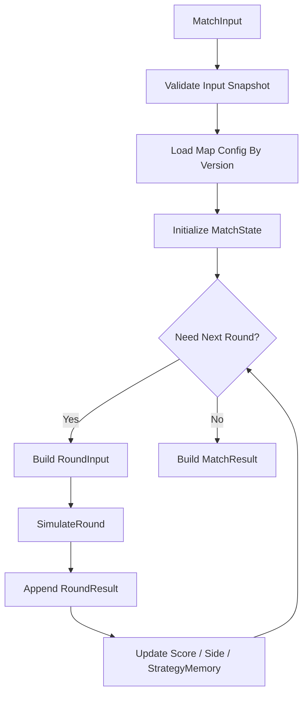
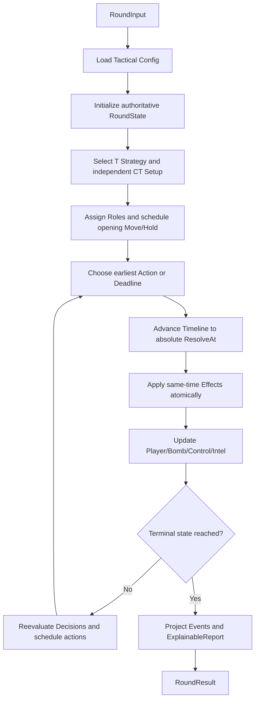

# Dust2 模拟对局设计文档

## 1. 系统概述

### 1.1 目标

构建一套带 `Dust2` 地图语义的数值战斗引擎。

系统不做真实 CS 空间仿真，不模拟逐帧移动、弹道、物理导航网格和连续视野传播。地图、视野、转点与炸弹不是事后叙事标签：它们分别由语义 `MapNode/MapEdge/Route`、可见性与情报、可打断 `ScheduledAction` 以及权威 `BombState` 参与实际结算；场景标签和数值修正只补充这些权威状态，不替代它们。

正式整场对局由 `MatchInput` 驱动，并始终按 RuleSet 推演到比赛终局。单回合测试、调试和批量标定使用内部 `RoundInput/roundSimulator`，但仍执行同一个 causal RoundEngine，不能通过 `MatchInput` 的固定回合数截断正式比赛。每小局由 Match 层派生 `RoundInput`：

```text
MatchInput
  -> InitializeMatchState
  -> BuildRoundInput
  -> SelectTStrategyAndCTSetup
  -> AssignRolesAndOpeningRoutes
  -> RunRoundEventLoop
       -> PlanFromCurrentDecisionView
       -> ScheduleMove/Hold/Encounter/BombActions
       -> AdvanceToEarliestActionOrDeadline
       -> ApplyTimestampBatchAtomically
       -> UpdateDamage/Deaths/Intel/Control/Bomb
       -> ReevaluateDecisionAndTerminal
  -> GenerateExplainableReport
  -> UpdateMatchMemory
  -> MatchResult
```

模拟器输入应由调用方显式传入阵容、选手属性、角色标签、武器配置、地图配置版本、随机种子和规则集。服务端可以在业务层根据玩家拥有的选手或默认配置帮助构造这些入参，但 `matchengine` 不直接读取选手表；它只消费自包含的输入快照，并输出结构化战报。

核心原则：

| 原则 | 说明 |
|---|---|
| 少模拟，多结算 | 只模拟玩家能感知、策划能调参的层级 |
| 地图提供语义 | `Dust2` 定义路线、包点、距离、姿态、常见防守，不作为完整物理世界 |
| 结果可解释 | 每个关键事件输出主因、修正项和分差 |
| 参数可控 | 以胜率、下包率、拆包率、击杀数等目标分布标定 |

### 1.2 设计边界

| 项目 | 第一版范围 |
|---|---|
| 地图 | 仅支持 `Dust2`，使用战术语义模板 |
| 决策 | 全自动 AI 决策 |
| 玩家输入 | 阵容、选手属性、角色标签、武器配置、规则参数或规则集引用 |
| 推演方式 | 服务端一次性算完整回合；可由同一 `MatchInput` 连续推演多回合 |
| 输出 | 第一版展示击杀；后端完整输出事件、时间戳、原因、状态、比分、炸弹和控制权快照 |
| 实时操作 | 不支持 |
| Match Handler | 第一版不使用 |
| 配置方式 | `Scenario`、`Encounter`、`RouteTemplate`、参数表驱动 |

### 1.3 核心抽象

```text
RouteTemplate     Dust2 战术模板
StrategyTemplate  队伍回合策略
Scenario          战斗场景标签集合
Encounter         一次明确参战人员的遭遇战
EncounterStartContext / CombatPulseContext  遭遇战启动上下文与脉冲不可变快照
MapTag            地图语义标签
PlayerProfile     选手静态属性
PlayerState       选手回合状态
MatchInput        整场模拟入参快照
RoundInput        单回合模拟入参快照
MatchState        跨回合状态、比分、半场、战术记忆
RoundPlan         回合计划
RoundState        回合状态
StrategyMemory    跨回合战术倾向与反制记忆
EncounterResolver 遭遇战结算
BombResolver      下包/拆包结算
MatchResult       整场结构化战报
ExplainableReport 可解释战报
EventReason       事件原因

MapNode           正式 Dust2 配置必需的辅助地图节点，用于展示、路线图关系、击杀点采样、包点、控制权和交火范围
MapEdge           正式 Dust2 配置必需的辅助路径标记，用于耗时、风险热点权重和拦截候选标签
Visibility        可选关系模型；正式 Dust2 配置必须覆盖关键视线，用于场景修正
```

---

## 2. 核心机制设计

### 2.1 Dust2 地图模型

`Dust2` 在第一版中不是完整空间图，而是战术语义层。

核心数据优先级：

| 层级 | 用途 | 第一版地位 |
|---|---|---|
| `RouteTemplate` | 定义 Dust2 常见战术模板 | 主模型 |
| `Scenario` | 定义每次结算的场景标签 | 主模型 |
| `Encounter` | 定义参战人员、阶段、权重和输出 | 主模型 |
| `MapTag` | 定义距离、角度、风险、包点等地图语义 | 主模型 |
| `MapNode` | 提供战报位置、路线锚点、可选采样范围、包点和控制区语义；正式 Dust2 配置必需 | 辅助模型 |
| `MapEdge` | 提供转点耗时、风险热点权重、拦截候选标签；正式 Dust2 配置必需 | 辅助模型 |
| `Visibility` | 提供架点、距离、暴露关系修正；单条关系可选，但正式 Dust2 必须覆盖关键视线 | 辅助模型 |

`A大`、`A小`、`B二楼` 是宏观进攻路线。点位图是正式第一版移动可达性、行动耗时、战报坐标、风险热点权重和拦截候选的必需辅助输入；它不替代 RouteTemplate/Scenario，也不升级为连续空间物理仿真。

#### 战术模板

`RouteTemplate` 是 Dust2 的主要配置单元。

| Template ID | 说明 | 常见阶段 |
|---|---|---|
| `A_Long_Rush` | A 大快攻，依赖 Entry、Utility 和同步拉枪 | `OpeningDuel` -> `SiteEntry` |
| `A_Short_Split` | A 小夹 A，依赖中期控制和包点协同 | `MidControl` -> `SiteEntry` |
| `B_Tunnel_Explode` | B 二楼爆弹，依赖近距离突破和道具执行 | `TunnelContact` -> `SiteEntry` |
| `Mid_To_B` | 中路夹 B，依赖信息和 CT 补防误判 | `MidControl` -> `B_Split` |
| `Default_Pick` | 默认控图找首杀，节奏慢，信息收益高 | `OpeningPick` -> `MidRoundDecision` |
| `Fake_A_Go_B` | A 区施压后转 B，依赖纪律和欺骗成功率 | `FakePressure` -> `LateExecute` |

每个模板配置：

| 字段 | 说明 |
|---|---|
| `id` | 模板 ID |
| `map_id` | `de_dust2` |
| `side` | `T` 战术或 `CT` setup |
| `target_site` | `A` / `B` / `None` |
| `recommended_min / recommended_max` | 推荐投入人数范围 |
| `required_roles` | `Entry`、`Support`、`AWPer`、`Lurker` 等 |
| `key_attributes` | 关键属性权重 |
| `route_ids / route_allocations` | 同阵营路线与目标人数分配 |
| `scenario_ids` | 可生成的 `Scenario` 集合 |
| `common_ct_setup_ids` | 常见 CT 防守 setup 模板 ID；只表达赛前先验，不指定本回合实际 CT setup |
| `success_next_phase` | 成功后进入的阶段 |
| `failure_fallbacks` | 失败后允许转点、救包、强攻或保枪 |

#### 核心点位

| Node ID | 名称 | 区域 | 类型 |
|---|---|---|---|
| `T_SPAWN` | 匪家 | T侧 | 起点 |
| `LONG_DOOR` | A大门 | A大 | 通道 |
| `A_LONG` | A大 | A大 | 交火区 |
| `PIT` | 大坑 | A大 | 架点 |
| `A_SITE` | A包点 | A区 | 包点 |
| `MID` | 中路 | 中路 | 枢纽 |
| `CATWALK` | A小 | A小 | 通道 |
| `SHORT` | 小道平台 | A小 | 交火区 |
| `B_UPPER` | B二楼 | B区 | 通道 |
| `B_TUNNEL` | B洞 | B区 | 交火区 |
| `B_SITE` | B包点 | B区 | 包点 |
| `CT_SPAWN` | 警家 | CT侧 | 枢纽 |
| `CT_MID` | 警家中路 | CT侧 | 回防点 |
| `B_DOOR` | B门 | B区 | 回防点 |
| `CAR` | 沙地/车位 | 中路 | 架点 |

#### 点位控制权

每个 `MapNode` 持有控制状态：

| 状态 | 含义 |
|---|---|
| `Unknown` | 未被确认 |
| `TControlled` | T方控制 |
| `CTControlled` | CT方控制 |
| `Contested` | 双方争夺 |
| `EmptyKnown` | 已确认无人 |

控制权由最近一次局部冲突、存活人数、可见威胁点决定。

#### 控制权失效

控制权不是永久信息。每个点位维护 `UpdatedAt` 和 `ObservedBy`。

| 状态 | 失效规则 |
|---|---|
| `Unknown` | 默认状态，不失效 |
| `EmptyKnown` | 若 `ControlIntelTTL` 内无人持续观察，退回 `Unknown` |
| `TControlled` | 若 T 方离开且无人观察，经过 `ControlIntelTTL` 后降级为 `Unknown` |
| `CTControlled` | 若 CT 方离开且无人观察，经过 `ControlIntelTTL` 后降级为 `Unknown` |
| `Contested` | 局部交火结束后必须转为某方控制或 `Unknown` |

真实占领状态和情报状态分离：

```text
ActualControl  // 引擎真实控制权
KnownControlT  // T 方认知
KnownControlCT // CT 方认知
```

AI 决策只能读取本方 `KnownControl`，不能直接读取 `ActualControl`。

### 2.2 地图配置表

第一版配置以战术语义表为主，点位图表为辅。

#### `tb_route_template`

| 字段 | 类型 | 说明 |
|---|---|---|
| `id` | string | 战术模板 ID |
| `map_id` | string | 地图 ID |
| `side` | enum | `T` 表示进攻战术模板，`CT` 表示开局防守 setup 模板 |
| `target_site` | enum | `A` / `B` / `None` |
| `tempo` | enum | `Fast` / `Default` / `Slow` / `Late` |
| `recommended_min` / `recommended_max` | int | 推荐人数范围 |
| `required_roles` | string[] | 关键角色 |
| `key_attributes` | map | 属性权重 |
| `route_ids` | string[] | 本模板允许使用的同阵营 `tb_route`；CT setup SHALL 覆盖完整五人部署 |
| `route_allocations` | map<string,int> | 各路线目标人数；总数必须等于队伍人数并满足 Route min/max |
| `scenario_ids` | string[] | 可生成场景 |
| `map_tag_ids` | string[] | 模板默认地图语义标签 |
| `common_ct_setup_ids` | string[] | 仅 T 模板使用；引用常见 CT setup 作为先验/标定语义，不决定本回合 CT 实际选择 |
| `success_next_phase` | string | 成功后阶段 |
| `failure_fallbacks` | string[] | 失败后候选策略 |

正式 Dust2 除六个 `side=T` 战术模板外，必须配置多个 `side=CT` setup 模板，至少表达 A/B/Mid 的初始覆盖与合法回防入口。CT setup 使用本方阵容、角色、属性、历史 `StrategyMemory` 和独立 `CTSetupSeed` 选择；不得读取本回合 T 已选模板、T Route/Intent 或其他隐藏状态。T 模板中的 `common_ct_setup_ids` 只描述赛前可知的地图先验，可用于 T 模板评分、Scenario 适配和标定，不得把其中某项强制成实际 CT setup。

#### `tb_scenario`

| 字段 | 类型 | 说明 |
|---|---|---|
| `id` | string | 场景 ID |
| `route` | enum | `A_Long` / `A_Short` / `B_Tunnel` / `Mid` / `PostPlant_A` / `PostPlant_B` |
| `phase` | enum | `OpeningDuel` / `MidControl` / `SiteEntry` / `Retake` / `BombResolution` |
| `range` | enum | `Close` / `Mid` / `Long` |
| `site` | enum | `A` / `B` / `None` |
| `tempo` | enum | `FastExecute` / `SlowDefault` / `LowTime` |
| `posture` | enum | `T_Executing` / `CT_Holding` / `CT_Retaking` / `T_PostPlant` |
| `utility_context` | enum | `T_Advantage` / `CT_Advantage` / `Even` / `LowUtility` |
| `map_tag_ids` | string[] | 场景引用的地图语义标签 |
| `base_time_cost` | int | 基础耗时 |
| `base_weight` | int | 场景基础权重 |

#### `tb_map_tag`

`MapTag` 是独立表，不放进 `Visibility`，也不由 `EncounterModifier` 兼任。

职责边界：

| 表 | 职责 |
|---|---|
| `tb_map_tag` | 定义可复用地图语义，如长距离、强架点、包点压力、转点风险 |
| `tb_scenario` | 组合场景标签，引用 `map_tag_ids` |
| `tb_map_node` | 定义地图语义节点，提供默认展示坐标、图关系引用和可选二维区域范围 |
| `tb_visibility` | 仅描述点位之间的可见关系；单条关系可选，但正式 Dust2 配置必须覆盖关键视线 |
| `tb_encounter_modifier` | 定义某个场景下标签和属性如何转成分数 |

| 字段 | 类型 | 说明 |
|---|---|---|
| `id` | string | 标签 ID |
| `map_id` | string | 地图 ID |
| `category` | enum | `Range` / `Angle` / `Site` / `Risk` / `Posture` / `Timing` |
| `value` | string | 标签值，如 `LongRange`、`CT_HoldAngle`、`FastRotateRisk` |
| `side` | enum | `T` / `CT` / `Both` |
| `weight` | int | 默认权重 |
| `reason_code` | string | 默认战报原因码 |
| `description` | string | 说明 |

示例：

| `id` | `category` | `value` | `side` | `weight` |
|---|---|---|---|---:|
| `D2_A_LONG_RANGE` | `Range` | `LongRange` | `Both` | `12` |
| `D2_PIT_HOLD_ANGLE` | `Angle` | `CT_HoldAngle` | `CT` | `10` |
| `D2_B_TUNNEL_CLOSE` | `Range` | `CloseRange` | `Both` | `8` |
| `D2_MID_ROTATE_RISK` | `Risk` | `FastRotateRisk` | `Both` | `7` |

#### `tb_encounter_modifier`

| 字段 | 类型 | 说明 |
|---|---|---|
| `scenario_id` | string | 场景 ID |
| `factor` | string | 修正因子 |
| `side` | enum | `T` / `CT` / `Both` |
| `attribute` | string | 关联属性 |
| `weight` | int | 权重 |
| `reason_code` | string | 战报原因码 |

#### `tb_map_node`

`MapNode` 是地图语义节点。它同时承载默认锚点坐标和可选二维区域范围：`x/y` 是路线、路径、视野和默认展示使用的锚点坐标；当节点配置了 `shape` 时，事件显示坐标可以在该节点自身的区域范围内采样。第一版只使用这一张地图节点表表达点、范围和地点语义，避免“点位”和“区域”在配置心智上分裂。

| 字段 | 类型 | 说明 |
|---|---|---|
| `id` | string | 节点 ID |
| `map_id` | string | 地图 ID |
| `name` | string | 显示名称 |
| `zone` | string | 宏观区域名，例如 `A区` / `B区` / `中路`，不是独立表引用 |
| `site` | enum | `A` / `B` / `None` |
| `node_type` | enum | `Spawn` / `Lane` / `Cover` / `Site` / `Connector` |
| `default_side` | enum | 初始优势方：`T` / `CT` / `Both` / `None` |
| `x` / `y` | float | 雷达图归一化锚点坐标 |
| `floor` | enum | `Ground` / `Upper` / `Ramp` / `Unknown` |
| `area_usages` | string[] | 可选区域用途：`KillSample` / `Plant` / `Control` / `Encounter` / `Sound` / `Risk`；其中 `Risk` 表示赛前配置的风险热点 |
| `shape` | enum | `None` / `Circle` / `Polygon` |
| `radius` | float | 圆形区域半径，雷达图归一化单位；仅 `shape = Circle` 时生效 |
| `points` | string | 多边形顶点列表，格式由导表层统一约定；仅 `shape = Polygon` 时生效 |

规则：

| 场景 | 处理 |
|---|---|
| `shape = None` | 节点只作为路线、路径、视野和默认事件展示锚点使用 |
| `shape = Circle` | 事件显示坐标可在以 `x/y` 为中心、`radius` 为半径的圆形范围内采样 |
| `shape = Polygon` | 事件显示坐标可在 `points` 定义的多边形内部采样；`x/y` 仍作为默认展示中心 |
| `area_usages` 包含 `KillSample` | `KILL` 事件优先从该节点自身区域范围内采样 |
| `area_usages` 不包含 `KillSample` 或区域几何为空 | `KILL` 事件使用 `MapNode.x/y`，允许极小半径偏移 |
| 节点只用于路线/图关系 | `shape` 可以为 `None`，`area_usages` 可以为空 |

采样规则：

```text
if shape == Circle:
    sample point inside circle centered at MapNode.x/y

if shape == Polygon:
    sample point inside polygon

if shape == None:
    use MapNode.x/y with tiny jitter
```

采样必须使用派生 Seed，保证同一输入、同一回合、同一事件生成相同展示坐标。

```text
LocationSeed = Hash(RoundSeed, "event_location", EventID, SourceObjectID)
```

`MapNode` 的区域几何不参与真实空间仿真。它只提供“这个事件在雷达图上应该自然落在哪个范围里”的展示语义，以及包点、控制区、交火区、声音区、风险区等可复用地图语义。

`area_usages` 包含 `Risk` 的节点表示赛前配置的风险热点：设计者基于长期观赛、地图经验和玩法调参，预先标记常见交火、过点、转点受压或暴露位置。风险热点是模拟输入，用于影响概率、权重、AI 决策和事件位置采样候选分布；它不表示某场对局中已经发生的临时事故位置，也不直接强制决定运行时死亡、掉包或拦截坐标。

#### `tb_map_edge`

| 字段 | 类型 | 说明 |
|---|---|---|
| `from_node` | string | 起点，引用 `tb_map_node.id` |
| `to_node` | string | 终点，引用 `tb_map_node.id` |
| `base_time` | int | 基础移动时间 |
| `stamina_cost` | int | 体能消耗 |
| `risk` | int | 转移风险 |
| `noise` | int | 暴露概率 |
| `risk_points` | string[] | 路径关联的预定义风险热点，引用 `tb_map_node.id`，通常要求节点 `area_usages` 包含 `Risk`；用于风险、暴露、交火概率和事件位置采样权重，不直接决定运行时死亡或掉包坐标 |
| `intercept_nodes` | string[] | 可触发中途拦截检查的候选锚点，引用 `tb_map_node.id`；最终事件位置由运行时上下文生成 |
| `bidirectional` | bool | 是否双向 |

#### `tb_visibility`

| 字段 | 类型 | 说明 |
|---|---|---|
| `from_node` | string | 观察点，引用 `tb_map_node.id` |
| `to_node` | string | 被观察点，引用 `tb_map_node.id` |
| `visible` | bool | 是否可见 |
| `range` | enum | `Close` / `Mid` / `Long` |
| `angle_advantage` | enum | `T` / `CT` / `None` |
| `cover_modifier` | int | 掩体修正 |
| `exposure_modifier` | int | 暴露修正 |

#### `tb_route`

| 字段 | 类型 | 说明 |
|---|---|---|
| `id` | string | 路线 ID |
| `name` | string | 显示名称 |
| `side` | enum | `T` / `CT` |
| `target_site` | enum | `A` / `B` / `None` |
| `nodes` | string[] | 路线点位序列 |
| `min_players` | int | 最少人数 |
| `max_players` | int | 最大人数 |
| `style_tags` | string[] | 路线标签 |

#### `tb_combat_const`

`#CombatConst.xlsx` 使用结构化 key-value 表。代码只能通过常量访问层读取，不在逻辑中散落硬编码数值。

| 字段 | 类型 | 说明 |
|---|---|---|
| `key` | string | 常量键，唯一 |
| `category` | enum | `Time` / `Combat` / `Bomb` / `Resource` / `Decision` / `Intel` / `Clamp` / `Calibration` |
| `value_type` | enum | `Int` / `Float` / `Bool` / `String` |
| `value` | string | 原始值，由加载层按 `value_type` 转换 |
| `min_value` | string | 可选下限，用于配置校验 |
| `max_value` | string | 可选上限，用于配置校验 |
| `unit` | string | `s` / `score` / `percent` / `count` / `none` |
| `description` | string | 说明 |

第一版必配常量：

| `key` | `category` | `value_type` | `unit` | 说明 |
|---|---|---|---|---|
| `RoundTimeLimit` | `Time` | `Int` | `s` | 常规回合时长 |
| `BombExplodeTime` | `Bomb` | `Int` | `s` | 下包后爆炸倒计时 |
| `BasePlantTime` | `Bomb` | `Int` | `s` | 基础下包时间 |
| `BaseDefuseTime` | `Bomb` | `Int` | `s` | 基础拆包时间 |
| `BasePickupTime` | `Bomb` | `Int` | `s` | 基础捡包时间 |
| `MinPickupTime` | `Clamp` | `Int` | `s` | 捡包时间下限 |
| `MaxPickupTime` | `Clamp` | `Int` | `s` | 捡包时间上限 |
| `ForceExecuteThreshold` | `Decision` | `Int` | `s` | 低时间强攻阈值 |
| `DecisionDelay` | `Decision` | `Int` | `s` | 决策行动的离散耗时 |
| `MaxDecisionCount` | `Decision` | `Int` | `count` | 单回合最大重新决策次数 |
| `MaxEncounterPulses` | `Combat` | `Int` | `count` | 单次遭遇战最大脉冲数 |
| `MinCombatDuration` | `Combat` | `Int` | `s` | 单次 Encounter 最短持续时间 |
| `MaxCombatDuration` | `Combat` | `Int` | `s` | 单次 Encounter 最长持续时间 |
| `PulseFireWindow` | `Combat` | `Int` | `s` | 单个战斗脉冲覆盖的射击时间窗 |
| `CombatScale` | `Combat` | `Float` | `score` | 战斗分差转概率缩放 |
| `MinDamagePotential` | `Clamp` | `Float` | `percent` | 武器致命潜力下限 |
| `MaxDamagePotential` | `Clamp` | `Float` | `percent` | 武器致命潜力上限 |
| `MinExposureModifier` | `Clamp` | `Float` | `percent` | 暴露修正下限 |
| `MaxExposureModifier` | `Clamp` | `Float` | `percent` | 暴露修正上限 |
| `BaseNoise` | `Decision` | `Float` | `score` | 随机扰动基础值 |
| `MaxRandomNoise` | `Decision` | `Float` | `score` | 随机扰动绝对上限 |
| `CloseScoreGap` | `Decision` | `Float` | `score` | 近似同分阈值 |
| `DecisiveScoreGap` | `Decision` | `Float` | `score` | 明显优势阈值 |
| `DefaultStrategyTemplateID` | `Decision` | `String` | `none` | 开局计划重试仍失败时使用的配置默认模板 ID，第一版指向合法的 `Default_Pick` 配置行 |
| `DefaultCTSetupTemplateID` | `Decision` | `String` | `none` | CT setup 重试仍失败时使用的合法 `side=CT` 配置模板 ID |
| `StrategyRepeatWindow` | `Decision` | `Int` | `round` | 战术重复统计窗口 |
| `RepeatFreeCount` | `Decision` | `Int` | `round` | 允许无惩罚连续使用同战术次数 |
| `StrategyRepeatPenalty` | `Decision` | `Float` | `score` | 同路线/模板连续使用惩罚 |
| `SuccessBonusPerRound` | `Decision` | `Float` | `score` | 最近同战术成功奖励 |
| `MaxPreviousSuccessBonus` | `Clamp` | `Float` | `score` | 最近成功奖励上限 |
| `CounterMemoryBonus` | `Decision` | `Float` | `score` | CT 针对重复战术的反制加成 |
| `MinStrategyWeight` | `Clamp` | `Float` | `score` | 战术候选权重下限 |
| `MaxStrategyWeight` | `Clamp` | `Float` | `score` | 战术候选权重上限 |
| `ControlIntelTTL` | `Intel` | `Int` | `s` | 控制权情报有效时间 |
| `CommunicationDelay` | `Intel` | `Int` | `s` | 队内情报传播延迟预留字段；第一版必须配置为 `0`，表示即时共享 |
| `SoundIntelMinConfidence` | `Intel` | `Int` | `percent` | 真实声音区域情报置信度下限，第一版为 `30` |
| `SoundIntelMaxConfidence` | `Intel` | `Int` | `percent` | 真实声音区域情报置信度上限，第一版为 `70` |
| `DeathIntelMaxConfidence` | `Intel` | `Int` | `percent` | 观察者死亡瞬间情报置信度上限，第一版不超过 `70` |
| `MinIntelTTL` | `Intel` | `Int` | `s` | 情报 TTL 下限 |
| `MaxIntelTTL` | `Intel` | `Int` | `s` | 情报 TTL 上限 |
| `UtilityBudget` | `Resource` | `Int` | `score` | 每队每回合可用于抽象道具行动的预算 |
| `MaxStateTransitions` | `Clamp` | `Int` | `count` | 单回合状态转换上限 |
| `MaxScheduledActions` | `Clamp` | `Int` | `count` | 单回合调度行动上限 |
| `MaxEffectsPerTimestamp` | `Clamp` | `Int` | `count` | 单时间戳 Effect 上限 |
| `MaxNoOpTransitions` | `Clamp` | `Int` | `count` | 进入恢复与无进展检查前允许的连续 NoOp 数 |
| `MaxRotationsPerTeam` | `Clamp` | `Int` | `count` | 单队主动转点上限 |
| `MaxRoundTimeline` | `Clamp` | `Int` | `s` | 单回合绝对时间线上限 |
| `MinAttribute` | `Clamp` | `Int` | `score` | 输入属性下限 |
| `MaxAttribute` | `Clamp` | `Int` | `score` | 输入属性上限 |
| `MinHP` | `Clamp` | `Int` | `score` | HP 下限 |
| `MaxHP` | `Clamp` | `Int` | `score` | HP 上限 |
| `MinStamina` | `Clamp` | `Int` | `score` | 体能下限 |
| `MaxStamina` | `Clamp` | `Int` | `score` | 体能上限 |
| `MinFocus` | `Clamp` | `Int` | `score` | 专注下限 |
| `MaxFocus` | `Clamp` | `Int` | `score` | 专注上限 |
| `MinHitChance` | `Clamp` | `Float` | `percent` | 命中率下限 |
| `MaxHitChance` | `Clamp` | `Float` | `percent` | 命中率上限 |
| `MaxKillChance` | `Clamp` | `Float` | `percent` | 击杀率上限 |
| `MinPlantTime` | `Clamp` | `Int` | `s` | 下包时间下限 |
| `MaxPlantTime` | `Clamp` | `Int` | `s` | 下包时间上限 |
| `MinDefuseTime` | `Clamp` | `Int` | `s` | 拆包时间下限 |
| `MaxDefuseTime` | `Clamp` | `Int` | `s` | 拆包时间上限 |
| `MinMoveTime` | `Clamp` | `Int` | `s` | 移动耗时下限 |
| `MaxMoveTime` | `Clamp` | `Int` | `s` | 移动耗时上限 |

上述 key 是正式第一版的完整必配库存；场景族十属性权重和具体 Scenario 修正可以存放在 `EncounterModifier`，其余公式、调度、Clamp 和终局所需数值不得依赖未命名代码默认值。新增必配 key 必须先修订本表、Luban 表源和配置校验，再进入引擎实现。

### 2.3 回合资源模型

使用三个资源：

| 资源 | 作用 |
|---|---|
| `RoundTime` | 全局回合时间，限制下包和拆包 |
| `Stamina` | 个人体能，限制移动和连续交火 |
| `Focus` | 个人专注，影响命中、决策、残局稳定性 |

#### 时间与状态机

`RoundTime` 不作为独立业务逻辑到处判断。回合状态机持有统一时钟，并在状态切换时决定当前启用哪一个时间约束。

| 概念 | 作用 | 生效阶段 |
|---|---|---|
| `Timeline` | 事件时间轴，从回合开始累计，用于战报时间戳 | 全阶段 |
| `RoundTimer` | 常规回合倒计时，限制 T 方完成下包 | 下包前 |
| `BombTimer` | 炸弹倒计时，限制 CT 方完成拆包 | 下包后 |

状态机只维护一个递增的 `Timeline`。resolver/planner 可以计算行动 `Duration`，但不得通过“阶段返回耗时”阻塞整个回合；scheduler 将它冻结为 `ResolveAt = StartAt + Duration`，并只推进到全局最早的有效 action 或 deadline。

```text
nextAt = min(NextValidAction.ResolveAt, ActiveRoundDeadline, ActiveBombDeadline)
Timeline = nextAt
RoundTimer = max(0, RoundDeadline - Timeline)  // 仅下包前投影
BombTimer  = max(0, BombDeadline - Timeline)   // 仅下包后投影
```

`RoundTimer` 和 `BombTimer` 不同时作为胜负条件生效。下包成功后，`RoundTimer` 失效，`BombTimer` 初始化为配置值，例如 `40s`。

```text
PlantSuccess:
    Phase = PostPlant
    Bomb.Status = Planted
    Bomb.PlantedAt = Timeline
    Bomb.ExplodeAt = Timeline + BombExplodeTime
    BombDeadline = Bomb.ExplodeAt
    BombTimer = max(0, BombDeadline - Timeline)
```

下包前时间耗尽，CT 以 `TIME_EXPIRED` 获胜。下包后即使 `RoundTimer` 已小于等于 0，也只检查 `BombTimer`。

#### 资源消耗

| 行为 | 消耗 |
|---|---|
| 移动 | `RoundTime + Stamina` |
| 快速转点 | 更多 `Stamina`，更少 `RoundTime` |
| 慢速推进 | 更多 `RoundTime`，更少暴露 |
| 交火 | `Stamina + Focus` |
| 受伤 | `HP` 降低，`Focus` 波动 |
| 连续击杀 | `Focus` 上升，`Stamina` 下降 |
| 被首杀 | 队伍 `Momentum` 下降 |
| 下包/拆包 | `RoundTime + Focus` 判定 |

#### 数值边界

所有运行时数值必须 clamp。

| 字段 | 范围 | 说明 |
|---|---:|---|
| `HP` | `0..100` | 归零即死亡 |
| `Stamina` | `0..MaxStamina` | 不允许负数 |
| `Focus` | `0..MaxFocus` | 不允许负数 |
| `Momentum` | `-100..100` | 防止滚雪球失控 |
| `HitChance` | `MinHitChance..MaxHitChance` | 保留随机波动 |
| `KillChance` | `0..MaxKillChance` | 防止必杀 |
| `PlantTime` | `MinPlantTime..MaxPlantTime` | 修正后不得小于最小值 |
| `DefuseTime` | `MinDefuseTime..MaxDefuseTime` | 修正后不得小于最小值 |
| `MoveTime` | `MinMoveTime..MaxMoveTime` | 防止瞬移 |

推荐默认值：

```text
MinPlantTime = 3s
MinDefuseTime = 5s
MinMoveTime = 1s
MinHitChance = 0.05
MaxHitChance = 0.95
MaxKillChance = 0.85
```

### 2.4 选手属性

第一版属性如下：

| 属性 | 说明 |
|---|---|
| `Aim` | 正面对枪能力 |
| `Reaction` | 遭遇战反应 |
| `Positioning` | 站位、架点、规避暴露 |
| `Awareness` | 信息判断、转点、补防 |
| `Teamplay` | 协同推进、补枪覆盖 |
| `Utility` | 道具执行质量抽象 |
| `Composure` | 残局、下包、拆包稳定性 |
| `Mobility` | 移动和转点效率 |
| `Endurance` | 体能上限和抗疲劳 |
| `Discipline` | 战术纪律和执行稳定性 |

角色标签作为场景修正：

| 标签 | 主要影响 |
|---|---|
| `Entry` | 首轮突破、主动拉枪 |
| `Lurker` | 单走、断后、截回防、信息获取 |
| `AWPer` | 长距离视野威胁 |
| `IGL` | 队伍决策质量 |
| `Anchor` | 守点、防守稳定性 |
| `Support` | 团队修正、执行质量 |

#### 属性来源

作为模拟器，选手数值应以 `MatchInput` 中的 `PlayerProfile` 为准，而不是由 `matchengine` 在运行时读取 `TbPlayer`。

推荐职责边界：

| 层 | 职责 |
|---|---|
| 前端 / 调用方 | 允许用户输入或选择选手属性、角色标签、武器配置 |
| `match.Service` | 可从 Luban 表、玩家存档或默认模板构造 `MatchInput`，并负责校验 |
| `matchengine` | 不依赖 `config` 包，不查询选手表，只消费入参快照 |
| Luban `TbPlayer` | 作为默认选手库、展示数据和快速构造入参的来源，不是模拟时的隐式依赖 |

这样做的好处：

| 目标 | 说明 |
|---|---|
| 可测试 | 单测可以直接构造属性，不需要加载完整配置表 |
| 可回放 | 同一 `MatchInput + config_version + seed` 能复现结果 |
| 可调参 | 前端可以做自定义阵容、极端属性、A/B 标定 |
| 解耦 | 以后接玩家养成、临时 buff、伤病、疲劳时不需要改引擎读取逻辑 |

约束：

```text
PlayerProfile in MatchInput is authoritative.
PlayerID can reference config/default roster.
Engine never mutates PlayerProfile.
Runtime state changes only happen on PlayerState.
```

#### Utility 作用边界

`Utility` 是道具执行能力，不是全局战力光环。

每队每回合拥有有限 `UtilityBudget`，由队伍战术和选手 `Utility` 属性共同决定。使用后消耗，不能在每场交火中无限生效。

| 作用 | 说明 |
|---|---|
| 视野压制 | 降低敌方 `Visibility` 或缩短威胁边持续时间 |
| 先手修正 | 帮助进攻方抵消架点优势 |
| 暴露控制 | 降低移动、下包、转点时的 `Exposure` |
| 执行同步 | 提高 `SyncPeek` 和多人进点质量 |
| 拆包掩护 | CT 可消耗 Utility 降低被干扰概率 |

禁止用法：

```text
Utility 不直接全局增加 CombatScore
Utility 不跨局部战场无限复用
Utility 不绕过 Scenario / MapTag / Stamina 规则
```

`Support` 标签可以提高 Utility 的使用效率，但不能额外生成无限资源。

### 2.5 团战结算

局部交火不拆成单挑，使用小队团战模型。

第一版团战由 `Encounter` 驱动，不由 `Visibility` 图搜索自动生成。

`Encounter` 表示一次可解释的战斗结算：

```text
Encounter =
  Route
+ Phase
+ Range
+ Site
+ Tempo
+ Posture
+ UtilityContext
+ Participants
```

典型场景：

| Scenario | 含义 |
|---|---|
| `A_Long / OpeningDuel / LongRange / FastExecute / CT_Holding` | A 大快攻撞 CT 架点 |
| `B_Tunnel / SiteEntry / CloseRange / SlowDefault / T_UtilityAdvantage` | B 洞慢摸后爆弹 |
| `Mid_To_B / MidControl / MidRange / Default / Contested` | 中路控制权争夺 |
| `PostPlant_A / Retake / MidRange / LowTime / CT_NoKit` | A 包点低时间回防 |

`EncounterResolver` 的职责：

1. 根据 `RoundPlan` 和当前局势确定参战人员。
2. 根据 `Scenario` 标签读取修正项。
3. 计算双方 `EncounterScore`。
4. 在 Encounter 启动时只确定 `CombatDuration`、pulse 数量/绝对时间并安排 future action，不预生成未来伤亡。
5. 每个 `CombatPulse` 到时根据当时不可变快照生成 Damage/Resource Effect，提交后再派生击杀、控制结果和中断。
6. 输出 `ReasonRecord`，由已成功应用的 Effect 投影为 `EventReason`。

#### 交火触发条件

```text
双方存在存活选手
AND AI 生成了同一阶段的 Encounter
AND Encounter 中双方均有可参战人员
AND Scenario 允许本阶段发生交火
```

#### 团战输入

| 输入 | 说明 |
|---|---|
| `attackers` | 当前局部 T 选手 |
| `defenders` | 当前局部 CT 选手 |
| `scenario` | `Route + Phase + Range + Site + Tempo + Posture + UtilityContext` |
| `routeTemplate` | 当前战术模板 |
| `mapTags` | 距离、包点、架点、风险热点等 Dust2 标签 |
| `control` | 当前区域控制结果或认知 |
| `roundState` | 当前时间、炸弹、局势 |

#### 团队修正值

`TeamModifier` 是局部战斗环境对整队的修正。

| 修正项 | 来源 |
|---|---|
| 人数优势 | 当前可参战人数 |
| 架点优势 | `Scenario.posture` + `MapTag.angle_advantage` |
| 执行质量 | `Scenario` + `Utility` + `Discipline` + 角色匹配度 |
| 补枪覆盖 | `Teamplay` + 人数密度 |
| 交叉火力 | `Scenario.crossfire` 或 CT 防守模板 |
| 疲劳惩罚 | 平均 `Stamina` |
| 专注波动 | 平均 `Focus` |
| 控制权优势 | 当前区域控制结果 |

#### 遭遇战评分

`EncounterScore` 是队伍在当前场景中的结算分。

```text
EncounterScore =
    Sum(PlayerCombatScore * RoleWeight)
  + TeamModifier
  + ScenarioModifier
  + UtilityModifier
  + MomentumModifier
  + TimePressureModifier
  + RandomNoise
```

`DeterministicEncounterScore` 使用同一公式但不包含 `RandomNoise`。`EncounterScore` 用于主动权、姿态、脉冲数量/时长、撤退倾向和战报解释，不直接设置 Encounter 胜方、目标存活人数或伤亡表。若确定性分差达到 `DecisiveScoreGap`，只能裁剪 RandomNoise 使评分顺序不翻转；每个 CombatPulse 的命中和伤害采样仍完整执行，因此强势方更稳定但仍允许实际概率链产生爆冷。

第一版默认公式冻结为可测试的线性组合，所有权重来自 `CombatConst` 或 `EncounterModifier`，但代码中的计算顺序固定。

```text
WeightedPlayerScore =
    Aim * W_Aim
  + Reaction * W_Reaction
  + Positioning * W_Positioning
  + Awareness * W_Awareness
  + Teamplay * W_Teamplay
  + Utility * W_Utility
  + Composure * W_Composure
  + Mobility * W_Mobility
  + Endurance * W_Endurance
  + Discipline * W_Discipline

PlayerCombatScore =
    WeightedPlayerScore
  + RoleTagModifier
  + WeaponModifier
  + PostureModifier
  + VisibilityModifier
  + TeamSupportModifier
  - StaminaPenalty
  - DamagePenalty
  - SuppressionPenalty
```

推荐第一版基础权重：

| 场景族 | Aim | Reaction | Positioning | Awareness | Teamplay | Utility | Composure | Mobility | Endurance | Discipline |
|---|---:|---:|---:|---:|---:|---:|---:|---:|---:|---:|
| `OpeningDuel` | 0.28 | 0.24 | 0.18 | 0.08 | 0.08 | 0.06 | 0.04 | 0.02 | 0.01 | 0.01 |
| `FastExecute` / `SiteEntry` | 0.20 | 0.18 | 0.10 | 0.06 | 0.18 | 0.16 | 0.06 | 0.03 | 0.01 | 0.02 |
| `SlowDefault` / `MidControl` | 0.16 | 0.12 | 0.14 | 0.22 | 0.12 | 0.08 | 0.06 | 0.03 | 0.02 | 0.05 |
| `Retake` / `PostPlant` | 0.18 | 0.16 | 0.14 | 0.14 | 0.14 | 0.08 | 0.12 | 0.01 | 0.01 | 0.02 |

权重规则：

| 规则 | 说明 |
|---|---|
| 权重和 | 每个场景族基础属性权重之和必须为 `1.0` |
| 属性范围 | 输入属性建议 `0..100`，加载时 clamp 到 `MinAttribute..MaxAttribute` |
| 修正项范围 | 单个 modifier 建议不超过 `±25`，团队总修正建议 clamp 到 `-60..60` |
| 随机扰动 | `RandomNoise` 绝对值不得超过 `MaxRandomNoise` |
| 明显优势保护 | 若确定性分差 `abs(delta) >= DecisiveScoreGap`，有界 `RandomNoise` 不得把评分高低关系翻转；后续命中与伤害采样仍允许小概率爆冷，不得据此预定 Encounter 胜方 |

场景标签直接决定哪些属性重要：

| 标签 | 主要属性 | 典型解释 |
|---|---|---|
| `LongRange` | `Aim`、`Reaction`、`AWP`、`Positioning` | 长距离架点压制 |
| `CloseRange` | `Entry`、`Reaction`、`Composure` | 近点突破和补枪 |
| `FastExecute` | `Entry`、`Teamplay`、`Utility`、`Discipline` | 快攻执行质量 |
| `SlowDefault` | `Awareness`、`Discipline`、`Lurker` | 控图和信息判断 |
| `CT_Holding` | `Positioning`、`Reaction`、`Composure` | 架点方先手 |
| `LowTime` | `Composure`、`Discipline` | 低时间决策稳定性 |

#### 职业对枪模型

团战结算采用“遭遇战 + 少量交火脉冲”的模型。

不做逐个 `1v1 duel`，也不做完整真实战场。一次 `Encounter` 可拆成少量 `CombatPulse`，用于表现补枪、首杀后的 Momentum、伤害和撤退窗口。第一版建议 `1-3` 个脉冲。

```text
CombatStart
  -> BuildEncounter
  -> ResolvePulse #1
  -> UpdateHP / Focus / Stamina / EncounterScore
  -> ResolvePulse #2
  -> UpdateHP / Focus / Stamina / Momentum
  -> ResolvePulse #3
  -> EndCombat
```

#### 局部战场构建

`EngagementGraph` 是高级扩展，不是第一版主路径。

第一版由 `RoundPlan` 和 `Scenario` 直接生成 `Encounter`。只有当后续需要更细的局部空间表达时，才使用 `EngagementGraph` 作为 `Encounter` 内部的辅助模型。

局部战场由 `EngagementGraph` 生成时，不直接使用完整 `Visibility` 连通图。

`Visibility` 只表示理论视野。`EngagementGraph` 只纳入当前存在主动威胁的边，避免 A 大、A 小、中路因为视野链路被合并成一个过大的团战。

```go
type EngagementGraph struct {
    EngagementID string
    Nodes        []string
    Actors       []*PlayerState
    ThreatEdges  []ThreatEdge
    Control      map[string]string
}

type ThreatEdge struct {
    FromNode    string
    ToNode      string
    ObserverID  string
    TargetID    string
    Directional bool
    Distance    string
    Exposure    int
    Cover       int
    Active      bool
}
```

主动威胁边需要同时满足：

```text
Visibility.visible == true
AND observer.Alive == true
AND target.Alive == true
AND target 当前处于可暴露状态
AND observer 姿态允许开火或压制
AND 距离/遮挡未超过武器与点位限制
```

`Visibility` 必须支持单向/双向。A 点能看 B 点，不代表 B 点一定能有效反打 A 点。

合并规则：

| 规则 | 说明 |
|---|---|
| 仅合并 `ActiveThreatEdge` 关联点位 | 不通过纯 visibility 链式扩散 |
| `MaxEngagementDepth` | 默认 `1`，最多向外传播一层主动威胁 |
| `MaxEngagementRadius` | 超出物理范围的点位不合并 |
| `MaxActorsPerEngagement` | 防止半张地图进入同一战场 |
| 玩家锁定 | 同一名选手同一时间只能属于一个 `EngagementGraph` |
| 重叠战场 | 选择威胁分最高的战场，其他战场等待下一事件 |

例子：

```text
A_LONG / LONG_DOOR / PIT
```

如果 `PIT` 正在架 `A_LONG`，且 T 正在从 `LONG_DOOR` 暴露进入 `A_LONG`，这些点位会形成一个 `EngagementGraph`。

但如果 `A_LONG -> MID -> CATWALK` 只是 visibility 图上连通，中路当前没有主动威胁边，则不会把 A 大和 A 小合并。

#### 选手战斗姿态

每名参战选手在交火开始时确定 `CombatPosture`。

| 姿态 | 说明 | 特点 |
|---|---|---|
| `Holding` | 架点、预瞄、等待敌人进入视野 | 先手高，暴露低 |
| `Peeking` | 小身位试探 | 风险中，信息收益高 |
| `Swinging` | 主动拉枪或多人同步拉 | 风险高，压制强 |
| `Moving` | 转点或推进中被看见 | 先手低，暴露高 |
| `Planting` | 下包中 | 无法正常对枪 |
| `FallingBack` | 撤退中 | 命中低，存活优先 |

架点方默认有优势，但不是绝对优势。T 方可以通过人数、执行质量、同步拉枪和道具抽象值抵消。

#### 单个选手战斗评分

每个脉冲中使用前文唯一冻结的 `PlayerCombatScore` 作为攻击方 `CombatScore`，不得再计算第二套分数：

```text
CombatScore = PlayerCombatScore

PlayerCombatScore =
    WeightedPlayerScore
  + RoleTagModifier
  + WeaponModifier
  + PostureModifier
  + VisibilityModifier
  + TeamSupportModifier
  - StaminaPenalty
  - DamagePenalty
  - SuppressionPenalty
```

`UtilityModifier`、`MomentumModifier` 和 `TimePressureModifier` 只在团队级 `EncounterScore` 中各计算一次，用于主动权、姿态、脉冲数量/时长和撤退倾向；它们不得再次直接加入 `PlayerCombatScore`，否则会重复计算团队局势。具体道具或节奏造成的可观察姿态、视野、协同变化，可以通过相应单项 modifier 间接影响本 pulse，但同一原因不得在两个层级重复计分。

| 项 | 说明 |
|---|---|
| `WeightedPlayerScore` | 根据当前场景族十属性归一化权重计算的个人基础能力 |
| `RoleTagModifier` | 当前角色与场景标签的匹配修正 |
| `WeaponModifier` | 武器与当前距离/场景的适配修正 |
| `PostureModifier` | 架点、移动、下包、撤退等姿态修正 |
| `VisibilityModifier` | 视野距离、角度优势、掩体、暴露面积 |
| `TeamSupportModifier` | 队友补枪覆盖、交叉火力 |
| `StaminaPenalty` | 体能不足导致反应和控枪下降 |
| `DamagePenalty` | 已受伤影响稳定性 |
| `SuppressionPenalty` | 被压制时命中和决策下降 |

#### 团队协同

职业队对枪的核心不是单人属性，而是站位和协同。团队协同不直接制造击杀，而是修正每个脉冲里的命中、存活和补枪概率。

| 协同项 | 触发条件 | 效果 |
|---|---|---|
| `TradeCoverage` | 队友能看见同一威胁点 | 队友死亡后，同脉冲或下一脉冲反击概率提升 |
| `Crossfire` | 两个以上角度覆盖同一敌人 | 目标生存率下降 |
| `Spacing` | 队员距离合理，不重叠暴露 | 降低被一波多杀概率 |
| `SyncPeek` | 多名 T 同时拉同一架点 | 抵消 CT 架点先手 |
| `Isolation` | 单人脱节，无队友补枪线 | 被击杀后无反制 |
| `Discipline` | 队伍执行稳定 | 降低无意义暴露和错误撤退 |

这部分就是“补枪概率高一些”的具体实现。系统不需要硬编码 `TRADE_KILL`，只要在同一个 `Encounter` 里提升队友的反击概率即可。

#### 脉冲结算

每个 `CombatPulse` 执行以下步骤：

1. 根据姿态和视野确定每名选手可攻击目标。
2. 根据 `CombatScore` 和目标 `SurvivalScore` 计算命中/击杀概率。
3. 从 `PulseSeed` 按 `ActorID/TargetID/RollKind` 派生独立 `ActorRollSeed`，完成目标、命中、致命伤害包及其他随机采样。
4. 基于 pulse 开始快照生成全部 `Effect`，再原子应用伤害、压制、Focus 波动和 Stamina 消耗，并由应用后的 HP 派生死亡与击杀。
5. 根据实际击杀和受伤结果调整下一脉冲的 `Momentum` 和姿态。

同一 `CombatPulse` 是一个原子战斗事务。所有在 pulse 开始快照中具备攻击资格的选手先完成目标选择、命中和伤害采样，再统一应用全部 `DamageEffect`；随后从应用后的 HP 派生死亡、`KILL`、`BOMB_DROP`、打断和控制权变化。某名选手在同一 pulse 中被击杀，不会取消其已经基于 pulse 快照形成的攻击。只有 CombatPulse 事务完成后，状态机才重新校验同秒的下包、拆包和移动等较低优先级行动。

```text
HitChance = sigmoid((CombatScore - TargetSurvivalScore) / Scale)
KillChance = min(HitChance * DamagePotential * ExposureModifier, HitChance)
```

第一版概率公式必须显式 clamp：

```text
RawHitChance = sigmoid((CombatScore - TargetSurvivalScore) / CombatScale)
HitChance = clamp(RawHitChance, MinHitChance, MaxHitChance)

RawKillChance = HitChance * DamagePotential * ExposureModifier
KillChance = clamp(min(RawKillChance, HitChance), 0, MaxKillChance)
```

`DamagePotential` 与武器配置绑定，取值建议 `0.20..1.20`；`ExposureModifier` 由姿态、掩体和移动状态决定，取值建议 `0.50..1.50`。`KillChance` 不得大于 `HitChance`，也不额外乘以 `TargetHPFactor`；低 HP 更容易死亡由实际伤害扣减自然体现。公式单测必须覆盖最小命中、最大命中、最大击杀率和极端分差不会产生 `0%` 或 `100%` 必然结果。

`TargetSurvivalScore`：

```text
TargetSurvivalScore =
    Positioning
  + Reaction
  + CoverModifier
  + TeamSupportModifier
  + Focus
  - MovementExposure
  - DamagePenalty
```

这是第一版唯一冻结的生存分公式。`SuppressionPenalty` 已经降低攻击方 `PlayerCombatScore`，不得又从 `TargetSurvivalScore` 扣除；若未来要改变其因果语义，必须先修订设计、配置键和 golden tests。

#### 伤害与击杀

第一版保留 `HP`，但前端可以只展示 `KILL`。

| 结果 | 状态影响 |
|---|---|
| 未命中 | 消耗少量 `Focus` |
| 命中未击杀 | 扣 `HP`，降低 `Focus`，可能触发撤退 |
| 重伤 | 标记 `Suppressed`，移动和对枪下降 |
| 击杀 | 生成 `KILL`，更新人数、控制权、Momentum |

受伤选手不会只是“血少”。AI 决策会把低 `HP`、低 `Focus`、低 `Stamina` 视为继续强打的风险。

#### 首杀与 Momentum

首杀不单独提前判定。它只是某个脉冲自然产生的第一条 `KILL`。

首杀出现后，更新局部 `Momentum`：

| 影响 | 说明 |
|---|---|
| 首杀方 | `Focus` 小幅上升，继续推进评分上升 |
| 被首杀方 | `Focus` 下降，撤退/补防/保守评分上升 |
| 补枪覆盖好的一方 | 可抵消部分负面 `Momentum` |

这样能体现首杀价值，但不会让首杀成为独立抽奖。

#### 团战结束条件

一次局部交火在以下任一条件满足时结束：

| 条件 | 说明 |
|---|---|
| 一方局部选手全灭 | 点位控制权转移 |
| 一方撤退成功 | 生成撤退或转点决策 |
| 双方失去视野 | 交火中断 |
| 达到 `MaxEncounterPulses` | 避免单次交火无限拉长 |
| `CombatDuration` 达到上限 | 进入局势重评估 |

团战结束后，状态机立即触发局势评估。T 方可能继续推进、转点或强攻；CT 方可能补防、回撤或重防。

#### 结算结果

Encounter 不再一次性返回完整伤亡表、权威状态或阻塞性的 `TimeCost`。`Start` 只调度未来 `CombatPulse/EncounterEnd`；每个 pulse 到达自己的 `ResolveAt` 时只返回待事务应用的 Effect：

```go
type CombatPulseResult struct {
    Effects       []Effect
    ReasonRecords []ReasonRecord
}
```

公开事件、控制权、Momentum、炸弹掉落和最终玩家状态全部由成功应用的 Effect 及其派生 Effect 投影，resolver 不得直接写入权威 `RoundState`。

可能事件：

| 事件 | 说明 |
|---|---|
| `KILL` | 击杀 |
| `DAMAGE` | 受伤，第一版可不展示 |
| `CONTROL_GAINED` | 点位控制变化 |
| `BOMB_DROP` | 炸弹掉落 |
| `BOMB_PICKUP` | 炸弹拾取 |

### 2.6 AI 决策

所有战术行为由 AI 自动执行。

#### T 方决策

| 决策 | 输入 |
|---|---|
| 开局路线分配 | 阵容、选手标签、地图路线、随机种子 |
| 是否继续推进 | 伤亡、信息、控制权、剩余时间 |
| 是否转点 | 当前路线受阻、目标包点压力、Bomb 位置 |
| 谁转点 | 体能、位置、角色、Bomb 持有人 |
| 是否强攻 | 剩余时间不足、人数优势、包点距离 |
| Lurker 行为 | 信息缺口、截回防价值、单走风险 |

#### CT 方决策

| 决策 | 输入 |
|---|---|
| 开局防守选位 | 阵容、地图默认站位、选手标签、随机种子 |
| 是否补防 | 已知 T 压力、包点风险、剩余人数 |
| 谁补防 | 距离、体能、当前位置、角色 |
| 是否重防 | 信息可信度、局势评分、随机扰动 |
| 是否拦截转点 | 可见关系、路径风险、选手位置 |
| 是否尝试拆包 | 剩余爆炸时间、存活人数、Focus、Composure |

#### 决策公式

```text
DecisionScore =
    SituationScore
  + PlayerRoleBias
  + TacticalContextScore
  + MatchMemoryModifier
  + RandomNoise
```

`RandomNoise` 受 `Discipline`、`IGL`、`Awareness` 约束。纪律、指挥和局势感知越高，随机波动越小。若不含随机项的候选分差达到 `DecisiveScoreGap`，噪声不得翻转候选评分顺序；这只保护决策趋势，不预定后续 Encounter 或回合胜方。

#### 跨回合战术记忆

多回合模拟需要保留“战术连续性”和“对手适应”，但不应该让引擎变成脚本系统。第一版建议把跨回合逻辑只接入战术选择评分，不直接改写团战结算公式。

`MatchState` 维护最近若干小局的摘要：

```go
type StrategyMemory struct {
    RecentRounds []RoundMemory
    TeamStats    map[string]TeamRoundStats
}

type RoundMemory struct {
    RoundNumber        int
    SideTTeamID        string
    StrategyTemplateID string
    RouteTemplateID    string
    TargetSite         string
    Tempo              string
    Winner             string
    WinReason          string
    OpeningKillsT      int
    OpeningKillsCT     int
    Planted            bool
}

type TeamRoundStats struct {
    RecentRouteUse     map[string]int
    RecentTemplateUse  map[string]int
    RecentTargetSiteUse map[string]int
    RecentWinsByTemplate map[string]int
}
```

战术选择时增加记忆修正：

```text
StrategyScore =
    TemplateBaseWeight
  + LineupFitScore
  + CurrentScorePressure
  + PreviousSuccessBonus
  - RepeatPenalty
  - CounterReadRisk
  + RandomNoise
```

| 修正项 | 计算建议 |
|---|---|
| `PreviousSuccessBonus` | 最近 `StrategyRepeatWindow` 内同模板胜利次数 * `SuccessBonusPerRound`，上限 `MaxPreviousSuccessBonus` |
| `RepeatPenalty` | 同队连续使用同 `RouteTemplateID` 次数超过 `RepeatFreeCount` 后累加 |
| `CounterReadRisk` | 对手最近被同路线攻击次数 * `CounterMemoryBonus`，受对手 `Awareness/IGL` 影响 |
| `CurrentScorePressure` | 落后方更愿意选择高方差模板，领先方更偏向稳定模板 |
| `LineupFitScore` | 模板关键角色与当前阵容匹配度 |

例子：T 方连续 5 个小局都执行 `B_Tunnel_Explode`：

```text
Round 1-2:
  B_Tunnel_Explode 获得正常模板权重，若成功可获得少量 PreviousSuccessBonus

Round 3-5:
  RepeatPenalty 开始累加，CT 的 CounterReadRisk 同时上升

Round 6:
  若 B 连续成功但分差仍明显，AI 仍可能继续打 B
  若 B 成功率下降、首杀劣势或 CT 重防 B，A_Short_Split / Fake_A_Go_B / Default_Pick 的评分应超过 B_Tunnel_Explode
```

这不是强制“第 6 局必须换战术”，而是让换战术成为评分自然结果。这样既能出现“头铁继续 RushB”的风格，也能让高 `Awareness/Discipline/IGL` 的队伍更早调整。

跨回合记忆边界：

| 边界 | 规则 |
|---|---|
| 影响范围 | 只影响 `SelectStrategyTemplate`、CT 开局防守倾向、补防初始权重 |
| 不影响 | 不直接修改 `Aim/Reaction` 等选手基础属性 |
| 半场切换 | 角色互换后清空或衰减阵营相关记忆，保留队伍风格记忆 |
| 可回放 | `StrategyMemory` 来自前序 `RoundResult`，同一 `MatchInput + seed` 必须稳定 |
| 前端解释 | 当记忆修正实际影响战术选择时，后端输出 `STRATEGY_ADJUSTED`，并在 `ROUND_START.Reason` 中保留对应评分输入；前端第一版可以不展示 |

#### 信息模型

AI 不允许读取全图真实信息。每方维护独立 `TeamIntel`。

```go
type TeamIntel struct {
    Records      []IntelRecord
    KnownEnemies map[string]IntelRecord
    KnownControl map[string]IntelRecord
    SoundCues    []IntelRecord
    BombIntel    IntelRecord
}

type IntelRecord struct {
    Type       string
    TargetID   string
    NodeID     string
    Source     string
    Confidence int
    ObservedBy []string
    LastSeenAt int
    ExpiresAt  int
}
```

情报来源：

| 来源 | 内容 | 可信度 |
|---|---|---|
| 直接视野 | 敌人位置、人数、状态 | 高 |
| 交火事件 | 敌人大致点位、人数压力 | 中高 |
| 声音线索 | 脚步、换弹、下包、掉包 | 中 |
| 自由人信息 | 空点、转点路线、截回防 | 取决于 `Awareness` |
| 历史控制权 | 某点曾经清空或被占领 | 随时间衰减 |

AI 决策输入只能使用：

```text
RoundState public fields
TeamIntel of current side
KnownControl of current side
Known bomb info
```

禁止使用：

```text
敌方真实全员位置
敌方当前完整行动计划
ActualControl
未被观察到的 Bomb 精确位置
```

因此：

| 决策描述 | 实际输入 |
|---|---|
| `CT 已知 T 压力` | 视野接触、交火事件、声音线索、队友死亡位置 |
| `T 发现空点` | 路线推进无接触、自由人观察、控制权过期前的空点情报 |
| `CT 补防` | 本方情报评分，不是读取 T 真实人数 |
| `T 转点` | 本方受阻信息、已知防守压力、Bomb 位置、剩余时间 |

#### 情报传播与衰减

| 问题 | 规则 |
|---|---|
| 情报是否全队瞬时共享 | 第一版视为队内无线电即时共享，并保留 `CommunicationDelay` 配置字段；第一版该值必须为 `0`，非零值校验失败，不实现延迟投递队列 |
| 死亡队友是否提供信息 | 提供死亡瞬间的攻击来源和大致人数，`confidence` 不超过 `70` |
| 声音是否误判 | 第一版不生成虚假位置或虚假人数；声音不确定性只通过 `confidence = 30-70`、区域级位置和 TTL 表达 |
| 没看到人是否等于空点 | 不是；生成低置信度 `EmptyAssumption` |
| Bomb 是否精确已知 | 只有直接视野或明确声音事件才知道精确点；否则只知道区域 |
| 观察者死亡 | 其提供的情报立即降低 `confidence`，但不删除 |
| 情报过期 | `Timeline >= ExpiresAt` 后降级或移除 |

置信度分层：

| `confidence` | 含义 |
|---:|---|
| `90-100` | 直接视野、刚发生 |
| `71-89` | 交火确认 |
| `30-70` | 真实声音、移动暴露、队友死亡信息；死亡信息不得超过 `70` |
| `1-29` | 空点假设、过期控制权 |
| `0` | 不可用于决策 |

AI 决策必须把 `confidence` 纳入评分。低置信度信息只能影响评分，不能触发确定性补防或转点。

### 2.7 炸弹机制

#### 下包尝试

```text
CanAttemptPlant =
    T 存活人数 >= 1
AND Bomb 持有人位于 A_SITE 或 B_SITE
AND Bomb 持有人当前不是 Engaged
AND Bomb 持有人状态允许下包
```

下包不要求包点完全安全。包点控制权决定下包风险，而不是决定能否尝试。

下包使用数值检定：

```text
PlantScore =
    SiteControl
  + EntryResult
  + UtilityCover
  + BombCarrier.Composure
  + TeamDiscipline
  - CTPressure
  - TimePressure
  - PlantRisk
```

```text
PlantRisk =
    CTThreatToSite
  + UnknownAngleRisk
  + LowFocusPenalty
  + LowUtilityCoverPenalty
  - TSiteControlBonus
  - UtilityCoverBonus
```

| 场景 | 处理 |
|---|---|
| 包点 T 控制 | 低风险下包 |
| 包点 `Unknown` | 允许强下包，中风险 |
| 包点 `Contested` | 允许强下包，高风险，优先插入 `Intercept` |
| CT 直接威胁点可见下包者 | 立即插入交火打断 |
| CT 只可能回防但暂不可见 | 进入下包竞速 |

下包事件必须输出原因：

| 结果 | 典型原因 |
|---|---|
| `BOMB_PLANT_START` | `T_SITE_CONTROL`、`UTILITY_COVER`、`LOW_TIME_FORCE` |
| `BOMB_PLANT_INTERRUPT` | `CT_PRESSURE`、`PLANTER_ISOLATED`、`UNKNOWN_ANGLE` |
| `BOMB_PLANT` | `SITE_CONTROL_ADVANTAGE`、`DISCIPLINE_EXECUTION` |

#### 下包时间

```text
PlantTime = BasePlantTime - ComposureModifier - FocusModifier
```

下包期间：

| 情况 | 结果 |
|---|---|
| CT 进入威胁点位 | 触发打断交火 |
| 下包人死亡 | `BOMB_DROP` |
| T 拾取炸弹 | `BOMB_PICKUP` |
| 时间耗尽 | CT 胜 |
| 下包完成 | 进入爆炸计时 |

#### 下包边界

下包完成和击杀下包者同一时间发生时，按事件优先级结算：

```text
CombatDamage/Kill > BombPlantComplete
```

规则：

| 场景 | 结果 |
|---|---|
| 下包者在 `PlantCompleteAt` 前死亡 | 下包失败，`BOMB_DROP` |
| 下包者死亡时间 `== PlantCompleteAt` | 击杀先生效，下包失败 |
| 下包者存活到 `PlantCompleteAt` | 下包成功，进入 `PostPlant` |
| 下包期间 CT 进入可见威胁点 | 插入 `Intercept`，先结算交火 |

#### 拆包判定

下包后不展开独立守包小游戏。使用最终冲突和拆包判定。

拆包使用数值检定：

```text
DefuseScore =
    RetakeResult
  + Defuser.Composure
  + RemainingTime
  + UtilityCover
  - TPostPlantPresence
  - LowHPPenalty
  - LowFocusPenalty
```

```text
CanDefuse =
    CT 存活
AND 到达包点时间 + DefuseTime <= BombRemainingTime
AND 拆包选手 Focus/Composure 判定成功
AND CanDenyDefuse == false
```

T 全灭但包已下时，仍执行拆包判定。

`CanDenyDefuse`：

```text
CanDenyDefuse =
    存在 T 存活
AND T 能在 DefuseFinishAt 前获得视野或到达威胁点
AND T 的 HP/Stamina/Focus 允许交火
AND T 未被控制、压制或阻断路径
```

| 场景 | 处理 |
|---|---|
| T 远离包点且赶不到 | 不能干扰拆包 |
| T 藏在可见威胁点 | 可干扰或拖拆 |
| CT 有 Utility 掩护 | 降低 `CanDenyDefuse` 成功率 |
| T 低 HP/低 Focus | 干扰评分下降 |
| T 需要穿越 CT 控制点 | 先触发拦截或判定来不及 |

拆包事件必须输出原因：

| 结果 | 典型原因 |
|---|---|
| `DEFUSE_START` | `CT_RETAKE_WIN`、`ENOUGH_TIME`、`KIT_ADVANTAGE` |
| `DEFUSE_INTERRUPT` | `T_CAN_DENY`、`DEFUSER_LOW_HP`、`NO_COVER` |
| `BOMB_DEFUSE` | `RETAKE_SUCCESS`、`COMPOSURE_CLUTCH`、`ENOUGH_TIME` |
| `BOMB_EXPLODE` | `CT_RETAKE_TOO_SLOW`、`LOW_TIME`、`T_POSTPLANT_POSITION` |

#### 拆包边界

拆包完成和击杀拆包者同一时间发生时，按事件优先级结算：

```text
CombatDamage/Kill > BombDefuseComplete > BombExplode
```

规则：

| 场景 | 结果 |
|---|---|
| `DefuseFinishAt < Bomb.ExplodeAt` 且拆包者存活 | CT 胜，`BOMB_DEFUSED` |
| `DefuseFinishAt == Bomb.ExplodeAt` 且拆包者存活 | CT 胜，`BOMB_DEFUSED` |
| 拆包者死亡时间 `<= DefuseFinishAt` | 拆包失败 |
| 拆包者死亡时间 `== DefuseFinishAt` | 击杀先生效，拆包失败 |
| `DefuseFinishAt > Bomb.ExplodeAt` | T 胜，`BOMB_EXPLODED` |

等号判给 CT，是为了避免浮点/整数时间边界导致“理论刚好来得及”被判失败。

#### 炸弹掉落与拾取

炸弹作为独立实体存在于 `BombState`。

| 状态 | 说明 |
|---|---|
| `Carried` | 某 T 持有 |
| `Dropped` | 掉落在点位 |
| `Planting` | 正在下包 |
| `Planted` | 已下包 |
| `Defused` | 已拆除 |
| `Exploded` | 已爆炸 |

拾取规则：

1. 只有 T 方存活选手可以拾取未下包炸弹。
2. 拾取者必须移动到 `Bomb.NodeID`。
3. 移动途中仍可被 `Visibility` 拦截。
4. 炸弹位于 CT 控制区时，T 方需要先争夺或清空该点位。
5. 炸弹位于 `Contested` 点位时，不允许直接拾取，必须先结算局部交火。
6. 炸弹位于 T 控制区时，最近且状态允许的 T 优先拾取。

拾取行动：

```text
PickupTime = clamp(BasePickupTime - ComposureModifier, MinPickupTime, MaxPickupTime)
```

若炸弹长期掉落且 T 无法接近，T 方 AI 应进入强攻、救包或保枪式失败判断，避免反复转点。

#### 全局胜负判定优先级

同秒事件先按“同秒优先级”更新状态，再执行全局胜负判定。胜负判定只在事件批次结算后运行。

全局优先级：

| 优先级 | 条件 | 胜者 | `WinReason` |
|---:|---|---|---|
| 100 | 炸弹已拆除 | CT | `BOMB_DEFUSED` |
| 90 | 炸弹已爆炸 | T | `BOMB_EXPLODED` |
| 80 | 炸弹未下、T 全灭且 `Bomb.Status != Dropped` | CT | `T_ELIMINATED` |
| 75 | 炸弹未下、T 全灭且 `Bomb.Status == Dropped` | CT | `T_ELIMINATED_BOMB_DROPPED` |
| 70 | 炸弹未下且 CT 全灭 | T | `CT_ELIMINATED` |
| 60 | 下包前 `RoundTimer <= 0` 且炸弹未下 | CT | `TIME_EXPIRED` |
| 40 | 已下包且 CT 全灭且无拆包可能 | T | `BOMB_SECURED` |
| 30 | `NoProgressEligible` 且 `ValidNoProgress` 成立 | CT | `NO_PROGRESS_TIMEOUT` |

`ValidNoProgress` 只是描述业务状态的纯条件，不会在普通事件批次后立即终局。只有连续 NoOp 达到 `MaxNoOpTransitions`、状态机已经通过 `NoProgressRecoveryState` 记录并完成一次确定性的 `ForceExecute`/恢复行动且仍无法产生合法进展后，才设置一次性的 `NoProgressEligible=true` 并执行 `NoProgressCheck`。终局纯函数只读取该资格标记和当前状态。恢复周期以 `CycleID` 标识：`Status=Running` 时，由该 `RecoveryActionID` 自身产生的排队、时间推进、移动、事件和完成 bookkeeping 不得清空恢复证明；恢复完成后若重新建立合法下包路径或普通可执行 action，则记为 `Succeeded` 并原子清空资格、NoOp 计数和恢复状态，若仍不可恢复则记为 `Failed` 并保留到紧随其后的 `NoProgressCheck`。来自其他 action/effect 的真实进展或恢复期间的外部打断会结束当前周期并原子清空上述状态。

边界封口：

| 场景 | 结果 |
|---|---|
| CT 全灭且炸弹未下 | T 立即 `CT_ELIMINATED` 获胜 |
| T 全灭且炸弹未下 | CT 立即 `T_ELIMINATED` 获胜 |
| `PlantCompleteAt == RoundTimerExpireAt` | 先结算同秒事件；下包者存活则下包成功 |
| CT 击杀最后一名 T 同一秒炸弹爆炸 | 先更新击杀，再判定爆炸；`BOMB_EXPLODED` 优先于 CT 全灭/T 全灭 |
| 除拆包者外最后一名 CT 同秒死亡，但拆包者存活并完成拆包 | `BOMB_DEFUSED` 优先 |
| 最后一名 CT 正是拆包者，且其死亡时间 `== DefuseFinishAt` | CombatPulse 先应用，拆包者死亡使完成行动失效，拆包失败 |
| T 全灭但炸弹掉落且未下 | CT 胜，保留 `BOMB_DROP` 事件用于战报 |

原则：

```text
PostPlant 阶段：Bomb result > elimination
PrePlant 阶段：elimination > timeout
Planting 边界：同秒下包完成在 RoundTimer 归零前接受
```

---

## 3. 数据/逻辑流转

### 3.1 整场推演流程

`MatchInput` 是必须推演到赛制终局的对局级入口。单回合模拟是内部 `roundSimulator` 的独立测试/调试模式，不是 `MatchInput.MaxRounds = 1` 的正式比赛特例。



整场状态只做三件事：

| 职责 | 说明 |
|---|---|
| 比分推进 | 以 TeamID 维护权威队伍比分、回合号、半场和胜利条件；`ScoreT/ScoreCT` 只按当前阵营映射投影 |
| 战术记忆 | 根据前序小局生成 `StrategyMemory`，影响下一局战术权重 |
| 汇总输出 | 聚合每局事件、最终选手统计和整场解释 |

第一版同时提供单回合测试入口和正式完整比赛入口；正式入口必须支持当前规则集的 MR12、换边与加时，单回合入口只用于验证同一因果 RoundEngine。MR15 和经济系统可在后续规则集扩展，不能用固定回合数量绕过比赛终局规则。

### 3.2 回合推演流程



第一版不构建物理导航网格，但必须在配置的 `MapNode/MapEdge/Route` 语义图上做有界确定性可达性与路径选择。AI 只生成当前状态下的 Intent/Action；Encounter 由双方实际位置、可见性、行动与拦截条件动态形成，不在开局按模板预生成固定序列。每次实际伤害、伤亡、情报、控制权、移动和炸弹变化都会反馈到后续决策。

### 3.3 状态机执行模型

第一版使用离散事件状态机，不使用固定 tick。

这里的状态机负责推进 Move/Hold/Intercept/Encounter/Decision/Bomb 等可打断 action 及其同时间戳事务，不负责模拟完整实时空间。移动、转点和拦截由 `RouteTemplate`、`MapNode/MapEdge/Route`、`Scenario`、`Duration/ResolveAt` 与风险语义共同表达。

固定 tick 适合 Match Handler 的实时同步，例如 `10Hz` 或 `20Hz` 驱动客户端输入、插值和广播。本系统第一版通过 RPC 一次性推演完整回合，没有实时输入，不需要每 `100ms` 扫描一次世界状态。

状态机每次推进到下一个有效事件：

```text
CurrentState
  -> GenerateCandidateActions
  -> ScheduleWithAbsoluteResolveAt
  -> PickEarliestActionOrDeadline
  -> AdvanceTimelineToNextAt
  -> ApplyTimestampBatchAtomically
  -> ProjectEventsFromAppliedEffects
  -> EvaluateTerminalAndReplan
```

#### 固定 tick 与离散事件对比

| 模型 | 优点 | 缺点 | 适用性 |
|---|---|---|---|
| 固定 tick | 适合实时输入、碰撞、同步 | 推演成本高，调试噪声大，事件解释困难 | 后续实时 Match Handler |
| 离散事件 | 结果稳定，事件清晰，易回放，适合战报 | 不表达真实逐帧移动 | 第一版 RPC 推演 |

#### 时间推进单位

状态机不是逐秒循环，也不是逐 tick 循环。每个行动根据当前快照计算 `Duration`，再冻结为绝对 `ResolveAt`；行动本身不直接推进全局时间。

| 行动 | 时间来源 |
|---|---|
| 移动 | `tb_map_edge.base_time` + 选手 `Mobility` 修正 |
| 慢推 | 移动时间增加，暴露和体能消耗降低 |
| 快速转点 | 移动时间降低，体能消耗和暴露增加 |
| 交火 | `EncounterResolver` 根据人数、距离、架点和执行质量估算 |
| 下包 | `BasePlantTime` + `Composure/Focus` 修正 |
| 拆包 | `BaseDefuseTime` + `Composure/Focus` 修正 |

#### 行动调度

同一阶段可能存在多个候选行动。状态机使用事件调度器选择最早需要结算的行动。

```go
type ScheduledAction struct {
    ActionID      string
    ActorIDs      []string
    Type          string
    FromNode      string
    ToNode        string
    StartAt       int
    ResolveAt     int
    Priority      int
    VersionByActor map[string]int // ActorID -> 安排该 action 时的选手 ActionVersion
    MinRequiredActors int // 从来源 Route/模板人数约束冻结；单人 action 为 1
}
```

调度规则：

1. 生成双方当前可执行行动，如推进、架点、转点、补防、下包。
2. 为每个行动计算 `ResolveAt = StartAt + Duration`。
3. 取最早 `ResolveAt` 的行动作为下一个结算点。
4. 若行动路径经过敌方可见点位，提前生成 `Intercept` 结算点。
5. 若多个行动同一时间结算，按同秒优先级处理。

#### 行动生命周期

同一个选手不能同时执行多个互斥行动。每个 `PlayerState` 持有当前行动引用。

```go
type PlayerActionState struct {
    CurrentActionID string
    ActionVersion   int
    Status          string // Idle / Moving / Holding / Engaged / Planting / Defusing
}
```

取消旧行动的规则：

| 新行动 | 旧行动处理 |
|---|---|
| `Combat/Intercept` | 取消移动、转点、下包、拆包以外的普通行动，进入 `Engaged` |
| `Rotate` | 取消未完成的 `Move/Hold/Decision` |
| `Plant` | 取消 `Move/Hold`，要求选手位于包点且持包 |
| `Defuse` | 取消 `Move/Hold`，要求 CT 位于已下包点 |
| `Death` | 取消该选手所有未完成行动 |
| `BombDrop` | 取消持包者的 `Plant/MoveWithBomb` |

调度器结算行动前必须校验：

```text
对 action.ActorIDs 中的每个 ActorID：
    action.VersionByActor[ActorID] == player.ActionVersion
    AND action.ActionID == player.CurrentActionID
    AND player.Alive == true
```

单人行动任一校验失败时直接丢弃，作为过期行动处理，不产生完成事件。group action 在构造时必须冻结稳定排序后的 `ActorIDs`、逐 Actor 版本和来源 Route/模板人数约束派生的 `MinRequiredActors`，并满足 `1 <= MinRequiredActors <= len(ActorIDs)`，否则 planner 返回结构化不变量错误而不是入队；某个成员失效时先从本次执行资格集合中移除。合法成员数仍不少于 `MinRequiredActors` 时仅由剩余成员继续，否则整个 group action 失效并让幸存成员重新规划；不得由遍历顺序、隐藏常量或临时随机决定继续/取消。队形完整度只作为 `合法成员数 / 原始 ActorIDs 数` 的解释值，不引入第二个阈值。

#### 行动三层模型

行动拆成三层，避免持续动作和短动作混在一起。

```text
Intent          // 战术意图：想做什么
ActionInstance  // 具体行动：正在执行什么
BusyInterval    // 时间占用：什么时候不能做别的
```

```go
type Intent struct {
    IntentID string
    Type     string // AttackSite / Rotate / Hold / Plant / Defuse / Save
    Target   string
    Priority int
}

type ActionInstance struct {
    ActionID      string
    IntentID      string
    Type          string
    ActorIDs      []string
    Status        string // Pending / Running / Interrupted / Completed / Cancelled
    StartAt       int
    ResolveAt     int
    VersionByActor map[string]int
    MinRequiredActors int
}

type BusyInterval struct {
    ActorID string
    From    int
    To      int
    Reason  string // Moving / Engaged / Planting / Defusing
}
```

规则：

| 场景 | 处理 |
|---|---|
| `Hold` | 持续 `Intent`，不自动完成；只在被替换、死亡、转点或交火打断时结束 |
| `Plant/Defuse` 被打断 | `ActionInstance` 取消；`Intent` 可保留，交火后重新评估是否恢复 |
| 多人同步拉枪 | 使用 group `ActionInstance`；成员死亡后按冻结的 `MinRequiredActors` 确定性判断剩余成员继续或整体取消 |
| 转点中途被打断 | 已消耗时间和体能保留；剩余路径从当前 `OnEdgeLocation` 重新规划 |
| 交火结束后恢复 | 原 `Intent` 重新评分，不自动恢复旧 `ActionInstance` |

`Intent` 可以持续，`ActionInstance` 是一次执行，`BusyInterval` 负责并行动作互斥。

#### 同秒优先级

`ResolveAt` 相同的行动按细粒度优先级排序。

| 优先级 | 类型 | 说明 |
|---:|---|---|
| 100 | `CombatPulseCommit` / `Death` / `CombatKill` | 同一 pulse 的全部伤害先按 pulse 开始快照原子应用，再派生击杀和死亡 |
| 90 | `CombatAftermath` | 应用压制、Focus/Stamina/Momentum、行动打断等战斗后效；不得取消同 pulse 已形成的攻击 |
| 80 | `BombDrop` | 持包者死亡导致掉包 |
| 70 | `BombPlantComplete` | 下包完成 |
| 60 | `BombDefuseComplete` | 拆包完成 |
| 50 | `BombExplode` | 炸弹爆炸 |
| 40 | `ControlChange` | 点位控制权变化 |
| 30 | `MovementArrive` | 移动到达 |
| 20 | `Decision` | 转点、补防、强攻决策 |
| 10 | `IntelDecay` | 情报衰减 |

同秒排序仍无法区分时，使用稳定排序键：

```text
ResolveAt ASC
Priority DESC
ActionType ASC
MinActorID ASC
ActionID ASC
```

Action/Effect/Event ID 都由稳定语义身份派生，不使用全局自增顺序。resolver 必须先按语义 tuple 稳定排序候选，再分配局部 ordinal：

```text
ActionID = Hash(RoundSeed, ActionType, IntentID, StartAt, ResolveAt, SortedActorIDs, ActionOrdinal)
EffectID = Hash(ActionID, EffectType, ActorID, TargetID, EffectOrdinal)
EventID  = Hash(RoundSeed, "event", SourceActionID, SourceEffectID, EventType, EventOrdinal)
```

action 生命周期事件可以没有 SourceEffectID，但必须有 SourceActionID；EventOrdinal 仍在该 action 内按稳定语义排序分配。map 遍历顺序不得进入任何 ID。

关键边界：

| 同秒事件 | 结果 |
|---|---|
| 击杀拆包者 vs 拆包完成 | 击杀先生效，拆包失败 |
| 击杀下包者 vs 下包完成 | 击杀先生效，下包失败 |
| 拆包完成 vs 炸弹爆炸 | 拆包先生效，CT 胜 |
| 持包者死亡 vs 到达点位 | 死亡先生效，移动到达不再处理 |

#### 循环兜底

状态机必须有硬性终止条件。

| 兜底 | 默认值 | 处理 |
|---|---:|---|
| `MaxStateTransitions` | `200` | 超出后若当前状态未满足正式终局，返回 `SIMULATION_ERROR`，不得按局势猜胜方 |
| `MaxScheduledActions` | `500` | 超出后返回 `SIMULATION_ERROR` |
| `MaxNoOpTransitions` | `5` | 连续无状态变化达到阈值后先执行一次确定性恢复，再进入显式 `NoProgressCheck` |
| `MaxRotationsPerTeam` | `3` | 超出后禁止主动转点 |
| `MaxRoundTimeline` | `RoundLimit + BombExplodeTime` | 先结算已到期的 Round/Bomb deadline；若仍无正式终局则返回 `SIMULATION_ERROR` |

`NoOp` 定义：

```text
Timeline 未推进
AND 无选手位置变化
AND 无 HP/Stamina/Focus 变化
AND 无控制权变化
AND 无情报、Bomb、Intent/ActionQueue 变化
AND 无事件产出
```

通用状态指纹仍包含 action queue、事件和恢复状态，但“是否重置恢复周期”使用带来源的 `AppliedBatch` 判断，不能只比较两个无来源快照。当前 `RecoveryActionID` 自身的变更属于恢复周期内部进展；只有其完成后的可达性评估或其他 action/effect 的真实进展才能决定成功重置、失败保留或外部打断重置。

连续 `NoOp` 达到 `MaxNoOpTransitions` 后，状态机以 `CycleID = Hash(RoundSeed, "no_progress_recovery", RecoveryOrdinal)` 创建恢复周期并递增单回合单调的 `RecoveryOrdinal`；该 ordinal 在周期重置时不回退。创建后冻结当前 `NoOpCount`，并且在该周期内至多生成一次确定性恢复行动。`Status=Running` 期间不继续累计 NoOp；恢复 action 自身的状态变化只更新该周期，不触发通用 reset。恢复行动完成或确认不存在合法恢复行动后，才执行显式 `NoProgressCheck`：

| 场景 | 处理 |
|---|---|
| 未下包且 T 可到达包点 | 强制 T 执行最近包点 |
| 未下包且满足 `ValidNoProgress`（无可行下包计划且无行动可恢复可达性） | 设置 `NoProgressEligible`，由终局纯函数判 CT 胜，`NO_PROGRESS_TIMEOUT` |
| 已下包 | 直接进入拆包/爆炸判定 |
| 双方无法接敌 | 按时间耗尽或炸弹状态结算 |

`NO_PROGRESS_TIMEOUT` 是正式回合终局，但只能用于 `NoProgressEligible=true` 且配置和状态均合法、炸弹未下、仍有 T 存活、不存在任何可行下包计划的业务状态：炸弹处于 `Carried` 时，持包者没有到任一包点的合法路径且不存在能恢复路径的行动；炸弹处于 `Dropped` 时，没有任何存活 T 能先到达炸弹再到任一包点；同时没有待执行行动能够恢复可达性。此时公开 `RoundResult.WinReason` 保留独立值 `no_progress_timeout`。配置缺失、图引用损坏、Scheduler 超限或状态不变量错误必须返回结构化 `SIMULATION_ERROR`，不得伪装成 `NO_PROGRESS_TIMEOUT`。

恢复周期的重置规则固定为：

| 状态变化来源 | 处理 |
|---|---|
| 当前 `RecoveryActionID` 的排队、推进、到达或完成 bookkeeping | 保留 `CycleID/Status`，直到完成后统一评估是否恢复可达性 |
| 恢复 action 成功建立合法下包路径或普通可执行 action | `Status=Succeeded`，随后清空 recovery、NoProgressEligible 和 NoOpCount，恢复正常规划 |
| 恢复 action 完成但仍满足 `ValidNoProgress` | `Status=Failed`，保留失败证明，设置一次性 NoProgressEligible 并立即执行 NoProgressCheck |
| 当前周期确认不存在任何合法恢复 action | 直接记录 `Status=Failed/ResultCode=NO_LEGAL_RECOVERY`，再执行 NoProgressCheck |
| 其他 action/effect 产生真实进展，或外部交火/状态变化打断恢复 | 清空当前 recovery 周期、NoProgressEligible 和 NoOpCount，重新从正常事件循环判断 |

#### 移动中的拦截

移动不是无风险传送。每条 `MapEdge` 可配置 `risk_points` 和 `intercept_nodes`。第一版不引入完整连续空间寻路，但也不把运行时事件强行钉死在配置点上：`risk_points` 和 `intercept_nodes` 是赛前语义锚点，用于提高某些路径上发生暴露、交火或拦截的概率；当事件真正发生时，状态机会根据移动进度、可见关系、参与者状态、路径端点和附近风险热点生成本局的 `OnEdgeLocation`。

```text
A_LONG -> MID -> CATWALK
```

如果移动路径上的任一点位被敌方可见点覆盖，状态机在移动完成前插入一次 `Intercept`：

```text
MoveStart at 0:35
ExpectedMoveEnd at 0:47
VisibilityIntercept at 0:41
```

`Intercept` 进入 `Clash`，交火结果决定行动继续、撤退、死亡或掉包。

#### 边上位置

移动中被拦截时，选手不再简单归属起点或终点，而是归属 `OnEdgeLocation`。

```go
type OnEdgeLocation struct {
    EdgeID       string
    FromNode     string
    ToNode       string
    AnchorNodeID string
    Progress     float64
    DisplayName  string
    X            float64
    Y            float64
}
```

`AnchorNodeID` 是可选解释锚点，可来自附近风险热点、拦截候选点或路径端点。它用于解释和采样权重，不表示最终坐标被配置节点强制决定。

运行时位置：

```text
CurrentNode != ""
OR CurrentEdgeLocation != nil
```

规则：

| 场景 | 处理 |
|---|---|
| 选手在边上死亡 | 使用运行时生成的 `CurrentEdgeLocation` 作为死亡位置 |
| 炸弹在边上掉落 | `Bomb.Location` 保存运行时生成的 `OnEdgeLocation` |
| 前端地图标记 | 使用 `OnEdgeLocation.X/Y` |
| 战报位置 | 使用 `DisplayName`，如 `A大过点`、`中路转点` |
| 中途撤退 | 默认回最近安全节点；若被压制，回 `FromNode` |
| 继续前进 | 从当前 `OnEdgeLocation.Progress` 继续计算剩余路径 |

`MapEdge.risk_points` 引用的 `MapNode` 应包含显示名和坐标，通常还会带有用于采样候选的几何范围：

```text
LONG_DOOR_TO_A_LONG:
  risk_points = [A_LONG_CROSS, A_LONG_CORNER]
```

这表示该路径经过常见高风险热点。它会影响移动中暴露、交火和拦截的概率，以及运行时事件位置采样的候选权重；但如果本局真的发生死亡或掉包，最终坐标仍由运行时根据当时条件生成，可以靠近这些热点，也可以落在路径上更合理的位置。

#### 伪代码

```go
for state.Phase != RoundEnd {
    ensureRunnableActions(state)

    nextAt := scheduler.NextResolveAtWithDeadlines(state)
    state.AdvanceTime(nextAt - state.Timeline)

    batch := scheduler.PopAllAt(nextAt)
    batch = append(batch, dueDeadlineActions(state, nextAt)...)
    applied := executeTimestampBatch(state, batch)

    state.Events = append(state.Events, eventBuilder.FromApplied(applied)...)
    updateIntelControlAndDecisionTriggers(state, applied)

    if terminal := EvaluateRoundTerminal(state, applied); terminal != nil {
        enterRoundEnd(state, terminal)
        break
    }

    transition.Reevaluate(state, applied)
}
```

这种模型保留了真实时间压力，但不需要逐 tick 模拟。服务器只结算有意义的节点，战报天然可解释。

#### 开局部署到第一轮冲突

开局部署本身不消耗 `RoundTimer`。它等价于 CS 的 freeze time：双方 AI 根据阵容、选手角色和地图配置，生成初始行动计划。

```text
T:
  P1 -> A大路线
  P2 -> A大路线
  P3 -> A小路线
  P4 -> B二楼路线
  P5 -> 中路自由人

CT:
  C1 -> A包点
  C2 -> A大架点
  C3 -> A小/沙地
  C4 -> B包点
  C5 -> 警家/中路
```

部署完成后，状态机不会进入固定“第一轮 10 秒”。它会为每个队员或小队生成行动。

```text
P1/P2: Move T_SPAWN -> LONG_DOOR -> A_LONG
P3:    Move T_SPAWN -> MID -> CATWALK
P4:    Move T_SPAWN -> B_UPPER -> B_TUNNEL
P5:    Move T_SPAWN -> MID
C2:    Hold A_LONG angle
C3:    Hold CAR/SHORT angle
```

每个行动都有自己的 `ResolveAt`。例如：

| 行动 | 开始 | 预计完成 | 说明 |
|---|---:|---:|---|
| P1/P2 到 A大门 | `0:00` | `0:08` | A大推进 |
| P3 到中路 | `0:00` | `0:07` | A小前置移动 |
| P4 到 B二楼 | `0:00` | `0:09` | B区推进 |
| C2 架 A大 | `0:00` | 持续 | 防守架点 |
| C3 架沙地 | `0:00` | 持续 | 影响中路/A小 |

状态机取最早需要结算的事件，不等待所有人走完。

#### 时间不均匀的处理

转点和冲突天然不均匀。系统不把回合切成固定几段，而是给每个行动单独计算耗时。

| 时间来源 | 计算方式 |
|---|---|
| 路径移动 | 路径上的 `MapEdge.base_time` 累加 |
| 选手移动修正 | `Mobility` 高则耗时降低；`Stamina` 低则耗时增加 |
| 推进方式 | 慢推增加时间、降低暴露；快转降低时间、增加体能消耗和暴露 |
| 中途拦截 | 若路径进入敌方可见范围，插入更早的 `Intercept` |
| 局部交火 | `EncounterResolver` 根据人数、架点、距离和执行质量返回 `CombatDuration` |
| 决策反应 | 转点/补防不是瞬时，加入 `DecisionDelay` |

例子：

```text
0:00  开局行动生成
0:07  P3 到达 MID，被 C3 沙地视野覆盖，触发中路拦截
0:08  P1/P2 到达 LONG_DOOR，进入 C2 A大架点威胁范围
0:09  P4 到达 B_UPPER，暂未接敌
0:12  中路冲突结算：P3 受伤但存活
0:15  A大冲突结算：C2 击杀 P1，P2 退到 LONG_DOOR
0:17  B区 P4 推进到 B_TUNNEL
0:19  T方 AI 根据 A大受阻、中路受伤、B区无接触，重新评估转点
```

这里没有“统一第一轮结束时间”。中路冲突、A大冲突、B区推进各自有不同完成时间。状态机按时间顺序处理它们，每次事件后更新信息，再决定是否触发转点、补防或强攻。

#### 冲突耗时

冲突不是瞬间结算。`EncounterResolver.Start` 只返回调度计划：

```text
CombatDuration
CombatPulseActions + CombatEndAction
```

`CombatDuration` 代表这次局部交火允许占用的时间窗；它不会让 scheduler 跳过中间时间，也不会提前确定整场交火结果。每个 `CombatPulseAction` 到达自己的绝对 `ResolveAt` 时，resolver 才读取最新存活、HP、Focus、Stamina、Suppression、Momentum、姿态和参与者快照并计算 Effect。

| 场景 | 耗时特点 |
|---|---|
| 近距离遭遇 | 短，约 `2-5s` |
| 多人强攻架点 | 中，约 `4-8s` |
| 掩体多、双方保守 | 长，约 `6-12s` |
| 一方执行质量高 | 时间降低，击杀更集中 |
| 双方人数多 | 时间增加，但击杀事件可能更密集 |

一次交火可以自然输出多个击杀事件，事件来自各自 pulse 已应用的 DamageEffect，时间分布在 `CombatDuration` 内；不得在 EncounterStart 时预生成 `CombatEvents` 或固定伤亡表。

```text
CombatStart: 0:08
CombatDuration: 7s

0:10 C2 击杀 P1
0:13 P2 击杀 C2
0:15 A大控制权变为 Contested
```

参与这次冲突的选手在 `0:08-0:15` 期间处于 `Engaged` 状态，不能同时完成转点或下包。未参与该冲突的其他选手继续执行自己的行动。

#### 转点耗时

转点不是改变目标路线，而是重新生成移动行动。

```text
Rotate A_LONG -> CATWALK:
    path = A_LONG -> LONG_DOOR -> T_SPAWN/MID -> CATWALK
```

转点总耗时：

```text
RotateTime =
    PathEdgeTime
  + DecisionDelay
  + FormationPenalty
  - MobilityModifier
  + StaminaPenalty
```

| 项 | 说明 |
|---|---|
| `PathEdgeTime` | 点位路径耗时 |
| `DecisionDelay` | 指挥判断和队伍响应 |
| `FormationPenalty` | 多人一起转点的队形成本 |
| `MobilityModifier` | 选手移动属性修正 |
| `StaminaPenalty` | 低体能导致转点变慢 |

转点途中仍可能被拦截。状态机会根据路径上的 `Visibility` 规则插入 `Intercept`，不会让选手无风险穿越地图。

#### 决策窗口

“几轮冲突和转点”不是固定写死三次。第一版可以用最多三次主动转点限制，但触发点来自局势变化。

触发 AI 重新决策的事件：

| 触发 | 例子 |
|---|---|
| 局部冲突结束 | A大 2 人死亡，继续 A 的评分下降 |
| 关键点位控制变化 | A小被 T 控制 |
| 发现空点 | B二楼无接触，B 点压力评分上升 |
| Bomb 状态变化 | 炸弹掉落或被拾取 |
| 时间压力 | `RoundTimer` 低于阈值 |
| 人数变化 | 5v3、3v4 等 |

AI 决策会产生下一批行动：继续推进、转点、补防、牵制、强攻或尝试下包。

这种设计下，“第一轮冲突、第一轮转点、第二轮冲突”是战报表现层的描述；引擎内部是事件队列和状态重评估。

### 3.4 阶段状态机

| 阶段 | 说明 | 退出条件 |
|---|---|---|
| `OpeningDeploy` | 双方 AI 开局站位 | 部署完成 |
| `Advance` | T 推进，CT 守点 | 进入可见冲突 |
| `Clash` | 局部团战 | 冲突结算完成 |
| `RotateDecision` | T 转点，CT 补防 | 决策完成 |
| `SiteContest` | 包点争夺 | 包点控制明确 |
| `Planting` | 下包 | 成功、打断、死亡 |
| `PostPlant` | 最终冲突和拆包判定 | 拆包、爆炸、全灭 |
| `RoundEnd` | 回合结束 | 生成战报 |

`RoundState.Phase` 是回合当前主导活动的解释性投影，不是排他性的全局行动锁。每个 `Intent`、`ActionInstance` 和 `Encounter` 维护自己的局部阶段与资格。只要 Actor、位置、Bomb 和时间前置条件满足，互不共享 Actor/区域的行动可以跨主导阶段并发：例如 A 大处于 `Clash` 时，B 区未参战选手仍可完成移动、进入 `SiteContest`、开始下包或触发新的中期决策。主导 Phase 不得要求所有 Active Encounter 清空后才允许其他区域产生新行动。

### 3.5 核心数据结构

```go
type MatchState struct {
    MatchID      string
    MapID        string
    ConfigVersion string
    RuleSetID    string

    RoundNumber int
    TeamAID     string
    TeamBID     string
    ScoreByTeam map[string]int    // TeamID -> 权威累计比分
    SideByTeam  map[string]string // TeamID -> T / CT

    StrategyMemory StrategyMemory
    PlayerStats    map[string]PlayerMatchStats
    Rounds         []RoundResult
}
```

`MatchState` 是运行时状态，不直接返回给前端。前端消费的是 `MatchResult` 和每局 `RoundResult` 中经过整理的事件、比分、玩家状态、炸弹状态和控制权快照。

```go
type MatchScore struct {
    RoundNumber int
    ScoreTeamA  int // 权威比分
    ScoreTeamB  int // 权威比分
    TeamTID     string
    TeamCTID    string
    ScoreT      int // 由 ScoreByTeam[TeamTID] 派生的兼容投影
    ScoreCT     int // 由 ScoreByTeam[TeamCTID] 派生的兼容投影
}
```

`SideSwitch` 只修改 `SideByTeam` 以及下一回合的 `TeamTID/TeamCTID`，绝不交换、重置或按阵营累计 `ScoreByTeam`。所有比赛早停、加时和 `WinnerTeamID` 判定只读取权威队伍比分；`ScoreT/ScoreCT` 仅用于当前回合阵营视图和兼容旧客户端。

```go
type RoundPlan struct {
    TStrategyTemplateID string
    CTSetupTemplateID   string
    RoleAssignments     []RoleAssignment
    OpeningRoutes       map[string]string // PlayerID -> RouteID
    BombCarrierID       string
}
```

```go
type Scenario struct {
    ID             string
    Route          string
    Phase          string
    Range          string
    Site           string
    Tempo          string
    Posture        string
    UtilityContext string
}
```

```go
type EncounterPlan struct {
    EncounterID string
    ScenarioID  string
    AttackerIDs []string
    DefenderIDs []string
    Weight      int
}
```

`EncounterPlan` 是运行时由实际位置、可见性、行动和冲突条件产生的局部计划，不存放在开局 `RoundPlan` 中，也不代表预定伤亡或胜方。

```go
type NoProgressRecoveryState struct {
    CycleID         string
    Status          string // NotAttempted / Running / Failed / Succeeded
    RecoveryActionID string
    StartedAt       int
    CompletedAt     int
    ResultCode      string
}

type RoundState struct {
    RoundNumber int
    Phase       string

    Timeline      int
    RoundDeadline int
    BombDeadline  int

    MapID     string
    TeamTID   string
    TeamCTID  string
    RoundPlan RoundPlan
    Players  map[string]*PlayerState
    Nodes    map[string]*NodeRuntimeState
    Intel    map[string]*TeamIntel

    Bomb             BombState
    ActiveEngagements map[string]*EncounterState
    Scheduler        *ActionScheduler
    Utility          map[string]*TeamUtilityState

    MomentumT    int
    MomentumCT   int
    DecisionCount int
    RotationCount map[string]int
    TransitionCount int
    NoOpCount       int
    NoProgressEligible bool
    RecoveryOrdinal int // 单回合单调递增，用于派生唯一 CycleID
    RecoveryAttempt NoProgressRecoveryState

    Events   []GameEvent
    Terminal *RoundTerminal
}
```

```go
type PlayerState struct {
    Profile PlayerProfile
    TeamID  string
    Side    string
    Weapon  WeaponLoadout

    Location    PlayerLocation // Node XOR OnEdgeLocation
    HP          int
    Stamina     int
    Focus       int
    Suppressed  bool
    Posture     CombatPosture

    Alive       bool
    HasBomb     bool

    Intent      PlayerIntent
    Action      PlayerActionState

    Kills       int
    Deaths      int
    Damage      int
}
```

```go
type BombState struct {
    Status       string // Carried / Dropped / Planting / Planted / Defusing / Exploded / Defused
    CarrierID    string
    Location     PlayerLocation
    PlantedSite  string
    PlantedAt    int
    ExplodeAt    int
    PlantActionID  string
    PlantActorID   string
    PlantStartAt   int
    PlantFinishAt  int
    DefuseActionID string
    DefuseActorID  string
    DefuseStartAt  int
    DefuseFinishAt int
}
```

```go
type GameEvent struct {
    EventID       string
    SourceActionID string
    SourceEffectID string
    MatchID       string
    RoundNumber   int
    Timestamp     int64
    EventType     string
    Phase         string

    AttackerID    string // 兼容现有 DTO；非战斗 action 可为空
    VictimID      string // 兼容现有 DTO；非战斗 action 可为空
    NodeID        string
    Site          string
    Location      *EventLocation

    Message       string
    Reason        *EventReason
    State         *EventStateSnapshot
    Extra         map[string]any // 保留现有扩展字段
}
```

```go
type EventLocation struct {
    SourceType string // Node / Area / RiskHotspot / OnEdge
    SourceID   string
    Name       string
    X          float64
    Y          float64
    Floor      string
}
```

```go
type ReasonModifier struct {
    Code   string
    Value  float64
    Detail string
}

type ReasonValue struct {
    Kind   string // Number / String / Bool / Null
    Number *float64
    String *string
    Bool   *bool
}

type ReasonStateChange struct {
    Field  string
    Before ReasonValue // 只允许公开标量状态
    After  ReasonValue // 只允许公开标量状态
}

type ReasonRecord struct { // 内部 resolver/effect 审计记录
    Code           string
    MainFactor     string
    Modifiers      []ReasonModifier
    ScoreDelta     float64
    Probability    *float64
    Formula        string
    Inputs         map[string]float64
    StateChanges   []ReasonStateChange
    SourceActionID string
    SourceEffectID string
}

type EventReason struct {
    Code           string
    MainFactor     string
    Modifiers      []ReasonModifier
    ScoreDelta     float64
    Probability    *float64 // 不适用时为 nil；实际 0 概率不能与缺失混淆
    Formula        string
    Inputs         map[string]float64
    StateChanges   []ReasonStateChange
    SourceActionID string
    SourceEffectID string
    Detail         string // 兼容现有客户端的可选说明
}
```

```go
type EventStateSnapshot struct {
    ScoreTeamA int // 权威比分
    ScoreTeamB int // 权威比分
    ScoreT     int // 当前阵营兼容投影
    ScoreCT    int // 当前阵营兼容投影
    Players    []PlayerPublicState
    Bomb       BombPublicState
    Controls   []NodeControlState
}
```

`ReasonRecord -> EventReason` 投影必须保留 `Code/MainFactor/Modifiers/ScoreDelta/Probability/Formula/Inputs/StateChanges/SourceActionID/SourceEffectID`，不得把 `float64 ScoreDelta` 截断为整数。`ReasonValue` 必须且只能设置与 Kind 对应的一个值字段，禁止把 map/object 塞入 StateChanges 造成非规范序列化。`GameEvent.SourceActionID/SourceEffectID` 必须从同一 ReasonRecord/AppliedEffect 复制，供稳定排序和审计；若事件来自真实 action 生命周期而无 Effect，则 `SourceEffectID` 为空但 `SourceActionID` 必须存在。`StateChanges` 只包含客户端允许看到的已应用标量变化，敌方隐藏 Intent、ActionQueue、未观察位置和 ActualControl 不得投影。

`State` 是给前端回放用的可选快照。第一版至少在 `ROUND_START`、`BOMB_PLANT`、`BOMB_DEFUSE`、`BOMB_EXPLODE`、`ROUND_END` 输出完整快照；`KILL` 事件必须至少输出受影响玩家和比分/炸弹摘要。若带宽或响应体过大，可以在 RPC 层裁剪，但引擎结果必须保留。

```go
type ExplainableReport struct {
    KeyEvents       []GameEvent
    StrategySummary string
    LossReasons     []EventReason
    WinFactors      []EventReason
}
```

### 3.6 事件类型

| Type | 第一版展示 | 说明 |
|---|---:|---|
| `ROUND_START` | 否 | 回合开始、战术选择 |
| `STRATEGY_ADJUSTED` | 否 | 跨回合记忆导致战术权重变化 |
| `DAMAGE` | 否 | 实际伤害、压制和资源变化 |
| `KILL` | 是 | 击杀 |
| `ROTATE` | 否 | 转点 |
| `REINFORCE` | 否 | CT 补防 |
| `CONTROL_GAINED` | 否 | 控制权变化 |
| `BOMB_DROP` | 否 | 炸弹掉落 |
| `BOMB_PICKUP` | 否 | 炸弹拾取 |
| `BOMB_PLANT_START` | 否 | 开始下包 |
| `BOMB_PLANT_INTERRUPT` | 否 | 下包被交火、伤害、死亡或状态变化打断 |
| `BOMB_PLANT` | 否 | 下包 |
| `DEFUSE_START` | 否 | 开始拆包 |
| `DEFUSE_INTERRUPT` | 否 | 拆包被交火、伤害、死亡或状态变化打断 |
| `BOMB_DEFUSE` | 否 | 拆包 |
| `BOMB_EXPLODE` | 否 | 爆炸 |
| `ROUND_END` | 否 | 回合结束 |

第一版前端只消费 `KILL`。后端完整输出所有事件。

#### 事件位置生成规则

事件位置用于前端雷达图展示，不用于反推战斗结果。战斗结算先确定事件发生的语义来源，再生成展示坐标。配置风险热点只提供候选分布、概率权重和解释原因，不应绕过战斗、移动或拦截流程直接决定事件坐标。

`KILL` 事件位置优先级：

| 来源 | 处理 |
|---|---|
| 选手处于 `CurrentEdgeLocation` | 使用运行时生成的 `OnEdgeLocation.X/Y`，表示死在转点或过点途中 |
| 事件语义来源是配置风险热点 | 将风险热点的 `MapNode.x/y` 或几何范围作为采样候选之一，并结合当时移动进度、视野、交火双方状态和路径端点生成最终坐标 |
| 事件发生在 `MapNode` 且 `area_usages` 包含 `KillSample` 且区域几何有效 | 从该 `MapNode` 自身范围内采样 |
| 事件发生在 `MapNode` 但没有可用采样范围 | 使用 `MapNode.x/y`，允许极小半径偏移 |
| 无法定位 | 使用当前路线或场景的 fallback 坐标，并输出配置告警 |

采样后的坐标写入 `GameEvent.Location`：

```text
Location = {
  SourceType,
  SourceID,
  Name,
  X,
  Y,
  Floor
}
```

同一个 `EventID` 在同一 `RoundSeed` 下必须生成相同 `Location`。前端只使用 `Location.X/Y` 展示标记，不自行生成随机偏移。

输出给前端的字段边界：

| 字段 | 是否返回 | 说明 |
|---|---:|---|
| 事件类型 | 是 | `EventType` 使用稳定枚举 |
| 时间戳 | 是 | `Timestamp` 为回合内秒数，整场展示可由 `RoundNumber + Timestamp` 组合 |
| 原因解释 | 是 | `Code/MainFactor/Modifiers/ScoreDelta/Probability/Formula/Inputs/StateChanges/SourceActionID/SourceEffectID` 按适用性保留，ScoreDelta 不截断、0 概率不当作缺失 |
| 玩家状态 | 是 | 至少包含存活、HP、当前位置、击杀、死亡、伤害 |
| 比分 | 是 | 每个关键事件快照或 `ROUND_END` 中必须包含 |
| 炸弹状态 | 是 | `Carried/Dropped/Planted/Exploded/Defused`、携带者或位置、包点、爆炸时间 |
| 位置控制权 | 是 | 返回 `FinalControls`；关键 `CONTROL_GAINED` 事件可返回变化快照 |
| 内部真实信息 | 否 | 不返回敌方未暴露意图、完整真实路径、未观察到的精确位置 |

#### 战报解释规则

事件不是纯日志，必须携带可解释原因。

| 事件 | `MainFactor` 示例 | `Modifiers` 示例 |
|---|---|---|
| `KILL` | `AWP_RANGE_ADVANTAGE` | `CT_HOLDING`、`T_LOW_UTILITY`、`ENTRY_ISOLATED` |
| `ROTATE` | `ROUTE_BLOCKED` | `A_LONG_LOST_TWO`、`B_LOW_PRESSURE`、`TIME_ENOUGH` |
| `BOMB_PLANT` | `SITE_CONTROL_ADVANTAGE` | `UTILITY_COVER`、`PLANTER_HIGH_COMPOSURE` |
| `BOMB_DEFUSE` | `ENOUGH_TIME` | `CT_RETAKE_WIN`、`T_CANNOT_DENY` |
| `ROUND_END` | `BOMB_EXPLODED` | `CT_RETAKE_TOO_SLOW`、`T_POSTPLANT_PRESENCE` |

展示层可以先只显示击杀文本，后续把 `Reason` 展开为“本回合输赢原因”和“战术反馈”。

---

## 4. 技术实现细节

### 4.1 服务端模块划分

```text
server/internal/match/
  api_rpc.go          RPC 入口
  service.go          对局业务编排
  model.go            RPC DTO / 战报结构
  repository.go       对局记录持久化，第一版可占位

server/internal/framework/matchengine/
  engine.go           整场/回合推演入口
  match_state.go      跨回合状态、比分和战术记忆
  round_state.go      回合状态
  ruleset.go          规则集和输入参数校验
  route_template.go   Dust2 战术模板
  scenario.go         场景标签和修正
  round_plan.go       回合计划生成
  planner.go          候选 Encounter / 行动生成
  scheduler.go        离散事件调度，第一版可轻量实现
  transition.go       阶段切换规则
  map_graph.go        正式第一版必需的语义辅助图；负责可达性、移动耗时和拦截候选，不实现物理寻路
  decision.go         AI 决策
  match_memory.go     跨回合战术重复、反制和风格修正
  encounter.go        遭遇战结算
  combat.go           脉冲级击杀/伤害结算
  bomb.go             炸弹逻辑
  explainer.go        事件原因生成
  calibration.go      批量模拟和指标统计
  event.go            事件生成
  model.go            引擎模型
```

### 4.2 推演入口

```go
type MatchEngine interface {
    Simulate(ctx context.Context, input *MatchInput) (*MatchResult, error)
}

type roundSimulator interface { // internal only
    SimulateRound(ctx context.Context, input *RoundInput) (*RoundResult, error)
}
```

`Simulate` 是唯一公开正式入口。内部 `roundSimulator` 只用于 Match 规则层、单测、调试和批量标定，并且生产实现仍固定指向同一个 causal RoundEngine；业务 RPC 不得直接获得或调用该接口，测试 fake 也不得生成生产战斗事件。

#### 输入模型冻结

```go
type MatchInput struct {
    MatchID       string
    MapID         string
    MapVersion    string
    Seed          int64 // immutable root seed
    RuleSet       RuleSet
    MapConfig     MapConfigSnapshot
    WeaponSpecs   map[string]WeaponSpec
    TeamA TeamInput
    TeamB TeamInput

    InitialSideByTeam map[string]string // team_id -> T / CT
}
```

```go
type TeamInput struct {
    TeamID   string
    Name     string
    Players  []PlayerProfile
    TeamTags []string // Aggressive / Structured / UtilityHeavy / Clutch 等
}
```

```go
type PlayerProfile struct {
    PlayerID   string
    DisplayName string
    Portrait   string
    RoleTags   []string
    Attributes PlayerAttributes
}
```

```go
type PlayerAttributes struct {
    Aim         int
    Reaction    int
    Positioning int
    Awareness   int
    Teamplay    int
    Utility     int
    Composure   int
    Mobility    int
    Endurance   int
    Discipline  int
}
```

```go
type WeaponLoadout struct {
    Primary   string // AK47 / M4A1 / AWP / Galil / Famas 等
    Secondary string
    Armor     bool
    Helmet    bool
    HasKit    bool
    Grenades  []string // Smoke / Flash / HE / Molotov
}
```

```go
type WeaponSpec struct {
    ID                string
    DisplayName       string
    Damage            float64
    RoundsPerMinute   int
    MagazineSize      int
    ArmorPenetration  float64
    RangeModifier     float64
}
```

`PlayerProfile` 只保存选手静态档案，不绑定枪械。业务层/回合构建器根据当前阵营与规则生成 `WeaponLoadout`（第一版 T 默认 AK-47、CT 默认 M4A1-S），并保证其中 ID 存在于 `MatchInput.WeaponSpecs`；换边时重新派生，不能写回 Profile。`MapConfigSnapshot` 和 `WeaponSpecs` 都是调用开始时冻结的自包含输入，模拟过程中不得回查 Luban 全局表。

```go
type RuleSet struct {
    RuleSetID              string
    RegulationRoundsPerHalf int
    RegulationWinRounds     int
    OvertimeEnabled         bool
    OvertimeRoundsPerHalf   int
    OvertimeWinRounds       int
}
```

`RuleSet` 只描述整场赛制、换边和加时，不复制或覆盖回合战斗参数。`RoundTimeLimit`、Bomb/Plant/Defuse 时间、Decision/Pulse/Scheduler 上限和全部 clamp 的唯一权威来源是已校验 `MapConfigSnapshot.CombatConstants`。若兼容 RPC DTO 暂时仍带同名旧字段，`match.Service` 必须在进入引擎前丢弃它们或验证与配置快照完全相等；RoundEngine 不读取这些兼容副本。赛制或快照缺失/越界返回 `INVALID_MATCH_INPUT` 或更具体配置错误。

`RoundInput` 是由 `MatchInput + MatchState` 派生的单局快照：

```go
type RoundInput struct {
    MatchID       string
    RoundNumber   int
    MapID         string
    MapVersion    string
    Seed          int64 // 已由 Match 层派生的 RoundSeed；独立测试时显式提供
    RuleSet       RuleSet
    MapConfig     MapConfigSnapshot
    WeaponSpecs   map[string]WeaponSpec

    TeamT TeamInput
    TeamCT TeamInput

    ScoreByTeam map[string]int // TeamID -> 权威队伍比分的只读快照
    StrategyMemory StrategyMemory
}
```

输入校验规则：

| 字段 | 规则 |
|---|---|
| `TeamInput.Players` | 每队必须正好 5 人，`PlayerID` 全局唯一 |
| `RoleTags` | 可以为空，但非法标签拒绝；角色缺口通过评分自然体现 |
| `Attributes` | 所有属性 clamp 到 `MinAttribute..MaxAttribute`，默认建议 `0..100` |
| `PlayerProfile` | 必须包含稳定 ID、档案字段和十项 Attributes；不绑定 WeaponLoadout |
| `WeaponSpecs / Round WeaponLoadout` | 回合装配武器 ID 必须存在于显式 WeaponSpecs，必需数值合法；非法武器拒绝 |
| `MapID/MapVersion/MapConfig` | ID 与冻结 MapConfigSnapshot 必须一致并通过完整语义校验 |
| `Seed` | 必须固定；若调用方未传，业务层生成后写回响应，不由引擎隐式生成 |
| `RuleSet` | 只校验常规赛/加时/换边参数；不得覆盖 CombatConstants 中的时间、脉冲、决策或调度参数 |

#### 输出模型冻结

```go
type MatchResult struct {
    MatchID    string
    MapID      string
    MapVersion string
    Seed       int64
    RuleSetID  string

    TotalRounds int
    FinalScoreTeamA int // 权威队伍比分
    FinalScoreTeamB int // 权威队伍比分
    WinnerTeamID string

    Rounds     []RoundResult
    FinalStats []PlayerMatchStats
    Report     ExplainableReport
}
```

```go
type RoundResult struct {
    RoundNumber int
    Seed        int64
    TeamTID     string
    TeamCTID    string

    Winner      string
    WinnerTeamID string
    WinReason   string

    ScoreTeamA int // 权威队伍比分
    ScoreTeamB int // 权威队伍比分
    ScoreT     int // 由本回合 TeamTID 投影的兼容字段
    ScoreCT    int // 由本回合 TeamCTID 投影的兼容字段

    RouteMain          string
    StrategyTemplateID string
    Events            []GameEvent
    PlayerStates      []PlayerPublicState
    Bomb              BombPublicState
    FinalControls     []NodeControlState
    Report            ExplainableReport
}
```

```go
type PlayerPublicState struct {
    PlayerID    string
    DisplayName string
    TeamID      string
    Side        string
    Alive       bool
    HP          int
    Stamina     int
    Focus       int
    CurrentNode string
    HasBomb     bool
    Kills       int
    Deaths      int
    Damage      int
    RoleTags    []string
    Weapon      WeaponLoadout
}
```

```go
type BombPublicState struct {
    Status      string
    CarrierID   string
    NodeID      string
    Site        string
    PlantedAt   int
    ExplodeAt   int
    DroppedAt   int
}
```

```go
type NodeControlState struct {
    NodeID      string
    Status      string // Unknown / TControlled / CTControlled / Contested / EmptyKnown
    KnownByT    bool
    KnownByCT   bool
    UpdatedAt   int
}
```

```go
type PlayerMatchStats struct {
    PlayerID string
    TeamID   string
    Kills    int
    Deaths   int
    Damage   int
    ADR      float64
    FK       int
    MK       int
    Plants   int
    Defuses  int
}
```

输出约束：

| 输出 | 规则 |
|---|---|
| 事件顺序 | `Timestamp ASC`，同秒按优先级和稳定排序键 |
| 时间戳 | 回合内秒数，必须单调不下降 |
| 原因解释 | 关键事件必须有 `Reason.Code/MainFactor`、可复现的 float64 `ScoreDelta`、source IDs，以及按适用性保留的 Probability/Formula/Inputs/StateChanges |
| 玩家状态 | `RoundResult.PlayerStates` 返回回合结束快照；关键事件可带增量快照 |
| 比分 | `RoundResult.ScoreTeamA/ScoreTeamB` 是权威队伍比分；`ScoreT/ScoreCT` 只按该回合 `TeamTID/TeamCTID` 派生用于兼容 |
| 炸弹状态 | `RoundResult.Bomb` 返回最终炸弹状态；炸弹事件带当时快照 |
| 控制权 | `FinalControls` 返回给前端；内部 `ActualControl` 不直接泄漏未观察信息 |

### 4.3 配置加载

配置统一由 Luban 导出。

```text
configs/Datas
  #RouteTemplate.xlsx
  #Scenario.xlsx
  #MapTag.xlsx
  #EncounterModifier.xlsx
  #MapNode.xlsx
  #MapEdge.xlsx
  #Visibility.xlsx
  #Route.xlsx
  #CombatConst.xlsx
```

服务端启动时加载地图、战术、场景和常量配置：

```go
cfg.Init()
mapConfig := cfg.GetMap("de_dust2")
engine := matchengine.NewService(mapConfig, logger)
```

运行时不得硬编码战术模板、场景修正、点位、路线、视野关系。允许在第一版只配置 `de_dust2`。

选手表是例外：`TbPlayer` 可以用于构造默认 `MatchInput`，但不属于 `matchengine` 的运行时依赖。进入引擎后，选手属性、角色和武器以 `MatchInput` 快照为准。

正式 `de_dust2` 配置的完整覆盖是可验证契约：必须包含六个 `side=T` 战术模板、多个覆盖 A/B/Mid 的 `side=CT` setup 模板、双方同阵营 route_ids/route_allocations、相应 T 进攻路线、CT 开局防守/补防/回防路线、OpeningDuel/MidControl/SiteEntry/Retake/BombResolution 场景族、核心 MapNode/MapEdge、关键 Visibility、A/B 可下包节点，以及每个场景族完整且归一化的十属性权重。缺少任一覆盖项不得以占位配置启动正式模拟。

#### 配置校验

地图配置加载后必须执行完整校验。校验失败时服务端拒绝启动或该地图不可用。

| 校验项 | 错误码 | 策略 |
|---|---|---|
| `RouteTemplate.id` 重复 | `CONFIG_DUP_ROUTE_TEMPLATE` | 拒绝加载 |
| `RouteTemplate.scenario_ids/route_ids/common_ct_setup_ids` 引用不存在、side 非法或引用 Route 阵营不匹配 | `CONFIG_BAD_TEMPLATE_SCENARIO` | 拒绝加载 |
| `RouteTemplate.recommended_min > recommended_max`、route_allocations 总人数不等于队伍人数或逐路线违反 min/max | `CONFIG_BAD_TEMPLATE_LIMIT` | 拒绝加载 |
| `Scenario.id` 重复 | `CONFIG_DUP_SCENARIO` | 拒绝加载 |
| `Scenario.route/site/phase` 非法 | `CONFIG_BAD_SCENARIO_TAG` | 拒绝加载 |
| `Scenario.map_tag_ids` 不存在 | `CONFIG_BAD_SCENARIO_MAP_TAG` | 拒绝加载 |
| 正式 Dust2 缺少必需战术、路线、阶段场景、核心图节点/边、关键视线或 A/B 下包覆盖 | `CONFIG_INCOMPLETE_DUST2_COVERAGE` | 拒绝加载 |
| 任一场景族十属性权重缺项、非有限数或总和超出允许容差 | `CONFIG_BAD_SCENARIO_WEIGHT` | 拒绝加载 |
| `MapTag.id` 重复 | `CONFIG_DUP_MAP_TAG` | 拒绝加载 |
| `MapTag.map_id/category/value` 非法 | `CONFIG_BAD_MAP_TAG` | 拒绝加载 |
| `EncounterModifier.scenario_id` 不存在 | `CONFIG_BAD_ENCOUNTER_MODIFIER` | 拒绝加载 |
| `EncounterModifier.reason_code` 不存在 | `CONFIG_BAD_REASON_CODE` | 拒绝加载 |
| `MapNode.id` 重复 | `CONFIG_DUP_NODE` | 拒绝加载 |
| `MapNode.map_id/site/node_type/default_side/floor` 非法 | `CONFIG_BAD_NODE_ENUM` | 拒绝加载 |
| `MapNode.x/y` 越界或缺失 | `CONFIG_BAD_NODE_COORD` | 拒绝加载 |
| `MapNode.shape` 非法 | `CONFIG_BAD_NODE_SHAPE` | 拒绝加载 |
| `MapNode.shape = Circle` 但缺少合法 `radius` | `CONFIG_BAD_NODE_CIRCLE` | 拒绝加载 |
| `MapNode.shape = Polygon` 但顶点少于 3 个或格式非法 | `CONFIG_BAD_NODE_POLYGON` | 拒绝加载 |
| 被事件位置解析器选作 `KillSample` 来源的节点具有合法 `x/y`，但缺少可用 `KillSample` 区域几何 | `CONFIG_MISSING_KILL_SAMPLE` | 允许加载但输出告警，运行时回退该节点 `x/y`；缺少 `x/y` 仍是 `CONFIG_BAD_NODE_COORD` |
| `MapEdge.from_node/to_node` 不存在 | `CONFIG_BAD_EDGE_NODE` | 拒绝加载 |
| `MapEdge.risk_points` 风险热点引用不存在或对应 `MapNode` 缺少坐标 | `CONFIG_BAD_RISK_POINT` | 拒绝加载 |
| `MapEdge.intercept_nodes` 不存在 | `CONFIG_BAD_INTERCEPT_NODE` | 拒绝加载 |
| `Visibility.from_node/to_node` 不存在 | `CONFIG_BAD_VISIBILITY_NODE` | 拒绝加载 |
| `Route.nodes` 引用不存在 | `CONFIG_BAD_ROUTE_NODE` | 拒绝加载 |
| `Route.nodes` 不连通 | `CONFIG_ROUTE_NOT_CONNECTED` | 拒绝加载 |
| `Route.min_players > max_players` | `CONFIG_BAD_ROUTE_LIMIT` | 拒绝加载 |
| T 开局或 CT setup 分配人数超出 `min/max`、模板阵营错误或不可达 | `INVALID_OPENING_PLAN` | 两方保持相同 MatchInput/root seed，分别以 `OpeningPlanSeed` / `CTSetupSeed` 和 `AttemptOrdinal=0` 确定性生成，仅以 `AttemptOrdinal=1` 重试一次；T 仍失败使用 `DefaultStrategyTemplateID`，CT 仍失败使用 `DefaultCTSetupTemplateID`，默认模板仍非法则返回错误 |
| 包点缺少可下包节点 | `CONFIG_NO_PLANT_SITE` | 拒绝加载 |
| `CombatConst.key` 重复 | `CONFIG_DUP_COMBAT_CONST` | 拒绝加载 |
| `CombatConst.value_type/value` 不匹配 | `CONFIG_BAD_COMBAT_CONST_TYPE` | 拒绝加载 |
| 常量超出 `min_value/max_value` | `CONFIG_BAD_COMBAT_CONST_RANGE` | 拒绝加载 |
| 必配常量缺失 | `CONFIG_MISSING_COMBAT_CONST` | 拒绝加载 |
| 炸弹参数小于最小值 | `CONFIG_BAD_BOMB_CONST` | 拒绝加载 |
| 第一版 `CommunicationDelay != 0` | `CONFIG_UNSUPPORTED_COMMUNICATION_DELAY` | 拒绝加载；第一版只支持即时队内共享 |
| 图中存在孤立关键点 | `CONFIG_UNREACHABLE_NODE` | 拒绝加载 |

运行时路径不可达：

| 场景 | 策略 |
|---|---|
| AI 选择不可达目标 | 放弃该行动，重新决策 |
| Bomb 掉落点不可达 | 若 T 无法到达，进入失败判定 |
| CT 无法到达已下包点 | 跳过拆包，等待爆炸 |
| 所有候选行动不可达 | 触发 `NoOp` 兜底 |

### 4.4 决策引擎接口

```go
type DecisionEngine interface {
    SelectStrategyTemplate(ctx *DecisionContext) StrategyTemplate
    AssignRoles(ctx *DecisionContext, strategy StrategyTemplate) []RoleAssignment
    BuildOpeningEncounter(ctx *DecisionContext, plan RoundPlan) EncounterPlan
    DecideMidRound(ctx *DecisionContext, plan RoundPlan) MidRoundDecision
    BuildSiteEncounter(ctx *DecisionContext, plan RoundPlan) EncounterPlan
    DecideBombPhase(ctx *DecisionContext, plan RoundPlan) BombDecision
}
```

```go
type DecisionContext struct {
    View           DecisionView
    MatchScore     MatchScore
    StrategyMemory StrategyMemory
    Templates      []RouteTemplate
    Scenarios      []Scenario
    MapTags        MapSemanticTags
    DecisionSeed   uint64
}

type DecisionView struct {
    Team               Side
    Phase              RoundPhase
    Timeline           int
    RoundTimeRemaining int
    BombTimeRemaining  int
    OwnPlayers         []PlayerSnapshot
    KnownControl       []KnownControlState
    TeamIntel          []IntelRecord
    BombIntel          BombIntel
}
```

`DecisionView` 是只读投影，按稳定 ID 顺序构造。它不得包含敌方 Intent、敌方 ActionQueue、未观察敌方位置、全局 `ActualControl` 或可回溯到完整 `RoundState` 的引用。决策器从 `DecisionSeed` 为每个候选/roll 派生局部随机源，禁止持有或共享可变 `*rand.Rand`。

### 4.5 遭遇战结算接口

```go
type EncounterResolver interface {
    Start(ctx EncounterStartContext) EncounterSchedule
    ResolvePulse(ctx CombatPulseContext) CombatPulseResult
}
```

```go
type EncounterStartContext struct {
    Encounter    EncounterPlan
    Scenario     Scenario
    Attackers    []PlayerCombatSnapshot
    Defenders    []PlayerCombatSnapshot
    MapTags      MapSemanticTags

    MomentumT    int
    MomentumCT   int
    EncounterSeed uint64
}
```

```go
type EncounterSchedule struct {
    CombatDuration int
    PulseActions   []ScheduledAction
    EndAction      ScheduledAction
    ReasonRecords  []ReasonRecord
}
```

```go
type CombatPulseContext struct {
    EncounterID string
    PulseIndex  int
    ResolveAt   int
    Scenario    Scenario
    Attackers   []PlayerCombatSnapshot
    Defenders   []PlayerCombatSnapshot
    MapTags     MapSemanticTags
    PulseSeed   uint64
}

type CombatPulseResult struct {
    Effects       []Effect
    ReasonRecords []ReasonRecord
}
```

`Start` 只安排未来 pulse/end action，不返回未来事件或伤亡。`CombatPulseContext` 只包含该 pulse 开始时的不可变战斗快照；`ResolvePulse` 使用 `PulseSeed/ActorID/TargetID/RollKind` 派生每次 roll，并返回待原子应用的 Effect。resolver 不得直接修改权威 `PlayerState`，也不得消费共享可变 RNG。

### 4.6 回合时间推进

时间推进只由 scheduler 统一处理。resolver/planner MAY 计算 action `Duration`，scheduler 将其冻结为绝对 `ResolveAt`；任何阶段、resolver 或单个 action 都不得自行推进 Timeline、递减计时器或等待整个 Encounter 完成。

```text
nextAt = min(NextValidAction.ResolveAt, ActiveRoundDeadline, ActiveBombDeadline)
AdvanceTime(nextAt - Timeline):
    Timeline = nextAt
    update queryable OnEdge progress and expiry candidates

RoundTimer = max(0, RoundDeadline - Timeline)  // pre-plant projection
BombTimer  = max(0, BombDeadline - Timeline)  // post-plant projection
```

下包前检查 `RoundTimer`：

| 场景 | 结果 |
|---|---|
| `RoundTimer <= 0` 且未下包 | CT 胜，`TIME_EXPIRED` |
| `RoundTimer <= ForceExecuteThreshold` | T 强制爆弹或强攻 |
| 第三轮转点后 | T 强制执行 |

下包成功后切换到 `PostPlant`：

```text
RoundTimer no longer decides winner
BombTimer = BombExplodeTime
Bomb.ExplodeAt = Timeline + BombExplodeTime
```

下包后检查 `BombTimer`：

| 场景 | 结果 |
|---|---|
| `BombTimer <= 0` | T 胜，`BOMB_EXPLODED` |
| CT 到包点并完成拆包 | CT 胜，`BOMB_DEFUSED` |
| CT 全灭且无拆包可能 | T 胜，`BOMB_SECURED` |

### 4.7 随机性与可回放

所有随机数都以输入 Seed 为根派生。整场入口使用 `MatchInput.Seed`，单回合测试入口使用 `RoundInput.Seed`；根 seed 本身只作为不可变输入，不对应一个由全流程顺序消费的随机流。

```go
rootSeed := uint64(input.Seed)
roundSeed := DeriveSeed(rootSeed, mapVersion, ruleSetID, roundNumber)
```

禁止全局随机源、每场共享可变 `*rand.Rand` 或跨 action 顺序消费同一随机流。每次采样只能临时使用完整身份派生 seed；相同输入和 Seed 必须生成相同战报。

#### 稳定排序

任何 map、候选行动、候选目标、同分决策在随机采样前必须稳定排序。

默认排序键：

```text
Side ASC
RolePriority DESC
CurrentNode ASC
PlayerID ASC
ActionID ASC
```

禁止直接遍历 Go `map` 后参与随机或评分决策。

#### 平局处理

| 场景 | 处理 |
|---|---|
| 属性评分相同 | 使用稳定排序后，再用 Seed 派生随机扰动 |
| 目标优先级相同 | 按 `ThreatScore`、距离、`PlayerID` 排序 |
| 行动评分相同 | 按模板优先级，再按稳定排序键 |
| 同一秒同优先级 action | 按 `ResolveAt/Priority/ActionType/MinActorID/ActionID` |
| 同一 action 派生的公开事件 | 按 `Timestamp/Priority/ActionType/MinActorID/SourceActionID/SourceEffectID/EventID` |

随机扰动必须有边界：

```text
RandomNoise = DerivedRNG(DecisionSeed, CandidateID, "noise").Range(-NoiseLimit, +NoiseLimit)
NoiseLimit = BaseNoise * (1 - DisciplineFactor)
```

`Discipline` 越高，随机扰动越小。随机扰动只用于打破近似分数，不能覆盖明显局势差。

#### Seed 派生

不同子系统使用派生随机源，避免调用顺序变化导致全局结果漂移。

```text
RoundSeed = Hash(MatchSeed, MapVersion, RuleSetID, RoundNumber)
OpeningPlanSeed = Hash(RoundSeed, "opening_plan", AttemptOrdinal)
CTSetupSeed = Hash(RoundSeed, "ct_setup", AttemptOrdinal)
DecisionSeed = Hash(RoundSeed, "decision", Phase, Timeline, DecisionOrdinal)
ActionSeed = Hash(RoundSeed, "action", ActionID)
EncounterSeed = Hash(RoundSeed, "encounter", EncounterID)
PulseSeed = Hash(EncounterSeed, PulseIndex, ResolveAt)
ActorRollSeed = Hash(PulseSeed, ActorID, TargetID, RollKind)
BombSeed = Hash(RoundSeed, "bomb", BombActionID)
MemorySeed = Hash(RoundSeed, "match_memory", StrategyTemplateID)
LocationSeed = Hash(RoundSeed, "event_location", EventID, SourceObjectID)
```

T 方 `OpeningPlan` 与 CT 方 setup 分别使用 `OpeningPlanSeed` 和 `CTSetupSeed`，初次生成固定使用 `AttemptOrdinal=0`，仅一次重试固定使用 `AttemptOrdinal=1`。CT setup 选择上下文不得包含本回合 T 已选模板或隐藏行动。两方都保持相同 root seed 和可复现性，但不会因为重复消费完全相同的随机流而必然生成同一个非法计划。所有子系统只能使用自己的身份派生 seed，不得共享可变全局 RNG。同一输入、同一 Seed、同一配置版本必须输出相同事件列表。

### 4.8 可测试算法规则

Go 实现必须把算法方向落实成可单测的规则。测试不只验证“能跑”，还要验证公式边界和确定性。

#### 评分公式规则

| 规则 | 验证方式 |
|---|---|
| 属性权重和为 `1.0` | 加载配置时校验；单测覆盖每个场景族 |
| `PlayerCombatScore` 计算顺序固定且团队局势不重复计分 | golden case 输入固定十属性和 Role/Weapon/Posture/Visibility/TeamSupport/Stamina/Damage/Suppression，断言唯一冻结公式；Utility/Momentum/TimePressure 只进入团队级 EncounterScore |
| `TargetSurvivalScore` 计算顺序固定 | golden case 断言 `Positioning + Reaction + Cover + TeamSupport + Focus - MovementExposure - DamagePenalty`，不得额外引入 `WeightedSurvivalAttributes` 或 `SuppressionPenalty` |
| 团队修正可解释 | 每个 `TeamModifier` 必须生成 reason code 或 debug key |
| 同样输入不依赖 map 遍历顺序 | 多次运行同一 seed，事件列表完全一致 |
| 明显优势不被噪声反转 | 构造确定性 `delta >= DecisiveScoreGap` 用例，断言 `RandomNoise` 不能翻转评分排序；命中/伤害采样仍可产生小概率爆冷，测试不得预设 Encounter 胜方 |

#### Clamp 边界规则

| 字段 | 测试边界 |
|---|---|
| `HP` | 小于 0 变 0；大于 100 变 100；0 必须死亡 |
| `Stamina/Focus` | 不允许负数；不得超过上限 |
| `Momentum` | clamp 到 `-100..100` |
| `HitChance` | clamp 到 `MinHitChance..MaxHitChance` |
| `KillChance` | clamp 到 `0..min(MaxKillChance, HitChance)`，且公式中不使用 `TargetHPFactor` |
| `PlantTime/DefuseTime/MoveTime` | 修正后仍在最小/最大耗时内 |
| `StrategyScore` | clamp 到 `MinStrategyWeight..MaxStrategyWeight` 后再参与随机选择 |

#### 平局和随机扰动规则

| 场景 | 规则 |
|---|---|
| 完全同分 | 先稳定排序，再使用派生 seed 做有界随机 |
| 近似同分 | `abs(delta) < CloseScoreGap` 时允许 `RandomNoise` 影响候选评分排序 |
| 明显分差 | `abs(delta) >= DecisiveScoreGap` 时 `RandomNoise` 不能翻转评分排序；后续实际概率采样仍然执行 |
| 多候选战术同分 | 按模板优先级、最近使用惩罚、稳定排序键处理 |
| 多 action 同秒 | 按 `ResolveAt/Priority/ActionType/MinActorID/ActionID` |
| 同 action 派生多事件 | 按 `Timestamp/Priority/ActionType/MinActorID/SourceActionID/SourceEffectID/EventID` |

#### 回合阶段优先级规则

| 阶段 | 优先胜负检查 |
|---|---|
| `OpeningDeploy` | 不产生胜负，只生成初始行动 |
| `Advance` / `Clash` | 先检查全灭，再检查时间压力和转点 |
| `SiteContest` | 先处理击杀和控制权，再判断是否可下包 |
| `Planting` | 同秒击杀下包者优先于下包完成 |
| `PostPlant` | `Bomb result > elimination`，但同秒拆包完成优先于爆炸 |
| `RoundEnd` | 只汇总，不再生成新行动 |

#### 行动冲突规则

| 冲突 | 结果 |
|---|---|
| 同一玩家同时移动和交火 | 交火打断移动，进入 `Engaged` |
| 同一玩家下包时被击杀 | 下包失败，若携带炸弹则 `BOMB_DROP` |
| 同一玩家拆包时被击杀 | 拆包失败，继续检查爆炸时间 |
| 转点途中触发拦截 | 插入 `Intercept`，原移动 action 进入版本校验 |
| 旧 action 版本过期 | 静默丢弃，不产生事件 |
| 双方都无有效行动 | 触发 `NoOp` 兜底 |

#### 跨回合规则

| 场景 | 期望 |
|---|---|
| 连续 5 局同路线 | 第 6 局同路线 `RepeatPenalty` 和对手 `CounterReadRisk` 明显上升 |
| 连续成功同战术 | `PreviousSuccessBonus` 可抵消部分重复惩罚，但不得无限叠加 |
| 半场换边 | 阵营相关记忆清空或衰减，队伍风格记忆保留 |
| 单回合模拟 | `StrategyMemory` 为空时不得影响战术选择 |
| 同 seed 多回合 | 所有回合、事件、比分和最终统计完全一致 |

### 4.9 模拟标定指标

战斗公式以目标分布为约束，禁止只靠主观手感不断叠加修正项。

第一版标定目标：

| 指标 | 目标区间 | 说明 |
|---|---:|---|
| T 回合胜率 | `45%-55%` | 同水平队伍 Dust2 基准 |
| 平均每回合击杀数 | `6.5-8.5` | 避免过多全员存活或瞬间全灭 |
| 下包率 | `30%-45%` | T 能进入包点，但不每局都下 |
| 拆包率 | `8%-18%` | 已下包回合中 CT 有回防成功空间 |
| 爆炸率 | `15%-30%` | 守包成功存在但不泛滥 |
| 首杀方胜率 | `60%-75%` | 首杀重要但不决定一切 |
| 5v3 胜率 | `80%-92%` | 优势局稳定 |
| 3v5 翻盘率 | `3%-10%` | 允许少量名场面 |
| 强队 vs 弱队胜率 | `60%-75%` | 属性差有效但不碾压 |
| 平均回合时长 | `45s-85s` | 避免过短或大量拖满 |

标定方法：

```text
固定配置版本
固定阵容池
批量生成 10k+ 回合
统计指标分布
调整配置表参数
复跑同 Seed 验证差异
```

优先调整配置表参数，不优先改代码公式。

| 参数类别 | 调整目标 |
|---|---|
| `RouteTemplate` | 路线选择率、转点率、战术多样性 |
| `Scenario` | 场景胜率、交火阶段分布、回合节奏 |
| `EncounterModifier` | 架点优势、人数优势、执行质量收益 |
| `MapTag` | 长短距离、包点、防守姿态修正 |
| `MapEdge.base_time` | 回合时长、转点成功率，第一版可按模板抽象 |
| `UtilityBudget` | 强攻成功率、下包率 |
| `CombatScale` | 强弱差距、爆冷率 |
| `Plant/Defuse` 时间 | 下包率、拆包率、爆炸率 |
| `IntelTTL/confidence` | 转点质量、补防质量 |

### 4.10 第一版实现顺序

| 阶段 | 内容 |
|---|---|
| 1 | 配置 `Dust2` 的六个 T RouteTemplate、多个独立 CT setup RouteTemplate、双方 Route、Scenario、MapTag、EncounterModifier、CombatConst、MapNode、MapEdge 与 Visibility，先通过阵营、人数闭合、完整覆盖、引用、权重和常量校验 |
| 2 | 实现 `PlayerProfile`、`PlayerState`、Bomb、Control、Intel 与资源 clamp |
| 3 | 实现语义 `map_graph` 的可达性、移动耗时、运行时边上位置和拦截候选 |
| 4 | 实现 Action/Effect、Scheduler、deadline、批次事务、打断和纯终局判定 |
| 5 | 实现只读 `DecisionView`、`SelectStrategyTemplate`、`AssignRoles` 和 OpeningPlan 确定性重试 |
| 6 | 实现 Opening/Mid/Site/Bomb Planner，支持继续打、转点、强攻、补防和并发行动 |
| 7 | 实现 `EncounterResolver` 与原子 `CombatPulse`，由 DamageEffect 自然产生 `KILL` 和状态变化 |
| 8 | 实现 `BombResolver`，覆盖下包、掉包、捡包、拆包、爆炸和同秒边界 |
| 9 | 实现完整事件投影、`EventReason` 与 `ExplainableReport`，前端可以先只展示 `KILL` |
| 10 | 接回 MR12/换边/加时，完成端到端、不变量、确定性和批量标定；根据标定结果优先调整配置表，不通过预定结果改公式 |

### 4.11 非目标

| 项目 | 说明 |
|---|---|
| 真实弹道 | 不模拟 |
| 实时操作 | 不支持 |
| 玩家回合内下指令 | 不支持 |
| 完整 pathfinding | 不构建物理导航网格或连续空间寻路；第一版仍必须在配置的 `MapNode/MapEdge/Route` 语义图上执行有界确定性可达性与路径选择 |
| 复杂 visibility 传播 | 不做链式视野合并，只作为场景修正或高级扩展 |
| 细粒度中途拦截 | 不做逐帧碰撞；第一版用 `OnEdgeLocation`、`InterceptCheck`、`risk_points/intercept_nodes` 和实际 Encounter 抽象 |
| 类实时 Action 调度器 | 第一版实现本文要求的轻量离散事件队列、互斥占用、版本失效和抽象 OnEdgeLocation；不做固定 tick、网络同步、逐帧动画、通用实时 ECS 或复杂行为树 |
| 过细 HP/压制模拟 | 保留数值状态，但前端先展示击杀和关键原因 |
| 完整经济系统 | 暂不接入 |
| 真实烟闪细节 | 第一版抽象为 `Utility` 和执行质量 |
| 多地图 | 架构支持，数据只做 `Dust2` |
| 独立回防小游戏 | 不做，合并到最终冲突和拆包判定 |
